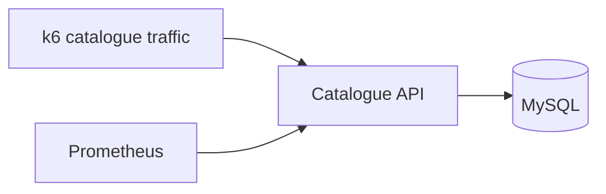
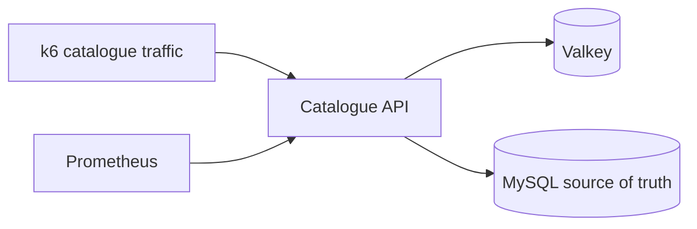

# Radius Performance Demo

A small, self-contained catalogue performance lab for demonstrating how GitHub Copilot and the Radius Canvas can diagnose a slow service-to-database dependency, introduce a Valkey cache, visualize the graph change, deploy it to Kubernetes, and verify recovery.

Phase 1 implements the runnable Go, MySQL, Valkey, Prometheus, Docker Compose, and Kubernetes foundation. Radius Canvas telemetry overlays, automated deployment orchestration, and the graph-effectiveness agent benchmark are specified but intentionally not presented as existing features.

## Architecture

Baseline:



Cache-enabled:



The API uses cache-aside reads. A cache hit returns from Valkey; a miss or cache error falls back to MySQL and attempts to populate Valkey. The MySQL edge remains because it is still the source of truth.

## Prerequisites

- Go 1.23 or newer for direct builds
- Docker with Docker Compose for the local stack
- k6 for load generation
- Optional: `kubectl` with Kustomize support for rendering or applying Kubernetes manifests

## Local quick start

Run the deterministic slow-database baseline:

```bash
make local-up
make load
```

Enable cache-aside without changing source:

```bash
make cache-enabled-local
make load
```

Stop the stack:

```bash
make local-down
```

The default `DB_READ_DELAY=250ms` makes the dependency bottleneck visible and repeatable. Override it for experiments, for example `DB_READ_DELAY=500ms make local-up`.

## Endpoints and metrics

| Endpoint | Purpose |
|---|---|
| `GET http://localhost:8080/healthz` | Process liveness |
| `GET http://localhost:8080/readyz` | MySQL-backed readiness |
| `GET http://localhost:8080/api/products?limit=10` | Bounded catalogue list |
| `GET http://localhost:8080/api/products/1` | Single product lookup |
| `GET http://localhost:8080/metrics` | Prometheus exposition |
| `http://localhost:9090` | Prometheus query UI |

Primary metrics are `catalog_http_request_duration_seconds`, `catalog_dependency_request_duration_seconds`, `catalog_cache_requests_total`, and `catalog_http_requests_total`. See the [telemetry contract](docs/specs/telemetry-contract.md) for labels and diagnostic queries.

## Kubernetes

Render the baseline or cache-enabled manifests:

```bash
kubectl kustomize deploy/kubernetes/base
kubectl kustomize deploy/kubernetes/cache-overlay
```

The API image is the documented placeholder `ghcr.io/ryanwaite/radius-performance-demo/catalog-api:latest`; publishing and Radius deployment automation are Phase 2 work.

## Repository layout

```text
cmd/catalog-api/                  API entry point
internal/catalog/                 repository and cache-aside domain logic
internal/config/                  environment configuration
internal/observability/           Prometheus instrumentation
internal/server/                  HTTP handlers
deploy/mysql/                     local schema and seed data
deploy/prometheus/                local scrape configuration
deploy/kubernetes/base/           baseline Kubernetes resources
deploy/kubernetes/cache-overlay/  Valkey graph overlay
load/                             k6 catalogue traffic
docs/specs/                       demo, implementation, and telemetry contracts
```

## Specifications

- **[Canonical Copilot + Radius experiment plan](docs/specs/copilot-radius-experiment-plan.md)**
- [End-to-end demo specification](docs/specs/demo-spec.md)
- [Implementation plan](docs/specs/implementation-plan.md)
- [Telemetry adapter contract](docs/specs/telemetry-contract.md)
- [Agent graph evaluation specification](docs/specs/agent-evaluation-spec.md)
- [Security policy](SECURITY.md)

The polished Canvas flow and the unattended benchmark serve different purposes. The demo explains one end-to-end story to a human audience; the benchmark measures whether graph access improves agent diagnosis and remediation under controlled, repeated incidents.

This project is original sample code released under the [MIT License](LICENSE). OpenTelemetry Demo is recognizable storefront inspiration for a later integration, not a source for this implementation.
