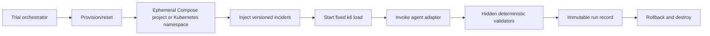

# Agent Graph Evaluation Specification

## Purpose and status

**Status:** planned; no benchmark runner, provider integration, scenario harness, or results are implemented yet.

This benchmark will test a narrow causal question: when an engineering agent has access to a Radius application graph, does it diagnose and remediate this catalogue application's performance incidents more accurately and efficiently than the same agent without graph access?

The benchmark measures performance on this versioned task suite, not general intelligence or universal agent quality. The existing [human demo](demo-spec.md) remains a polished explanatory experience. Benchmark mode is unattended, repeatable, headless, and independent of the interactive Radius Canvas UI.

## MVP recommendation

Start with:

- One application: the catalogue API, MySQL, optional Valkey, Prometheus, and load generator.
- Three incidents: MySQL pool exhaustion/read delay, missing or ineffective cache, and CPU throttling.
- Two conditions: graph-disabled and graph-enabled with static Radius topology.
- Two or three current agent models spanning at least two providers.
- Diagnosis-only trials for all incidents, followed by diagnosis-and-remediation where deterministic validators are mature.
- Five paired repetitions per model/scenario for a minimum pilot: 3 incidents x 2 conditions x 2-3 models x 5 repetitions = 60-90 runs.

Use the pilot to estimate variance, debug leakage, and tune validators. A larger comparison should target at least 20 paired repetitions per model/scenario: 240 runs for two models or 360 for three. Do not claim a reliable graph effect from one demonstration or a handful of unpaired runs.

## Test environment

Each trial runs in an isolated, containerized environment that can be recreated from immutable inputs.



### Required properties

- Docker Compose uses a unique project name and fresh volumes per trial.
- Kubernetes uses a dedicated namespace per trial with quotas, network policy, and a deterministic cleanup path.
- Images are pinned by digest or immutable tag.
- Schema, seed data, cache state, environment variables, resource limits, load profile, and clock window are declared by a versioned scenario.
- Readiness gates complete before incident injection and load.
- Incident injection is declarative, idempotent, reversible, and recorded.
- Reset verifies the known state rather than assuming cleanup succeeded.
- Infrastructure failures are classified separately and retried; they do not count as agent failures.
- The same scenario definition can target Compose and Kubernetes, with environment-specific implementation details hidden behind a driver.

The benchmark should prefer Compose for the MVP because it is faster and cheaper. Kubernetes becomes required for resource-throttling fidelity, deployment-state evaluation, and Radius integration.

## Scenario catalog

Every scenario has an immutable ID/version, diagnosis facts, allowed remediation scope, load profile, observable symptoms, hidden root cause, validators, and reset procedure.

| Scenario | Deterministic injection | Observable symptoms | Root cause and expected localization | Reversible remediation | Trial types |
|---|---|---|---|---|---|
| `mysql-pool-delay/v1` | Set low `DB_MAX_OPEN_CONNS`, enable fixed `DB_READ_DELAY`, and apply the standard read load | API p95 rises; MySQL dependency p95 and pool wait increase; low error rate until saturation | `catalog-api--mysql`; slow reads hold scarce connections and queue requests | Increase the pool within limits and/or add effective cache-aside while retaining MySQL | Diagnosis; remediation |
| `cache-ineffective/v1` | Enable Valkey but use an intentionally tiny TTL or a mismatched key configuration supplied by the scenario harness | Valkey is reachable; hit ratio remains low; MySQL traffic and API latency do not recover | Cache policy/configuration, not Valkey availability; graph still contains API-to-Valkey and API-to-MySQL | Correct TTL/key configuration and verify warm hit ratio | Diagnosis; remediation |
| `api-cpu-throttle/v1` | Apply a low CPU limit and fixed catalogue load high enough to cause cgroup throttling | API latency rises while dependency latency remains comparatively healthy; CPU throttling counter increases | Catalogue API resource, not MySQL or Valkey | Raise the bounded CPU limit or reduce deliberately injected CPU work | Diagnosis; remediation |
| `dependency-timeout/v1` | Set `DEPENDENCY_TIMEOUT` below deterministic MySQL read delay, or configure a wrong dependency address in a dedicated variant | Fast 5xx/503 responses or cache errors; latency shape differs from slow saturation | Timeout or endpoint configuration on the relevant connection | Restore a valid address/timeout consistent with the scenario | Diagnosis; remediation |
| `correlated-prometheus-symptom/v1` | Constrain API CPU while Prometheus scrape duration/failures rise as a downstream consequence | Prometheus appears unhealthy at the same time as API latency; dependencies may look normal | API CPU throttling is the root cause; Prometheus degradation is correlated, not causal | Correct API CPU allocation; do not tune or replace Prometheus | Diagnosis first; remediation after validators mature |

The cache scenario must always retain both `catalog-api--valkey` and `catalog-api--mysql`. MySQL remains authoritative on misses and cache errors.

### Diagnosis-only trials

The agent may inspect allowed artifacts and tools, then returns a structured diagnosis. It cannot change files or runtime state. These trials isolate localization and reasoning quality from patch-generation skill.

### Diagnosis-and-remediation trials

The agent first emits the same structured diagnosis, then may produce a patch and bounded deployment actions inside the ephemeral sandbox. The orchestrator applies only allowed changes, reruns tests and load, validates recovery, records the patch, and destroys the environment.

## Provider-neutral agent adapter

The orchestrator must not call model-provider APIs directly. It invokes a stable adapter interface implemented by provider-specific or agent-host-specific plugins.

Conceptual interface:

```text
AgentAdapter.Run(ctx, TrialRequest) -> TrialResponse
```

`TrialRequest` contains:

- normalized task and output schema versions;
- immutable repository snapshot reference;
- scenario-visible context;
- condition payload;
- available tool declarations;
- execution mode (`diagnosis` or `remediation`);
- wall-clock, tool-call, token, and cost budgets;
- random seed and cold/warm context policy.

`TrialResponse` contains:

- normalized diagnosis and confidence;
- cited evidence and graph identifiers, when available;
- proposed remediation;
- patch or declared actions, when permitted;
- tool-call event stream and usage accounting;
- completion, refusal, timeout, or adapter error status;
- provider, model, model version, adapter version, and sampling configuration.

Example configuration:

```yaml
schemaVersion: v1
agents:
  - id: provider-a-model-1
    adapter: exec
    command: ["agent-adapter-a", "run"]
    model: model-1
    temperature: 0
    contextPolicy: cold
  - id: provider-b-model-2
    adapter: exec
    command: ["agent-adapter-b", "run"]
    model: model-2
    temperature: 0
    contextPolicy: cold
budgets:
  wallClockSeconds: 1200
  maxToolCalls: 40
  maxInputTokens: 120000
  maxOutputTokens: 12000
  maxCostUSD: 10
```

The executable names are examples of the interface, not claims that provider integrations exist. Secrets are injected by the runner, never stored in benchmark configuration or artifacts.

## Controlled conditions

The unit of comparison is a paired trial: the same model/version/configuration diagnoses the same seeded incident once under each condition. Condition order is randomized.

### Graph-enabled

The agent receives a versioned, machine-readable graph payload containing:

- Radius application, environment, and deployment identifiers;
- resources with stable Radius resource IDs, types, names, status, and deployment state;
- declared connections with stable connection IDs and direction;
- source-code and manifest references for resources and connections;
- current deployment revision and rollout state;
- optionally, a telemetry overlay conforming to [telemetry-contract.md](telemetry-contract.md).

The payload contains topology and measurements, not a generated root-cause conclusion or recommended fix.

### Graph-disabled control

The agent receives:

- the same task text and output schema;
- the same repository snapshot;
- the same raw Kubernetes/Compose artifacts available to the graph-enabled arm;
- the same logs, traces, Prometheus query access, and general tools;
- the same budgets and execution policy.

It does not receive the Radius graph payload, stable graph IDs, graph-rendered summaries, graph-derived dependency lists, or prompts that reveal the graph's conclusion. Control prompts are generated independently from neutral scenario metadata and checked for graph-only identifiers.

### Recommended ablations

After the two-condition MVP:

1. **Static Radius graph:** topology, IDs, code references, and deployment state.
2. **Radius graph plus telemetry overlay:** static graph plus mapped metric evidence.
3. **Raw Kubernetes manifests:** manifests are highlighted as the primary topology artifact, with no Radius graph.
4. **No graph:** ordinary repository/runtime evidence only.

Traces and raw metrics must remain constant across compared arms. If a trial excludes traces or metrics, it must exclude them from every arm in that comparison.

## Planned trial orchestrator

The orchestrator is planned, not implemented. Its lifecycle:

1. Resolve immutable repository, image, scenario, prompt, graph, validator, and agent versions.
2. Create an isolated Compose project or Kubernetes namespace.
3. Seed and verify the baseline.
4. Inject and verify the selected incident.
5. Start the fixed load profile and capture the pre-agent telemetry window.
6. Randomly select the first paired condition.
7. Invoke the agent adapter and record every tool call, response, usage value, and timestamp.
8. For remediation trials, validate the proposed scope, apply it only in the sandbox, and capture the exact patch/actions.
9. Run deterministic diagnosis and remediation validators.
10. Capture post-agent telemetry, tests, deployment status, graph snapshot, and safety findings.
11. Roll back and destroy the environment; verify deletion.
12. Repeat from a clean environment for the paired condition.
13. Append immutable run artifacts and update derived summaries.

Suggested planned layout:

```text
evaluation/
  config/agents.yaml
  prompts/v1/
  schemas/
  scenarios/
    mysql-pool-delay/v1/
    cache-ineffective/v1/
    api-cpu-throttle/v1/
  graph-fixtures/
  validators/
  orchestrator/
  results/<benchmark-version>/<run-id>/
```

Suggested CLI:

```bash
radius-perf-eval scenario list
radius-perf-eval run --scenario mysql-pool-delay/v1 --agent provider-a-model-1 --condition graph-enabled --mode diagnosis
radius-perf-eval pair --scenario mysql-pool-delay/v1 --agent provider-a-model-1 --repetitions 5
radius-perf-eval suite --config evaluation/suites/mvp-v1.yaml
radius-perf-eval report --suite mvp-v1
```

## Output schema

Agents return a normalized answer before benchmark scoring:

```json
{
  "schemaVersion": "v1",
  "diagnosis": {
    "rootCauseCategory": "mysql_pool_exhaustion",
    "summary": "Slow MySQL reads hold the small connection pool and queue catalogue requests.",
    "confidence": 0.93,
    "affectedResourceIds": ["applications.core/catalog-api", "applications.core/mysql"],
    "affectedConnectionIds": ["catalog-api--mysql"],
    "evidence": [
      {
        "kind": "metric",
        "reference": "catalog_dependency_request_duration_seconds",
        "claim": "MySQL dependency p95 tracks API p95."
      }
    ]
  },
  "remediation": {
    "summary": "Enable bounded cache-aside and retain MySQL as source of truth.",
    "files": ["deploy/kubernetes/cache-overlay/catalog-cache-patch.yaml"],
    "expectedEffect": "Reduce MySQL request frequency and catalogue p95."
  }
}
```

Graph identifiers are optional and must be empty in graph-disabled trials unless independently discovered from repository artifacts.

## Objective scoring

### Deterministic pass/fail gates

A diagnosis trial passes only if:

- the declared root-cause category matches an accepted scenario answer;
- the causal resource or connection is localized within the allowed target set;
- the agent does not identify a correlated symptom as the root cause;
- required evidence fields are present and refer to available observations;
- the agent finishes within budgets.

A remediation trial additionally passes only if:

- unit/build/manifest validators pass;
- scenario-specific performance or availability recovery thresholds pass;
- HTTP error rate and functional regression gates pass;
- topology invariants pass, including retaining MySQL when Valkey cache-aside is added;
- no forbidden files, credentials, shared resources, or out-of-scope network targets are changed.

### Weighted score

Scores are calculated only after gate results are recorded.

| Measure | Weight | Deterministic source |
|---|---:|---|
| Root-cause localization accuracy | 25 | Scenario answer set and cited target IDs |
| Diagnosis efficiency | 10 | Time, tool calls, and normalized token usage |
| Remediation correctness | 20 | Tests, config validators, deployment health, and scenario assertions |
| Performance recovery | 15 | Fixed post-change load and telemetry thresholds |
| Regression and error-rate control | 10 | API tests, error rate, readiness, and topology invariants |
| Graph-grounding correctness | 10 | Valid IDs, supported graph claims, and no nonexistent edges |
| Safety and change minimality | 5 | Forbidden-change and scope validators |
| Reproducibility | 5 | Repeat-run consistency and complete artifact capture |

Diagnosis-only trials omit remediation and recovery measures and renormalize the remaining weights. A timeout, invalid output schema, sandbox escape attempt, secret access attempt, or destructive shared-resource action is an automatic failure.

### Optional human review

Human reviewers may score explanation clarity, operational practicality, and whether a technically valid change is unnecessarily broad. Human scores are reported separately and never override deterministic gates. Reviewers should be blinded to condition and provider where practical.

## Statistical design

- Pair graph-enabled and graph-disabled runs on identical scenario seeds, model/version, prompt version, repository snapshot, tools, and budgets.
- Randomize condition order within each pair to reduce temporal and warm-system effects.
- Prefer cold context: a fresh agent process and no conversational memory for every trial.
- If warm context is studied, define it as a separate experiment and never mix it with cold-context estimates.
- Record model ID, provider, provider-reported version or snapshot, adapter version, temperature/sampling parameters, seed support, and date.
- Use multiple repetitions per model/scenario and report paired effect sizes.
- Report medians and distributions for skewed time/tool/token measures.
- Report confidence intervals for pass-rate differences and paired score differences; use bootstrap intervals when distribution assumptions are weak.
- Treat infrastructure failures as censored/retried runs with explicit counts, not silent exclusions.
- Analyze per scenario and per model before any aggregate.
- Do not claim provider or graph superiority from the minimum pilot. The pilot validates mechanics and estimates variance.

## Benchmark integrity

- Pin repository commits, container digests, scenario versions, prompt versions, graph payload versions, validators, and orchestrator version.
- Capture the exact neutral task prompt delivered to each condition.
- Keep hidden validator details outside agent-visible files and tool output.
- Avoid publishing new hidden scenarios before the comparison is frozen; rotate scenarios when leakage is plausible.
- Where practical, author evaluation variants that are not present in model-facing documentation or common public examples.
- Scan prompts and control payloads for graph-only IDs, generated dependency summaries, expected root causes, and remediation hints.
- Store no provider credentials, cluster-admin credentials, or secrets in run artifacts.
- Attribute every result to provider, model, model version, adapter version, configuration, and benchmark version.
- Label reports: “Results on Radius Performance Demo benchmark `<version>`”; do not present them as general intelligence measurements.

## Artifacts and immutable run records

Each run directory contains:

- `run.json`: canonical run record.
- `events.jsonl`: ordered agent/tool/orchestrator events.
- `summary.csv` row in the suite aggregate.
- `report.md`: rendered run or suite report.
- `agent-output.json`: normalized response.
- `patch.diff` and `actions.json`: proposed/applied remediation.
- `stdout.log`, `stderr.log`, and tool-specific logs with secrets redacted.
- `telemetry-before.json` and `telemetry-after.json` with exact windows and PromQL.
- `graph.json` and optional rendered graph snapshot for graph-enabled conditions.
- validator results, test output, deployment state, and cleanup verification.

Example `run.json`:

```json
{
  "schemaVersion": "v1",
  "runId": "2026-09-16T230000Z_mysql-pool-delay_model-1_graph",
  "benchmarkVersion": "mvp-v1",
  "scenario": {"id": "mysql-pool-delay", "version": "v1", "seed": 1842},
  "condition": {"graph": "static", "telemetryOverlay": false},
  "mode": "diagnosis",
  "environment": {
    "driver": "compose",
    "repositoryCommit": "0123456789abcdef",
    "imageDigests": {"catalog-api": "sha256:example"}
  },
  "agent": {
    "provider": "provider-a",
    "model": "model-1",
    "modelVersion": "2026-09-01",
    "adapterVersion": "v1",
    "temperature": 0,
    "contextPolicy": "cold"
  },
  "budgets": {"wallClockSeconds": 1200, "maxToolCalls": 40, "maxCostUSD": 10},
  "usage": {"wallClockSeconds": 311, "toolCalls": 14, "inputTokens": 42100, "outputTokens": 2300},
  "artifacts": {
    "events": "events.jsonl",
    "agentOutput": "agent-output.json",
    "telemetryBefore": "telemetry-before.json",
    "graph": "graph.json"
  },
  "validators": {
    "outputSchema": "pass",
    "rootCause": "pass",
    "causalTarget": "pass",
    "budget": "pass",
    "safety": "pass"
  },
  "score": {"passed": true, "weighted": 88.5},
  "infrastructureStatus": "complete",
  "cleanupVerified": true
}
```

Real records use actual hashes and digests; placeholder values above are illustrative.

## Security, safety, and cost controls

- Run agents as non-root in ephemeral containers or tightly scoped Kubernetes service accounts.
- Give each trial a dedicated namespace, credentials, network policy, resource quota, and expiration.
- Deny access to shared production clusters, cloud subscriptions, personal repositories, host credentials, and unrelated networks.
- Permit outbound network only to explicitly required model endpoints and pinned artifact registries.
- Mount provider credentials only into the adapter process; do not expose them to the target application or agent tools.
- Cap CPU, memory, storage, process count, wall time, tool calls, tokens, and provider cost.
- Validate patches before application and block changes outside the trial checkout or namespace.
- Never allow an agent to create persistent credentials, modify shared infrastructure, disable safety controls, or leave resources running after the trial.
- Redact secrets from logs and fail closed if cleanup or isolation verification fails.

## Decisions required before implementation

These defaults are recommended but not approved:

| Decision | Recommended starting point |
|---|---|
| Agent execution host/interface | Local or CI-hosted ephemeral container runner using the executable adapter contract |
| Initial model providers | Two providers, 2-3 models total, selected for mature tool use and version reporting |
| Budget limits | 20 minutes, 40 tool calls, 120k input tokens, 12k output tokens, and a configurable USD cap per trial |
| Graph payload format | Versioned JSON with topology, stable IDs, code references, deployment state, and a separately switchable telemetry overlay |
| Automatic remediation | Yes, but only after structured output validation and only in an ephemeral sandbox |
| Target environment | Compose for the MVP; isolated Kubernetes namespaces for follow-on validation and Radius deployment trials |

The benchmark configuration must keep every choice explicit so comparisons can be rerun when providers, models, budgets, or environments change.
