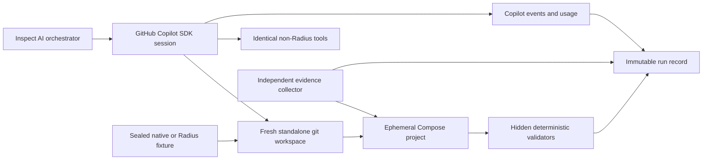

# Copilot + Radius Experiment Plan

## Status and authority

**Status:** canonical experiment design; implementation is planned unless a capability is explicitly marked implemented.

This document is the decision-ready plan for evaluating GitHub Copilot on the Radius Performance Demo. It governs treatment definitions, protocol, measures, analysis, integrity, and implementation sequencing. The focused specifications remain authoritative for their narrower contracts:

- [Agent evaluation details](agent-evaluation-spec.md): incident catalog, validators, scoring mechanics, and artifact detail.
- [Telemetry contract](telemetry-contract.md): stable metrics, PromQL, Radius identifiers, and telemetry adapter JSON.
- [Demo specification](demo-spec.md): interactive Radius Canvas presentation.
- [Implementation plan](implementation-plan.md): repository delivery phases.

The Go catalogue application, MySQL and Valkey paths, Prometheus metrics, Docker Compose stack, k6 load, and Kubernetes manifests are implemented. Inspect AI orchestration, Copilot SDK integration, Radius repository fixtures, benchmark reset, hidden validators, and benchmark result capture are planned.

## Purpose and research questions

The experimental unit is the **complete GitHub Copilot harness plus a selected model**, not an isolated raw LLM. Results therefore characterize a pinned Copilot runtime, model, tools, repository fixture, prompt, budget, and incident version.

### Primary product question

Does Radius-enabling a repository make GitHub Copilot more successful, efficient, and safe when diagnosing and changing a cloud-native application on behalf of a developer?

The primary treatment is the complete repository experience that a developer would adopt. It includes the Radius application model, graph access, stable identifiers and source references, repository configuration, and generic Radius skills.

### Secondary questions

- Where does any uplift come from: application graph, Radius skills, or their interaction?
- How much one-time effort is required to Radius-enable the repository?
- After how many tasks does operational benefit plausibly amortize that preparation cost?
- On which incident and task classes does Radius help, have no effect, or hurt?
- Does Radius improve diagnosis only, or also improve remediation correctness, recovery, and safety?
- Does an agent use the available graph and skills, and does use correlate with outcome?

### Product-treatment claims versus causal graph claims

The primary two-condition campaign estimates the effect of the **fully Radius-enabled repository treatment**. It cannot attribute the result to the graph alone because the treatment also changes repository files, instructions, skills, identifiers, and tool affordances.

Causal claims about graph access require the later graph-by-skills factorial ablation. Even then, conclusions apply to the pinned Copilot harness, models, tasks, fixtures, and benchmark version. They do not establish general LLM intelligence or universal benefit for every repository.

## Primary conditions

| Surface | A. Native repository | B. Fully Radius-enabled repository |
|---|---|---|
| Application source and tests | Same frozen snapshot | Same frozen snapshot |
| Compose and Kubernetes manifests | Included | Included |
| Telemetry and load tools | Included | Included |
| Ordinary repository instructions | Included | Included |
| `app.bicep` | Absent | Generated, corrected if necessary, validated, and frozen before trials |
| Radius repository configuration | Absent | Included and frozen |
| Radius application graph | Not available | Available with stable resource/connection IDs and source references |
| Radius skills | None | Generic, repository-scoped procedural skills |
| Scenario-specific hints | None | None |

The Radius-enabled fixture must describe the deployed application and how to use Radius. It must not encode incident answers, expected root causes, scenario thresholds, or scenario-specific remediation.

Radius setup occurs before timed trials. Both fixtures are frozen and hashed. `app.bicep` is not regenerated per trial, because generation time and variability would confound task execution. One-time setup cost is recorded separately.

### Variables held constant

- Neutral task prompt and structured output requirement.
- Application source behavior, tests, telemetry, load, and incident seed.
- Non-Radius tools and permissions.
- Selected model and model version or provider snapshot.
- GitHub Copilot SDK and CLI versions.
- Reasoning effort and sampling configuration.
- Wall-clock, model-call, tool-call, token, AI-credit, and cost budgets.
- Cold-context policy and fresh Copilot session.
- Environment driver and benchmark host class.

The initial benchmark disables automatic model routing, fleet execution, subagents, and cross-trial memory. Each trial uses one explicit pinned model in one fresh Copilot session.

### Neutral task prompt

The task must not mention Radius, an application graph, cache, or the expected cause. Scenario-visible symptoms and success requirements may vary, but the core prompt remains neutral.

> The catalogue application is not meeting its service objective under the supplied workload. Diagnose the root cause using the repository and runtime evidence available to you. Return the causal category, affected component or dependency, supporting evidence, confidence, and the smallest safe remediation. In remediation mode, implement and validate only the changes necessary to restore the objective without weakening health checks, tests, or source-of-truth guarantees.

The prompt must not tell the agent which tool or repository artifact to inspect.

## Follow-up factorial ablations

Run the primary native-versus-fully-Radius campaign first. If it produces a stable signal and the harness passes integrity checks, run a 2x2 graph-by-skills campaign:

| Condition | Graph / `app.bicep` | Radius skills |
|---|---:|---:|
| Native | No | No |
| Skills only | No | Yes |
| Graph only | Yes | No |
| Fully Radius-enabled | Yes | Yes |

The factorial model estimates:

- **Graph main effect:** average difference between graph-present and graph-absent conditions.
- **Skills main effect:** average difference between skills-present and skills-absent conditions.
- **Graph x skills interaction:** whether the combined effect differs from the sum of their separate effects.

A positive interaction would suggest that procedural skills help Copilot exploit the graph. A negative interaction could indicate redundant context, conflicting instructions, or added tool overhead. Do not infer these effects from the primary two-condition campaign.

A later graph-content ablation compares:

1. Static graph and deployment state.
2. Static graph plus telemetry overlay defined by the [telemetry contract](telemetry-contract.md).

Raw traces and metrics remain identical across arms unless their availability is itself the explicit treatment.

## Harness and environment



### Inspect AI

Inspect AI is the recommended benchmark orchestrator. It should own suite configuration, randomized paired scheduling, task state, scoring integration, artifact references, resumability, and report generation. Repository-specific environment and validator code remains separate from Inspect task definitions so it can be tested independently.

Inspect is pinned by exact package version and configuration hash. Its role is orchestration and evaluation, not diagnosis.

### GitHub Copilot SDK

The GitHub Copilot SDK is the agent harness. Each trial selects an explicit model available in the user's Copilot account.

Use the SDK rather than:

- **Copilot App UI:** interactive UI state, human timing, Canvas rendering, and manual actions are difficult to automate and reproduce.
- **Raw provider API:** it bypasses the Copilot tool loop, permissions, usage accounting, repository integration, skills, and product behavior being evaluated.
- **Copilot CLI alone:** the CLI may remain a useful implementation surface, but the SDK provides programmatic session creation, event capture, configuration, and lifecycle control needed by Inspect.

Pin both SDK and Copilot CLI/runtime versions because event and usage APIs may evolve. The accumulated session usage RPC is experimental and must be treated as a reconciliation source, not the only raw record.

## Package supply chain compliance

This benchmark is developed on Microsoft-managed devices, so package consumption is constrained by Microsoft engineering policy. Direct use of public package registries is no longer compliant and is blocked at the network layer. All Python and npm packages must be acquired through Central Feed Services (CFS).

This is a hard constraint on the benchmark, not background policy: it changes which dependency versions are available, and it interacts with the hermetic sandbox requirements below.

### Required configuration

Python consumption uses a single CFS index:

```ini
[global]
index-url = https://packagefeedproxy.microsoft.io/pypi/simple
```

The equivalent `uv` configuration declares one default index:

```toml
[[index]]
name = "cfs"
url = "https://packagefeedproxy.microsoft.io/pypi/simple"
default = true
```

npm consumption uses the CFS proxy registry:

```ini
registry=https://packagefeedproxy.microsoft.io/npm/
```

From the approved managed developer machine, the CFS proxy serves per-package requests without a personal access token or credential provider. That access appears to depend on network context rather than per-user identity: an unauthenticated GitHub-hosted runner receives HTTP 401 from the same endpoint. Access from GitHub-hosted runners and other off-network build environments is therefore not established, and CI that installs benchmark dependencies needs either a CFS-capable runner or a prebuilt, digest-pinned benchmark test image. A dedicated Azure Artifacts feed would require authentication; the proxy avoids introducing a credential into the benchmark.

### Prohibited patterns

- Any reference to `pypi.org`, `files.pythonhosted.org`, or `registry.npmjs.org` in committed configuration, lockfiles, Dockerfiles, CI workflows, or documentation.
- `--extra-index-url`, `PIP_EXTRA_INDEX_URL`, or any second package index. Multiple indexes are treated as a dependency-confusion risk and are flagged by CFS detectors.
- Falling back to a public registry when a package or version is unavailable through CFS. The correct escalation is a CFS exception request, which is a human decision.

Repository-level configuration is committed rather than relying on developer machine settings, because continuous integration and container builds do not inherit them.

### Quarantine lag constrains version pinning

CFS quarantines packages before release, so the CFS catalog trails public registries. Version pins must be chosen from what CFS actually serves, and a pin copied from a public registry listing will usually fail to resolve.

Observed at the time of writing:

| Package | Public latest | Latest stable on CFS | Pinned |
|---|---|---|---|
| `inspect-ai` | 0.3.266 | 0.3.263 | 0.3.263 |
| `github-copilot-sdk` | 1.0.14 | 1.0.13 | 1.0.13 |

Because quarantine lag shifts over time, every pin must be verified against CFS at the moment it is frozen, and the resolved versions recorded in the reproducibility record. A benchmark run is only reproducible if its dependency set is reachable through the same feed.

Pinned Python runtime is 3.12. The Copilot SDK requires 3.11 or later, and the newest available interpreter is deliberately avoided for stability.

The Copilot CLI and the Python SDK are versioned on separate lines. Their compatibility must be verified explicitly rather than assumed from version proximity, and the verified pair recorded alongside the other pins.

### Interaction with sandbox hermeticity

Dependencies are resolved and installed **once at image build time**, through CFS, before any scored trial begins. Trial containers perform no package resolution or download at run time.

This satisfies three requirements simultaneously:

- **Determinism.** Registry latency, upstream version drift, and transient feed availability are removed from measured trial variance, supporting the environment reset tolerances required in Phase 2.
- **Isolation.** No feed credential or registry endpoint needs to exist inside an agent-visible workspace, consistent with the credential exclusions below.
- **Compliance.** Package acquisition happens in one auditable place rather than implicitly across many container runs.

Trial containers should therefore have no egress to package registries, and the absence of that egress is a verified sandbox property and a negative test, not an assumption.

Container base images prefer Microsoft Container Registry equivalents where they exist. Where no equivalent exists, images are pinned by digest as already required, and the absence of an equivalent is recorded.

At the time of writing, MCR provides builder, distroless runtime, and Prometheus equivalents, but provides no MySQL or Valkey image. Those two remain on Docker Hub, pinned by digest. An MCR Redis mirror exists but is stale and is deliberately not adopted, because swapping the cache implementation to chase a base image would change the application under test for marginal benefit.

### Declared exception: Go modules

Go is not covered by the CFS controls above, and this exception is recorded rather than left implicit.

- Public `proxy.golang.org` and `sum.golang.org` are reachable and are not blocked by current device policy, which covers npm, PyPI, and NuGet.
- Go is not yet under CFS quarantine. Quarantine covers npm, NuGet, and PyPI, with Maven next and Cargo and Go listed as future onboarding.
- An internal centralized Go module proxy exists, built on Athens, but it is enabled through 1ES Pipeline Templates and OneBranch feature flags rather than exposed as a generally reachable endpoint. It is not available to this repository.

Go module download therefore occurs at image build time against the public proxy, outside scored trials. Module integrity rests on `go.sum` verification, and builds use a read-only module mode and a pinned toolchain. Modules are pre-populated into a builder layer so the application build itself resolves nothing from the network.

Where the sealed Go dependency set lives is an open design decision, not a settled rejection of vendoring. An agent-visible vendor tree would enlarge the fixture the agent explores and change exploration cost, but the allowlisted fixture builder means a vendor tree committed to the source repository need not appear in the agent workspace. Remediation validation also needs the dependencies: rebuilding an agent-modified application without network access requires a sealed dependency source. The candidates are:

1. a digest-pinned builder image containing the exact module cache;
2. a content-addressed dependency artifact mounted only into the patch validator;
3. a vendor tree kept in the build inputs and excluded from the agent-visible fixture;
4. an agent-visible vendor tree, treated explicitly as part of the benchmark fixture.

Choose one before remediation trials begin in Phase 3. Diagnosis-only trials do not rebuild the application and are unaffected.

Revisit this exception if Go onboards to CFS quarantine, if an internally reachable Go proxy becomes available to this repository, or if the benchmark moves into a 1ES pipeline.

## Repository fixture and workspace isolation

The Copilot agent must **never** run against the benchmark-development checkout or the full public `radius-performance-demo` repository during a scored trial. That repository contains experiment plans, public scenario concepts, expected diagnoses and remediations, harness code, result formats, and eventually scenario and orchestration files. Exposing it would create answer leakage and allow the agent to modify the benchmark control plane.

### Worktrees are not the scored-run boundary

Developers may use Git worktrees while authoring and comparing fixtures. Scored runs do not consume those worktrees.

A worktree remains linked to the parent repository's object database, configuration, hooks, refs, and administrative files. It can expose treatment branches or benchmark commits through refs, inherit or accidentally copy untracked/generated files, and permit parent-path access when mounts or tools are too broad. It also complicates exact cleanup and does not hide public plan content that remains reachable through the same checkout, host filesystem, or network. These properties make it useful for fixture preparation but unsuitable as the benchmark isolation boundary.

**Direct answer:** worktrees can prepare variants; benchmark runs consume sealed fixture artifacts and fresh standalone repositories.

### Three repository layers

| Layer | Contents | Agent access |
|---|---|---|
| Benchmark/control-plane repository | Inspect tasks, orchestration, scenario definitions, hidden variants, evidence collectors, validators, expected answers, reports, and fixture builder | Never mounted or exposed to the agent sandbox |
| Immutable application fixture source | Allowlisted application files exported from one pinned source commit, plus the declared Radius treatment overlay for the Radius fixture | Used only to build sealed fixture artifacts |
| Ephemeral per-trial agent workspace | Fresh standalone Git repository extracted from one exact fixture artifact | Mounted as the agent's only working directory |

The benchmark repository and hidden validators should ultimately live outside the public application fixture. Until that separation is implemented, the fixture builder must enforce a strict allowlist and construct artifacts without exposing the source checkout.

### Phase 0 fixture construction

Build and seal two artifacts from the same pinned application source commit:

1. **Native fixture:** allowlisted developer-realistic application source, tests, manifests, telemetry configuration, and ordinary repository instructions.
2. **Radius-enabled fixture:** the exact native fixture plus one versioned, allowlisted Radius treatment overlay containing validated `app.bicep`, Radius repository configuration, stable graph/source references, and generic Radius skills.

Prefer a content-addressed tar or OCI artifact with a manifest and SHA-256 digest. A dedicated fixture commit/repository exported with `git archive` is also acceptable, but the scored workspace must be created from the export, not attached to its `.git` directory. Application files and behavior must otherwise be byte-identical.

Create a machine-readable difference manifest that records every native-versus-Radius path, file digest, mode, and treatment reason. Fixture publication fails if an undeclared difference exists.

Explicitly exclude:

- `docs/specs/` and experiment plans;
- `benchmark/`, `evaluation/`, `results/`, orchestration, and scoring code;
- hidden scenarios, incident injection implementation, validators, expected answers, and ground-truth fixtures;
- CI secrets and provider credentials;
- `.env`, local configuration, logs, coverage, profiles, and result artifacts;
- developer-machine metadata and editor state;
- source-repository `.git`, local Git configuration, hooks, refs, remotes, alternates, credentials, submodules, and LFS state;
- load-injector controls or hidden incident parameters that reveal the cause.

The agent may receive developer-realistic runtime tools, application logs, metrics, traces, and ordinary manifests. The control plane injects the incident from outside the mounted repository.

The current demo repository cannot be exported as the native fixture, because its ordinary files already disclose the incident. The root README describes a slow service-to-database dependency, calls the default stack a deterministic slow-database baseline, states `DB_READ_DELAY=250ms`, and presents Valkey as the remediation. The same delay is the default in `docker-compose.yml` and in the Kubernetes catalog ConfigMap. Both conditions would see this text, so it would not bias the comparison between them, but it would let the native agent answer by reading rather than diagnosing and could push both conditions to a ceiling that hides any treatment effect.

The fixture therefore gets its own neutral documentation and healthy manifest defaults. The fixture README describes the service without naming a bottleneck, a diagnosis, or a preferred remediation. Agent-visible manifests carry baseline values that no hidden incident reuses. The leakage scan runs against the final sealed fixture artifact, not the source checkout, and searches for hidden parameter values, scenario identifiers, expected causal categories, and remediation language. Mutation tests plant each of these and prove the scan rejects them.

### Per-trial workspace creation

For every run:

1. Resolve the assigned fixture ID, version, and content digest.
2. Create a new empty temporary directory owned by the sandbox identity.
3. Extract the sealed artifact with path traversal, absolute path, device file, hard-link escape, and unsafe symlink protections.
4. Verify every path, mode, and SHA-256 against the fixture manifest; verify allowlist and denylist versions.
5. Initialize a new standalone Git repository in that directory.
6. Apply deterministic Git metadata where needed: fixed default branch, author identity, commit time, line-ending policy, and file modes.
7. Create one baseline commit and record its tree and commit hashes.
8. Verify clean status, no remote or only an inert local remote, no hooks, alternates, submodules, LFS fetch configuration, credentials, or network Git access.
9. Mount only this directory read-write as the agent working directory.
10. Start a fresh Copilot session with memory off.
11. After execution, record status, untracked files, binary changes, the final patch, and patch SHA-256 separately from the workspace.
12. Unmount and destroy the workspace, then verify the directory and related container mount no longer exist.

Recommended Git visibility is **yes**: Copilot should have `git status`, `git diff`, and a baseline for safe patch inspection. The repository has one synthetic baseline commit, no useful prior history, no live remote, and no credentials. Record both baseline tree hash and final patch hash.

### Docker and mount boundary

- Copy or mount the per-trial workspace read-write only into the agent container.
- Do not mount the source checkout, its parent directory, home directory, Docker configuration, SSH directory, credential stores, or benchmark/control-plane repository.
- Do not expose the Docker socket to the agent.
- Evidence collectors and validators use separate read-only workspace snapshots or control mounts and do not share writable state with the agent.
- Application containers consume pinned built artifacts and scenario configuration; they do not browse agent or benchmark control files.
- Resolve and validate every mount source before container creation. Parent-path and recursive broad mounts are forbidden.

### Network boundary

Initially deny general outbound internet from the scored sandbox. Permit Copilot/model control connectivity through a narrowly controlled path outside the application sandbox, plus only explicitly required local trial endpoints.

The agent must not fetch the public benchmark repository, search published expected answers, add arbitrary Git remotes, or query public code search. If GitHub access becomes necessary for a later task class, expose a controlled mirror containing only the assigned fixture and record that access as a new tool/treatment version.

### Reproducibility record

Every run records:

- fixture ID, version, and artifact digest;
- pinned application source commit;
- treatment overlay version and digest, or explicit absence;
- file manifest and native-versus-Radius difference-manifest digests;
- baseline Git tree and commit hashes;
- workspace creation tool version;
- allowlist and denylist versions;
- extraction and workspace verification results;
- final patch hash and final dirty-status summary;
- workspace and mount cleanup verification.

### Planned CLI flow

The following CLI is planned, not implemented:

```bash
radius-perf-eval fixture build \
  --source-commit "$SOURCE_COMMIT" \
  --condition native \
  --output oci://registry.example/fixtures/catalog-native:mvp-v1

radius-perf-eval fixture build \
  --source-commit "$SOURCE_COMMIT" \
  --condition radius-enabled \
  --overlay evaluation/treatments/radius/v1 \
  --output oci://registry.example/fixtures/catalog-radius:mvp-v1

radius-perf-eval workspace create \
  --fixture-digest sha256:... \
  --run-id "$RUN_ID" \
  --output "$WORKSPACE"

radius-perf-eval workspace verify --workspace "$WORKSPACE" --expected-tree "$TREE_HASH"
radius-perf-eval run --workspace "$WORKSPACE" --scenario "$SCENARIO" --agent "$AGENT"
radius-perf-eval workspace collect --workspace "$WORKSPACE" --output "$RUN_ARTIFACTS"
radius-perf-eval workspace destroy --workspace "$WORKSPACE" --verify
```

### Isolation exit criteria

- Ten repeated workspace creations from one fixture produce identical baseline tree and commit hashes.
- Native versus Radius fixture differences exactly match the declared treatment overlay manifest.
- Intentional forbidden files, unsafe symlinks, path traversal entries, remotes, hooks, alternates, submodules, LFS fetch configuration, or undeclared file differences cause verification failure.
- The agent cannot read parent paths, benchmark files, hidden validators, source-control credentials, or the Docker socket.
- After teardown, no workspace directory, agent container, mount, Compose project, volume, credential, or temporary fixture remains.

- A live escape probe executed inside every scored run approves none of its attempted parent-path reads, host-file reads, or out-of-workspace writes.

Repository isolation and runtime isolation are complementary. The unique Compose project resets application and dependency state; the fresh standalone repository resets agent-visible code, history, instructions, and writable context. Every scored run requires both.

### Shell confinement

The agent harness permission API cannot confine shell execution. Three structured fields on the shell permission request are unreliable, and two of them mislead rather than merely omit: the resolved-path list is empty even for a command naming one unambiguous literal path; the write-redirection flag reports false for a command that redirects output to a path outside the workspace; and the per-segment command view truncates at the redirection operator, so a handler screening segments sees a benign prefix while the full command text retains the escape. A handler that decides by inspecting declared paths approves everything it is shown. Under such a handler the agent successfully read a parent-directory file, read a host configuration file, and wrote outside its workspace, while every action was classified as within the workspace.

Shell therefore defaults to denied. Static command screening is defence in depth only, and probing established its boundary precisely: the screen holds against command substitution, because a literal path token survives it, and fails whenever no literal token is present — base64-encoded, interpreter-constructed, and variable-assembled paths all pass the screen. The weakness is the absence of a literal path, not substitution as such. These limitation probes are recorded as observations with no guaranteed outcome and are excluded from the pass criterion, so a screen that happens to deny one cannot be read as proof of confinement.

No agent confinement boundary exists yet. In Increment 1 the Copilot CLI and every tool it runs are host processes working in a host temporary directory. The Compose containers hold the application under test, not the agent, so their mounts bound the application data plane and say nothing about what an agent shell can reach on the host. Shell-enabled scored runs are therefore blocked until an OS-enforced agent boundary exists. It must confine the SDK-side CLI process and every tool it runs, allow writes only to the standalone fixture workspace, reach only the declared application endpoints, and deny the host home directory, Docker socket, benchmark checkout, and credentials.

Two designs can supply that boundary. The first is a dedicated agent runner: a container or VM that runs the CLI and its tools. The second is the Copilot runtime's own sandbox. The CLI wire protocol defines a `SandboxConfig` with filesystem read-only and read-write path lists, network policy, a fail-closed per-command bypass flag, confinement of the MCP and LSP servers the session launches, and a macOS seatbelt backend. The pinned Python SDK doesn't accept it at session creation, but its experimental `session.options.update` RPC carries a `sandboxConfig` field. Nobody has yet shown that the pinned CLI accepts the setting on a running session, or that it confines shell against the commands the static screen misses. The runtime sandbox would be cheaper than a runner if it works, so test it first. Test it with the static screen disabled, so the sandbox is the only thing under test, and include a positive control showing that an in-workspace write still succeeds. If it can't be verified, build the runner.

The live escape probe in Increment 1 is a permission-handler wiring check, not evidence of confinement. It shows that the static screen rejected three literal paths, and its prompt tells the agent not to work around a denial. Confinement evidence must come from escape tests against the agent runner's actual boundary, exercised by commands the static screen cannot catch. Because the permission-API failures are invisible to unit tests, that boundary test runs as a gate in each scored run and must pass affirmatively: missing evidence or a skipped probe fails the trial.

### MVP environment: Docker Compose

Every trial uses:

- a unique Compose project name;
- fresh volumes and containers;
- dynamic host ports discovered by the environment driver;
- images pinned by digest;
- frozen source and fixture hashes;
- verified schema and seed rows;
- verified initial cache state;
- verified environment variables and resource limits;
- readiness checks before injection and load;
- teardown with volumes and orphan containers removed;
- explicit cleanup verification.

The driver must fail closed if the environment differs from the scenario declaration. Merely running `docker compose down --volumes` is insufficient evidence of reset.

### Later Kubernetes and Radius target

The user-selected target is:

- AKS cluster: `ryanw-aks`
- Resource group: `ryanw-rg`
- Tenant/account: `radiustest20260806.onmicrosoft.com` Test account

This target is a direction, not a verified dependency. Cluster existence, account access, Radius installation/configuration, namespace permissions, quota, network policy, image access, and cleanup rights remain outstanding validation work.

Kubernetes trials use a unique namespace per trial and never share mutable application resources. The benchmark must not run against production or shared demo state.

### Independent evidence and hidden validators

The evidence collector runs outside the Copilot session and gathers ground truth directly from the environment. Following Harbor and Terminal-Bench patterns, the agent cannot edit collector state or hidden expected answers.

For remediation, use SWE-bench-style clean patch validation:

- apply the agent patch to the frozen fixture in an ephemeral checkout;
- reject modifications outside the allowed scope;
- run tests and manifest validation from a clean process;
- deploy only to the trial environment;
- compare behavior and telemetry against hidden scenario validators;
- retain the exact patch and commands.

The headless benchmark remains separate from the interactive Radius Canvas demo described in [demo-spec.md](demo-spec.md). Canvas may visualize benchmark artifacts later but is not part of timed execution.

### Negative assertions must not pass vacuously

A check of the form "nothing bad happened" can pass because nothing was examined. A validator that sees no forbidden write because the scenario never reached the code path, a leakage scan over an artifact that was never produced, and a hermetic-build test whose setup silently did nothing all report success on no evidence. This failure can decay without announcing itself: a check that depends on attempts trends green as attempts become rarer, which looks the same as a system that is getting better.

Each negative assertion declares which of these it needs, and only what it needs:

| Requirement | Meaning | Where it runs |
|---|---|---|
| Liveness | The artifact or record under inspection exists and is nonempty | Every scored run |
| Coverage | The scenario or validator path was exercised, with counts recorded | Every scored run |
| Complete inventory | An authoritative enumeration shows no forbidden item | Every scored run, where such an enumeration exists |
| Positive control or mutation test | The checker rejects a planted violation, and the setup is shown to have engaged the mechanism | CI and calibration |
| Per-run adversarial probe | A deliberate violation is attempted during the run | Only where the property cannot be inferred from authoritative state |

Per-run adversarial probes carry costs: they consume model requests, can warm caches or change state before the measured task, and add risk. Use them only where the table says to, and account for their usage separately from the scored task. Missing evidence and skipped checks fail rather than pass.

Hermetic builds illustrate the positive-control requirement. A test asserting that a Go build fails without network access passed while its cache-eviction step removed nothing, because the module cache lived at `/go/pkg/mod`, not the assumed `/root/go/pkg/mod`. The build succeeded from the populated cache and was nearly recorded as failing closed. The control that prevents this asserts the cache is empty after eviction and before the build.

## Scenarios and task modes

### MVP scenarios

| Scenario | Injection | Allowed remediation | Deterministic validators |
|---|---|---|---|
| MySQL pool/read delay | Fixed read delay plus constrained connection pool under standard load | Bounded pool/config change and/or effective cache-aside; no removal of MySQL | Correct causal category and `catalog-api--mysql`; functional tests; p95 recovery; error guardrail; pool/config bounds; topology consistency |
| Ineffective cache | Valkey enabled with hidden TTL/key/config variant that prevents useful hits | Correct cache policy/configuration; preserve fail-open behavior and MySQL source of truth | Cache causal category; hit-ratio recovery; MySQL request reduction; Valkey healthy; both `catalog-api--mysql` and `catalog-api--valkey` retained |
| API CPU throttling | Hidden CPU limit/workload variant causing cgroup throttling | Bounded API resource adjustment or removal of injected CPU work | API resource localization; throttling reduction; dependency latency not falsely blamed; throughput/p95 recovery; resource cap remains safe |

Later scenarios:

- Dependency timeout or endpoint misconfiguration.
- Misleading correlated symptom where an obvious degraded component, such as Prometheus scrape health, is not causal.

### Hidden variants

Public documentation names scenario concepts, but each version includes hidden variants that alter pool sizes, read delays, endpoint values, TTLs, CPU limits, workload intensity, and accepted remediation ranges. Variant assignment is seeded and recorded. The neutral prompt exposes symptoms, not hidden parameters or expected answers.

### Diagnosis-only

- Repository and runtime inspection are allowed.
- Writes, deployments, and runtime mutation are prohibited by permissions and validated afterward.
- Success requires a structured causal diagnosis with evidence and confidence.

### Diagnosis and remediation

- The agent must emit a structured diagnosis before changes.
- File and runtime changes are restricted to the ephemeral checkout and environment.
- Scenario definitions declare allowed files, resources, commands, and maximum scope.
- The orchestrator applies or executes bounded changes only after validation.
- Human approval is not required inside the sandbox, but all actions are logged and safety gates remain enforced.

## Exact trial protocol

1. Resolve immutable benchmark inputs: native and Radius fixture artifact digests, source commit, treatment overlay and difference manifests, application images, scenario/variant, prompt, skills, graph payload, validators, workspace builder, Inspect version, Copilot SDK/CLI version, model, reasoning effort, tools, and budgets.
2. Create an empty temporary directory, safely extract the assigned fixture, initialize a new standalone Git repository, create the deterministic baseline commit, and verify manifest, denylist, clean status, no remote/hooks/alternates/submodules/LFS, and baseline hashes.
3. Create a unique Compose project or Kubernetes namespace from a clean host state.
4. Verify images, schema, seed data, cache state, configuration, resource limits, readiness, workspace isolation, and absence of prior trial artifacts.
5. Inject the seeded incident from the control plane and independently verify that the intended fault is active without exposing hidden injection controls in the agent workspace.
6. Start the fixed workload and capture the pre-agent telemetry window and ground-truth evidence.
7. Start the authoritative monotonic trial clock.
8. Mount only the standalone workspace as the agent's working directory and create a fresh Copilot SDK session with memory off, the explicit pinned model, and the condition's allowed tools.
9. Capture every Copilot session event, `assistant.usage` event, model request, tool request/response, permission/action event, patch, terminal status, and adapter error.
10. In diagnosis-only mode, technically prohibit writes. In remediation mode, accept only bounded sandbox changes and preserve the baseline commit.
11. When the agent finishes or a budget expires, record normalized output, Git status, final patch hash, and terminal classification.
12. Run hidden diagnosis, functional, performance, regression, topology consistency, scope/minimality, and safety validators from separate control mounts.
13. For remediation, capture the post-change telemetry window under the same load profile.
14. Persist logs, patches, telemetry, graph snapshots, fixture and baseline hashes, raw usage payloads, validator results, and cleanup evidence outside the workspace.
15. Destroy the agent workspace, containers/namespace, mounts, volumes, credentials, and temporary files; verify every resource is absent.
16. Repeat the paired condition from a newly extracted fixture and new runtime environment with the same incident seed. Randomize which condition runs first.

Terminal classifications are mutually exclusive:

- infrastructure failure;
- Copilot SDK or adapter failure;
- invalid structured output;
- refusal;
- budget exhaustion;
- diagnosis failure;
- remediation failure;
- validated success.

Infrastructure and adapter failures are reported and retried under a predetermined policy; they are not silently converted into agent failures or dropped.

## Measures

### Primary outcome

**Deterministic validated end-to-end task success.** Diagnosis-only and remediation modes have separate gates. A weighted score is secondary and is calculated only after gate outcomes are fixed.

### Diagnosis

- Correct causal category.
- Correct causal resource and connection.
- Correct rejection of correlated but non-causal symptoms.
- Evidence validity and confidence calibration.
- Time to first correct structured diagnosis.

### Wall-clock timing

The orchestrator records monotonic durations and UTC timestamps for:

- total trial;
- provisioning/reset;
- incident injection and verification;
- baseline load and evidence collection;
- agent execution;
- time to correct diagnosis;
- remediation;
- validation;
- artifact persistence;
- teardown and cleanup verification.

Provider-reported latency is retained separately and never replaces end-to-end timing.

### Copilot usage

Capture each per-call `assistant.usage` payload and reconcile the accumulated totals with `session.usage.getMetrics` when available. Retain both raw forms.

Normalized nullable fields:

- input uncached tokens;
- input cached-read tokens;
- input cache-write tokens;
- visible output tokens;
- reasoning tokens;
- provider-reported total tokens;
- model-call count;
- AI credits or premium-request cost;
- provider-reported monetary charge, when available;
- estimated charge with pricing version, when calculation is necessary.

The accumulated usage RPC is experimental; pin the SDK/CLI and record schema/version changes. Reconciliation mismatches are artifacts, not values to overwrite.

Premium-request normalization filters on initiator before summing. The first observation was a two-call session on SDK 1.0.13 with its pinned CLI 1.0.83 and one model: summing per-call `assistant.usage.cost` gave 2.0, summing user-initiated calls gave 1.0, and the runtime total was 1.0. That session couldn't distinguish "charge user-initiated calls" from "charge only the first call." A four-turn session on the same runtime and model can. It produced eight usage events alternating user and agent initiators, each costing 1.0. The user-filtered sum was 4.0, matching the runtime total on three independent metric keys; the unfiltered sum was 8.0 and first-call-only was 1.0. The rule holds for multi-turn sessions on the pinned runtime and model family. Before it is used for cost estimands, validate it for sessions with no tools, multi-tool loops, retries and failed calls, each pilot model, and any later subagent-enabled configuration. Retain the unfiltered sum and the runtime total as raw artifacts. When the normalized value disagrees with `session.usage.getMetrics`, mark the cost metric unavailable for that trial rather than reporting the normalized value.

Cache overlap is resolved empirically rather than assumed. For the pinned SDK/CLI, `copilotUsage.tokenDetails` shows input tokens to be inclusive of cache-read tokens, so uncached input is a computed value rather than `null`. This resolution is specific to the pinned runtime and model family and must be re-verified whenever either changes; the general rule that overlapping fields are never summed still governs.

Providers and models account for cache and reasoning tokens differently. Some include cached tokens inside input totals; some split cache reads and writes; some include reasoning in output; some expose it separately; some do not expose it. Missing values are `null`, not zero. Never sum overlapping fields. Cross-provider token or cost rankings are therefore descriptive and qualified. Efficiency inference relies primarily on paired comparisons within the exact same model/version/runtime.

### Tools and treatment use

- Logical tool calls.
- Tool attempts, retries, failures, and duration.
- Model requests and turns.
- Permission prompts and denied actions.
- Graph tool calls, graph nodes/edges inspected, and graph-derived citations.
- Radius skill activation and steps used.
- Files, resources, and commands touched.
- Human intervention, which is expected to be zero in benchmark mode.

### Runtime recovery

- HTTP p50/p95/p99 and throughput.
- HTTP error rate.
- MySQL request rate and dependency latency.
- Cache hit/miss/error ratio.
- Valkey dependency latency.
- Pool wait and CPU throttling measures once implemented.
- Difference from the paired baseline under the same fixed workload.

See [telemetry-contract.md](telemetry-contract.md) for current metric names and mapping. Scenario validators must not claim pool-wait or CPU-throttling evidence until those collectors are implemented and validated.

### Patch quality and safety

- Tests and build pass.
- Required performance recovery occurs.
- No functional or error-rate regression.
- Radius graph and deployment topology remain consistent.
- Cache-aside retains both `catalog-api--mysql` and `catalog-api--valkey`.
- No unsafe, secret-bearing, destructive, or unrelated edits.
- Files/resources touched and patch size.
- Unnecessary changes and avoidable operational complexity.

### One-time Radius preparation cost

Record separately from trial timing:

- human and agent elapsed time to generate and correct `app.bicep`;
- generated and edited files;
- validation commands and failures;
- skill authoring/customization time;
- graph/source-reference corrections;
- environment setup needed only for Radius.

A rough break-even calculation is:

```text
tasks_to_break_even =
  one_time_radius_setup_minutes
  / median_minutes_saved_per_successful_task
```

Report sensitivity when task success changes, because avoiding a failed task can be more valuable than saving minutes. Do not charge fixture setup to each Radius trial.

### Intention to treat and treatment use

The primary analysis is **intention to treat**: every run assigned to the Radius-enabled fixture remains in that arm, whether or not Copilot uses the graph or skills.

Secondary segmentation may compare Radius-assigned runs that did and did not use graph/skills. This is per-protocol or treatment-use analysis and is subject to selection bias: stronger agents or easier incidents may be more likely to use a tool successfully. It cannot replace the randomized intention-to-treat estimate.

## Scoring and analysis

### Pass gates

Diagnosis-only:

- valid output schema;
- accepted causal category;
- accepted causal resource/connection;
- valid evidence;
- no prohibited mutation;
- within hard safety and budget limits.

Remediation adds:

- clean patch application;
- functional/build/manifest success;
- scenario recovery threshold;
- regression and error guardrails;
- topology consistency;
- scope/minimality and safety.

A sandbox escape attempt, secret access attempt, shared-resource mutation, invalid output, or uncleanable environment is an automatic failure with its own classification.

The weighted score remains as defined in [agent-evaluation-spec.md](agent-evaluation-spec.md). Optional blinded human review covers explanation clarity and operational practicality, is reported separately, and never overrides deterministic gates.

### Experimental design

- Pair conditions within exact Copilot model, model version, SDK/CLI/runtime, reasoning effort, prompt, tools, budget, scenario variant, seed, and host class.
- Use cold contexts and a fresh Copilot session for every run.
- Randomize condition order within each pair.
- Record exact fixture, prompt, graph, skill, model, tool, scenario, validator, and orchestrator versions.
- Analyze each model and scenario before aggregation.
- Report paired pass-rate differences, score/time/tool/usage deltas, effect sizes, and confidence intervals.
- Use bootstrap confidence intervals when distribution assumptions are weak.
- Publish infrastructure and adapter failure rates separately.

Recommended pilot:

```text
3 scenarios x 2 conditions x 2-3 models x 5 paired repetitions
= 60-90 total runs
```

The pilot validates mechanics and estimates variance. A larger comparison uses at least 20 paired repetitions per model/scenario: 240 runs for two models or 360 for three. Do not generalize from tiny samples.

### Estimands

- **Primary product estimand:** intention-to-treat difference between fully Radius-enabled and native repository fixtures.
- **Scenario-specific estimand:** primary treatment difference within each incident/task class.
- **Graph and skills effects:** factorial main effects and interaction from the later four-condition campaign.
- **Treatment-use association:** outcome difference by observed graph/skill use; secondary and non-causal because use is self-selected.
- **Amortization estimate:** one-time Radius preparation cost divided by observed per-task time/value uplift under explicit assumptions.

## Artifacts and run record

Each run stores:

- canonical `run.json`;
- ordered JSONL event log;
- raw Copilot session events and `assistant.usage` payloads;
- `session.usage.getMetrics` response and reconciliation;
- model/tool requests, permissions, retries, and terminal status;
- agent structured output;
- patch and executed actions;
- logs and validator output;
- pre/post telemetry windows and PromQL;
- graph payload/snapshot for graph-enabled conditions;
- fixture, prompt, skill, graph, image, SDK/CLI, Inspect, scenario, and validator hashes;
- suite summary CSV and Markdown report;
- redaction and cleanup-verification results.

Run-record excerpt:

```json
{
  "schemaVersion": "v1",
  "runId": "mvp-v1_mysql-pool-delay_seed-1842_model-x_radius",
  "assignment": {
    "fixture": "radius-enabled",
    "conditionOrder": 1,
    "mode": "diagnosis",
    "pairId": "mysql-pool-delay_seed-1842_model-x"
  },
  "inputs": {
    "repositoryCommit": "0123456789abcdef",
    "fixtureHash": "sha256:fixture",
    "appBicepHash": "sha256:bicep",
    "skillsHash": "sha256:skills",
    "promptHash": "sha256:prompt",
    "scenario": "mysql-pool-delay/v1",
    "variantHash": "sha256:hidden-variant",
    "validatorHash": "sha256:validator"
  },
  "copilot": {
    "sdkVersion": "pinned-version",
    "cliVersion": "pinned-version",
    "model": "explicit-model",
    "modelVersion": "provider-reported-version",
    "reasoningEffort": "pinned",
    "contextPolicy": "cold"
  },
  "usage": {
    "assistantUsageEvents": "assistant-usage.jsonl",
    "sessionMetrics": "session-usage-metrics.json",
    "inputUncachedTokens": 42100,
    "inputCachedReadTokens": null,
    "outputVisibleTokens": 2300,
    "outputReasoningTokens": null,
    "aiCredits": 1.0,
    "estimatedCostUSD": null
  },
  "timingMs": {
    "trial": 411000,
    "agent": 311000,
    "timeToCorrectDiagnosis": 284000
  },
  "validators": {
    "diagnosis": "pass",
    "scope": "pass",
    "safety": "pass"
  },
  "result": {
    "terminalClass": "validated_success",
    "intentionToTreatSuccess": true,
    "graphUsed": true,
    "skillsUsed": false
  },
  "cleanupVerified": true
}
```

Actual records use real immutable identifiers; placeholders above illustrate the schema.

## Integrity and leakage controls

- Public scenario concepts are distinct from hidden variants and hidden validators.
- Inspect tasks expose only scenario-visible symptoms and allowed tools.
- Automated checks reject prompts, skills, `app.bicep`, graph payloads, or repository instructions containing hidden values, accepted-answer categories, expected resource IDs beyond descriptive topology, or recommended scenario fixes.
- Radius skills remain generic and procedural across scenarios.
- Freeze and hash all dependencies, images, prompts, instructions, skills, graph payloads, `app.bicep`, SDK/CLI, Inspect, model configuration, scenarios, collectors, and validators.
- Verify every dependency pin resolves through CFS at freeze time and record the resolved versions, since quarantine lag makes public-registry versions unreliable as pins.
- Keep hidden validators outside the agent-visible checkout and tool namespace.
- Record provider/model attribution and benchmark date.
- Rotate hidden variants if public exposure or training leakage is plausible.
- Label every report with the benchmark version and fixture versions.

## Safety and cost controls

- Run Copilot and application workloads in ephemeral containers or isolated Kubernetes namespaces.
- Use non-root processes, scoped service accounts, resource quotas, network policy, and time-to-live cleanup.
- Expose only sandbox credentials and necessary model/registry endpoints.
- Install all packages at image build time through CFS, and deny trial-container egress to package registries.
- Deny production subscriptions, shared clusters, personal credentials, unrelated repositories, and unrestricted network access.
- Cap wall time, model calls, tool calls, tokens, AI credits, premium requests, monetary cost, CPU, memory, storage, and process count.
- Validate changes before execution and block paths/resources outside the declared sandbox.
- Redact secrets from artifacts.
- Fail closed when isolation, redaction, budget enforcement, or cleanup cannot be verified.
- Never allow an agent to mutate shared or production resources.

## Implementation roadmap

### Phase 0: Freeze fixtures and setup cost

Work:

- Commit and tag a clean application baseline.
- Configure and commit CFS package sources, and verify every dependency pin resolves through CFS.
- Implement the allowlist/denylist fixture builder and native-versus-Radius difference manifest.
- Produce sealed, content-addressed native and fully Radius-enabled fixture artifacts from the same source commit.
- Generate, correct, validate, and freeze `app.bicep`.
- Add generic Radius repository configuration and skills.
- Capture setup time, corrections, validation, files, and hashes.
- Run leakage review on instructions, skills, graph, and `app.bicep`.

Exit criteria:

- Fixtures differ only by declared Radius treatment surfaces.
- Fixture archives contain no benchmark plans, scenario implementations, expected answers, validators, results, credentials, local Git state, or developer artifacts.
- Both fixtures build and run the same application behavior.
- Radius graph IDs and source references validate.
- No scenario-specific answer leakage is detected.
- Ten repeated standalone workspace creations produce identical baseline tree and commit hashes.
- Forbidden file, unsafe archive path/symlink, remote, hook, or undeclared-difference tests fail closed.
- One-time setup cost record is complete.

### Phase 1: Inspect + Copilot SDK smoke task

Work:

- Pin Inspect, Copilot SDK, and CLI/runtime.
- Start a fresh SDK session with one explicit model.
- Run a non-scored smoke diagnosis in each fixture.
- Capture session events, `assistant.usage`, tool calls, terminal status, and `session.usage.getMetrics`.
- Reconcile usage and verify budget termination.

Exit criteria:

- Inspect can launch and terminate a Copilot session unattended.
- Event ordering and monotonic timing are complete.
- Raw and normalized usage records are preserved without double counting.
- No App UI, auto routing, memory, fleet, or subagents are involved.
- A required CI check installs the locked Python dependencies and runs the harness tests. A check that builds only the Go application does not validate harness changes.

### Phase 2: Deterministic Compose reset and one diagnosis scenario

Work:

- Implement per-trial standalone Git workspace creation, verification, collection, and destruction from sealed fixture artifacts.
- Implement unique-project Compose driver, dynamic ports, fresh volumes, digest pinning, and cleanup verification.
- Implement independent collector and hidden diagnosis validator.
- Implement one hidden `mysql-pool-delay/v1` variant.
- Establish the OS-enforced agent boundary: verify the runtime sandbox, or else build a dedicated agent runner.
- Pin every base image by digest and record hashes of the application source, driver, load profile, incident declaration, and rendered Compose configuration.
- Run randomized native/Radius pairs repeatedly.

Determinism suites pull and build every image in an unmeasured setup phase, run one or more discarded warm-up cycles, and then run identical measured cycles with pulling disabled. Gate definitions, thresholds, and tolerances are frozen in code before the measured run. A gate calibrated on one run is validated on a separate holdout run with no changes between freeze and run.

Exit criteria:

- Ten consecutive environment resets produce identical verified starting state.
- Ten consecutive workspace creations produce identical baseline hashes and clean status.
- The agent mount contains only the standalone fixture workspace; benchmark/control-plane paths and Docker socket are unreachable.
- Incident activation and cleanup are independently verified.
- Diagnosis-only writes are technically blocked.
- A complete paired run produces immutable records and a report.
- After teardown, no workspace, mount, agent container, Compose project, or volume remains.
- Repeating the same seed stays within predefined environment variance.

### Phase 3: MVP campaign

Work:

- Add ineffective-cache and API-CPU-throttling scenarios with hidden variants.
- Add pool and CPU evidence collectors needed for deterministic validation.
- Select 2-3 explicit models available in the Copilot account.
- Run five paired repetitions per model/scenario.

Exit criteria:

- 60-90 planned runs complete or have explicit terminal classifications.
- All scenarios meet reset, incident, evidence, and validator reliability thresholds.
- Paired deltas and confidence intervals are generated.
- Reports clearly state that the pilot estimates variance and benchmark-specific signal.

### Phase 4: Remediation trials

Work:

- Add bounded write permissions and clean patch application.
- Implement functional, performance, regression, topology, minimality, and safety validators.
- Add post-change load and telemetry capture.
- Exercise rollback and uncleanable-environment handling.

Exit criteria:

- Agent changes cannot escape the checkout or trial environment.
- Known good remediations pass; known unsafe or incomplete remediations fail.
- Cache remediation retains MySQL and Valkey edges.
- Every trial destroys or quarantines its environment with evidence.

### Phase 5: Factorial ablations, telemetry overlay, and Kubernetes

Work:

- Run native, skills-only, graph-only, and full Radius conditions.
- Estimate graph, skills, and interaction effects.
- Compare static graph with graph plus telemetry overlay.
- Validate access to `ryanw-aks` in `ryanw-rg` under the Test account.
- Add isolated namespace driver and Radius deployment-state collection.

Exit criteria:

- Four fixtures pass leakage and parity checks.
- Factorial analysis reports main effects and interaction with uncertainty.
- Telemetry-overlay treatment is isolated from static graph.
- Azure access, Radius setup, namespace isolation, quotas, network policy, image pulls, and cleanup are verified before scored runs.

## Recommended defaults and unresolved decisions

| Area | Recommended default | Status |
|---|---|---|
| Orchestrator | Inspect AI | Recommended; version not selected |
| Agent harness | GitHub Copilot SDK | Recommended; integration not implemented |
| Environment | Docker Compose | Recommended for MVP |
| Session policy | Fresh cold session, memory off | Recommended |
| Model selection | Explicit pinned model, no auto routing | Models unresolved |
| Parallelism | One agent, no fleet or subagents | Recommended |
| First task mode | Diagnosis-only | Recommended |
| Remediation | Apply bounded changes automatically only in sandbox after Phase 3 | Recommended |
| Initial Radius data | Static graph, no telemetry overlay | Recommended |
| Prompt | Neutral, no Radius/graph/cache/root-cause mention | Recommended |
| Radius fixture | Frozen validated `app.bicep`, repo config, graph, IDs/source refs, generic skills | Required; not built |
| Trial budgets | Fixed wall-clock, model/tool/token/AI-credit/cost caps | Exact values unresolved |
| Models | 2-3 models available in the user's Copilot account | Unresolved |
| Kubernetes target | `ryanw-aks` / `ryanw-rg` / Test account | User-selected; access/setup unverified |
| Package source | CFS proxy only, single index, installed at image build time | Required; machine configuration verified |
| Go modules | Public proxy at build time | Declared exception; no internal proxy reachable; sealed dependency location unresolved |
| Python runtime | 3.12 | `>=3.12,<3.13` is a compatibility range; pin the harness image and patch version by digest before scored runs |
| Dependency pins | `inspect-ai==0.3.263`, `github-copilot-sdk==1.0.13` | Verified installable via CFS |
| Agent CLI runtime | SDK-pinned CLI, not the host CLI | Recommended; both pairings verified working |
| Shell tool | Denied by default; permitted only inside an OS-enforced agent boundary | Required; permission API cannot confine shell; runtime sandbox reachable but unverified; runner not built |
| Fixture documentation | Neutral README and healthy manifest defaults | Required; current demo files disclose the incident |
| Human review | Optional, blinded, separate from deterministic score | Recommended |

Before Phase 1 implementation, choose the initial models, exact budgets, and the structured output schema. The Copilot SDK drives its own pinned CLI unless explicitly pointed at another binary; pinning the SDK-supplied CLI is preferred because it removes host machine state from the reproducibility surface, and both versions are recorded separately so a result cannot be misattributed. Before Phase 5, verify Azure access and select the Kubernetes/Radius deployment configuration.

## What this experiment can and cannot claim

### It can claim

- The intention-to-treat effect of a frozen fully Radius-enabled repository versus a frozen native repository for the tested Copilot model/runtime and benchmark tasks.
- Per-scenario differences in validated success, efficiency, recovery, and safety.
- The observed one-time Radius preparation cost and a transparent amortization estimate.
- After factorial ablations, benchmark-specific graph, skills, and interaction effects.
- Whether Copilot used graph or skills, reported as secondary behavior and association.

### It cannot claim

- Isolated raw LLM quality independent of the Copilot harness.
- A graph-only causal effect from the primary two-condition campaign.
- General intelligence, universal cloud-debugging ability, or benefit for all repositories.
- Provider superiority from incomparable token/cost accounting.
- Production safety from sandbox performance.
- A live-telemetry Canvas capability before the telemetry adapter is implemented.
- Statistical certainty from the minimum pilot or from unpaired demonstrations.
