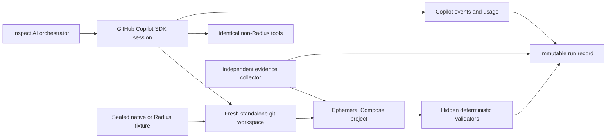

# Copilot + Radius Experiment Plan

## Status and authority

**Status:** canonical experiment design; implementation is planned unless a capability is explicitly marked implemented.

This document is the decision-ready plan for evaluating GitHub Copilot on the Radius Performance Demo. It governs treatment definitions, protocol, measures, analysis, integrity, and implementation sequencing. The focused specifications remain authoritative for their narrower contracts:

- [Agent evaluation details](agent-evaluation-spec.md): incident catalog, validators, scoring mechanics, and artifact detail.
- [Telemetry contract](telemetry-contract.md): stable metrics, PromQL, Radius identifiers, and telemetry adapter JSON.
- [Demo specification](demo-spec.md): interactive Radius Canvas presentation.
- [Implementation plan](implementation-plan.md): repository delivery phases.

Where this plan and the two focused specifications disagree, this plan wins. The agent evaluation spec and the implementation plan predate the decision to score on the Astronomy Shop with three arms, and their budgets, arm counts, and scoring weights are superseded where they conflict.

Operating rules for anyone working in this repository, human or agent, are in [`AGENTS.md`](../../AGENTS.md).

## Current state and next steps

This section is the handoff point. Update it in the same pull request as the work it describes.

**Owner decision, October 6, 2026: move the benchmark from Docker to Podman.**
The company no longer uses Docker. This supersedes the Docker execution target
below, not the historical measurements or their interpretation. Preserve all
Docker artifacts, fitted limits and qualification records as historical evidence;
none qualifies Podman. Do not fall back to Docker or alias its executable/socket.
The application and diagnostic telemetry must remain identical across all three
arms. No installation, VM/service startup, allocation change, model call,
cloud provisioning or live benchmark run is authorized by this decision.

The first prerequisite increment merged in
[PR #24](https://github.com/ryanwaite/radius-performance-demo/pull/24) and captures Podman engine and explicit
Compose provider identity without creating resources. Public legacy live driver,
footprint, pinning and holdout commands refuse rather than run Docker.
Read-only `doctor` remains available; per-project owned-resource cleanup internals
remain unchanged. The internal lifecycle is still Docker-specific, not an
alternate supported entrypoint. This is an inventory boundary, not a new runtime
framework or a runnable Podman benchmark. See the
[migration commands and remaining surfaces](../../benchmark/README.md#podman-migration).

The coordinating session initially found no Podman on its PATH. A subsequent
read-only child-session capture found `/opt/podman/bin/podman`, client/server
6.0.2, and an already-running libkrun VM. Machine inspection reported 5 CPUs and
3814 MiB; the reachable arm64 Linux engine reported 3783753728 bytes of memory,
rootful operation and cgroup v2/systemd. The inspected default connection was
`podman-machine-default-root`. This corrects the earlier PATH-only observation,
not the historical Docker evidence. No install/start/stop/resize ran.
`podman-compose` was absent on PATH; the installed Docker Compose was not used.
The owner still needs to select an approved provider and a benchmark connection.
The observed VM envelope is not a fit or eligibility verdict.

Raw read-only captures and offline policy/positive-control/mutation results live
in `../radius-perf-eval-artifacts/podman-migration-20261006-263f17ce/`.
The new inventory has its own fingerprint namespace, always says
`eligibleForTrials: false`, and never reads or writes Docker qualification
records or fitted limits. Missing provider identity leaves an incomplete
inventory while retaining the engine observations.

Before enabling execution, verify the selected Podman connection and VM envelope,
rootless/rootful context, cgroup version/manager and host-PID/cgroup probes,
applied CPU/memory limits, image identity, Compose normalization and labels,
internal networks/egress positive controls, published ports, resource ownership
and cleanup, and nonempty fresh telemetry/load evidence. Bind new host/runtime
identity and provider versions to newly fitted limits and qualifications. An
inventory fingerprint must never enter the existing Docker qualification path.
Repeat sandbox socket/path escape controls on the selected host without exposing
the Podman API to agents. Missing evidence remains failure, not an exception.

**Owner decision, October 8, 2026: use a customer-owned container recipe rather
than simplify the Shop to fit Radius limitations.** Preserve the full pinned
Shop core + full + observability + extras application and telemetry contract
across all three arms. Implement a small customer-owned derivative of the
pinned Kubernetes container recipe, adding controlled host mounts and
`readOnly` support while preserving existing defaults, secrets and connections.
This is not arbitrary Pod replacement or a new Radius core type. Record the
upstream recipe source and artifact pins and the derivative's exact changes;
the derivative is planned, not implemented by this policy.

Host mounts must be default-off behind a platform-owner-controlled gate and
approved host paths. Workload properties must not enable the gate, widen the
approved paths or override the platform's restrictions. Collector mounts must
be read-only. Do not change admission policies automatically or bypass a
cluster's rejection. Recipe packs cannot register duplicate resource types;
document and validate the intended replacement mapping or pack before any
separately approved registration. The October 6 inspected recipe artifact did
not read `platformOptions` or generate `hostPath`; do not use unsupported
`platformOptions` as if they implemented this contract. The upstream request is
[radius-project/resource-types-contrib#377](https://github.com/radius-project/resource-types-contrib/issues/377)
for host-path volume support.

The first implementation increment is offline only: validate recipe rendering
and the registration plan, preservation of existing behavior, and rejection of
disabled, unapproved or workload-overridden mounts, with nonempty inventories,
positive controls and guard mutations. Save raw results before summarizing
them. This documentation increment contains no implementation. Neither
increment authorizes publishing, registration into a live environment,
deployment, cluster provisioning, runtime changes, model probes or live tests;
each needs its separate applicable approval.

Keep these evidence boundaries separate:

| Evidence | Required conclusion and limit |
|---|---|
| Recipe behavior and registration | Offline output and controls establish only the pinned derivative's behavior and a valid registration plan. They do not establish that a live environment registered or ran it. |
| Application model and graph | Unblock accurate Radius authoring only when all authoring requirements are met, including the full application/telemetry inventory, native configuration and source references. Capture the actual graph through the extension. Host-mount support alone cannot make a partial model complete. |
| Podman runtime compatibility | Verify the Collector `docker_stats` receiver's actual API calls, socket location/access/security and the meaning of `/hostfs` on the selected host/VM. Podman's compatibility API and host-path support are not receiver compatibility or host-metric evidence. Podman remains unqualified after PR #24. |
| Kubernetes deployment | A separately approved target and deployment need their own rendered/applied workload, admission and fresh telemetry evidence. Do not infer Docker receiver compatibility on containerd, hostfs meaning or successful deployment from recipe rendering. |

Podman Compose and Kubernetes remain separate targets; no new Kubernetes
runtime or cluster is selected. Do not simplify the application, omit telemetry,
silently disable unsupported receivers, accept empty metrics or report a
partial model as success. Recipe support, graph completeness and deployment
evidence do not individually establish trial eligibility; the treatment,
runtime and trial gates remain in force.

**Scope decision, September 30, 2026:** evaluate the combined Radius repository experience. The owner removed separate graph-only, skills-only, and factorial experiments. The native and architecture-document controls remain. [Completion and reporting plan](benchmark-completion-plan.md) defines the delivery sequence and the approved local HTML dashboard with JSON/CSV downloads.

**Owner decision, October 2, 2026:** prioritize exploratory learning before
confirmatory publication. Keep the three arms, completed M2 contracts, SQLite
journal, verified exporter and dashboard. Connect one real externally injected
Shop fault and its healthy counterpart, then a small fixed development batch
with one model. The [exploratory policy](#exploratory-learning-path) below records
the approved direction and the settings still requiring approval. It does not
authorize model requests or declare formal M1/M4 acceptance complete.

**Baseline:** [PR #19](https://github.com/ryanwaite/radius-performance-demo/pull/19)
merged on October 1 at `ed56c60861e07b20440e242d7a58b4dc10c0c90f`.
M2's contracts and human-adjudication reference are complete; no live three-arm
comparison exists. The exploratory policy subsequently merged in
[PR #20](https://github.com/ryanwaite/radius-performance-demo/pull/20).

**Owner-directed fixture preparation, October 2, 2026:** keep OpenTelemetry
Astronomy Shop 3.1.0 at `dedc0178918e260823323b8d95005a8cb924b007`.
Prepare standalone source workspaces now; the owner will help verify the Radius
installation and generate the real application graph. Use the latest Radius
available at that setup, then record and freeze the exact installed Radius,
tool and skill versions and graph inputs before comparisons. The exact release
is not known yet. This does not authorize an automatic installation or upgrade,
extra model calls, or a floating version during trials.

The source-preparation module now exports the pinned public application, not
this benchmark checkout, and materializes independent native, architecture and
Radius authoring repositories. All start with the same source bytes and one
synthetic Git baseline. The source tar, per-file hashes/modes, exclusion and
common-change inventory, preparation receipt and pending treatment differences
stay outside the copies. No host configuration, source history or `.env` file
is copied. Upstream licensing, service source/tests, Compose manifests and
ordinary telemetry assets remain; a neutral README and non-secret source
defaults explain the export. This is source preparation, not a live deployment.

The concrete handoff is
`../radius-perf-eval-artifacts/shop-authoring-20261002T192813Z/prepared/`;
the owner's Radius workspace is `workspaces/radius/` below it. The sibling
`workspaces/native/` and `workspaces/architecture/` are source baselines, not
completed experimental controls. The
[recreation commands and handoff](../../benchmark/README.md#shop-source-authoring-workspaces)
describe the artifact files and limitations.

**Owner-approved GitHub authoring handoff, October 2, 2026:** the standalone
prepared checkout lacked the GitHub backing required by the Radius authoring
tools. The owner approved creating private
[`ryanwaite/astronomy-shop-radius`](https://github.com/ryanwaite/astronomy-shop-radius).
The coordinating session created and verified that repository with `main` at
`12dbef5dfde1df1b902ca74b7d2b03ada89eceef`, tree
`7d9c5587e18627943c8237229b1fea0293c958b5`. It checked every tracked file against
`source.manifest.json` and the clean synthetic baseline before pushing.
There were no local setup changes; no benchmark files or credentials were
uploaded. The existing `workspaces/radius/` now has
`origin` set to `https://github.com/ryanwaite/astronomy-shop-radius.git`, and
`main` tracks `origin/main`. Native and architecture siblings remain unchanged
and unpublished. No Radius installation, generation or model call ran.

That checkout is now a **GitHub-backed authoring checkout, not a scored trial
workspace**. The prior source receipt is immutable historical evidence of
preparation, not an attestation that this checkout is still remote-free.
Do not rewrite it to describe the new remote. No remote-free trial seal exists;
the source-only draft remains ineligible. During assisted setup, inventory
GitHub dependencies by authoring versus diagnosis capability under the
[authoring and diagnostic access boundary](#authoring-and-diagnostic-github-access).
This assessment does not block source preparation or other fixture work that
does not depend on a runtime access decision.

**Merged model and offline import, October 3, 2026:** the owner generated the
application model and merged
[ryanwaite/astronomy-shop-radius#1](https://github.com/ryanwaite/astronomy-shop-radius/pull/1)
at `dce2f8f596e2eda9d7d07c114cb44749dc27acb0`. The complete committed difference
adds only `.radius/.gitignore`, `app.bicep`, `app.origin.json` and
`bicepconfig.json`. `radius_perf_eval.radius_overlay` imports that exact overlay
over the independently reconstructed native source, produces complete difference
and setup inventories, and recreates standalone native/Radius draft baselines.
It preserves the source tar's CRLF batch files in both arms while explicitly
accounting for their pre-existing Git normalization. Owner workspaces and
historical receipts are unchanged.

The [static review and generation trace](radius-overlay-review.md) distinguish
raw model hash `c6bfefa7fd5d2577bcb764e7a4f0dc2d6bddd416541623312b09ecff24df74e1`
from the Radius-normalized origin hash
`81cf697706f4584d4ef93f66d7e75a573b9b7e6a418601eca0f54d0039e65f59`.
The origin is valid; an initial raw-hash comparison was corrected, not treated
as a regeneration requirement. The generation log shows that the author chose
the core Compose profile before writing Bicep. Full-profile application services
and shared diagnostics active in the benchmark are absent from the model.
Required Flagd UI settings and database bootstrap are missing even within core.
These are authored-model/runtime-contract findings, not evidence that the graph
renderer discarded resources. Literal source references resolve, but that does
not prove deployed parity. Raw captures and offline guard-mutation logs remain
under `../radius-perf-eval-artifacts/radius-import-20261003/`.

**M3 remains incomplete.** The real model and Bicep configuration now exist.
The owner reported a generated graph; retained history shows a ready graph and
an empty missing-reference query, not a complete graph inventory or deployment.
Repository tools/skills were not added; app-hosted exposure and installed
CLI/extension/tool versions remain unverified. The type alias `radius:0.61`
does not identify the installed CLI. The treatment is draft and unsealed.
Next, implement and validate the approved customer-owned recipe offline, then
correct/validate the full application's selected profiles and native contracts
only when all authoring requirements are met,
then capture actual graph and diagnostic tool/skill access in the application
session through the extension. Keep diagnostic GitHub policy unchanged pending
explicit owner approval. Do not run the Radius executable directly.
The architecture document must follow validated Radius
facts and the approved isolated-author policy, including request approval,
provenance and token parity; it has not been written. Empty difference lists
are labelled pending, not successful parity checks. Public built-in flag code
remains unchanged for source authoring; there is no selected incident and no
incident-specific leakage clearance. Optional recorded LLM conversations were
excluded, so that optional upstream replay profile is not runnable as exported.
The source manifest, preparation receipt and imported Radius draft say
`eligibleForTrials: false`. No extra model requests, architecture authoring,
live Shop activity or cloud resources were used for this import.

Offline source and guard-mutation controls passed with Docker unreachable.
The existing Shop driver regression checks also passed. Raw logs, including
the earlier interrupted and failed mutation-control runs, are preserved in
`../radius-perf-eval-artifacts/shop-fixtures-20261002/`; use `pytest-final.log`
and `pytest-driver.log` for the final outcomes. The real source inspection
and repeated-baseline receipts live alongside the handoff. They establish
identical exported source and reproducible Git baselines, not running-service
equivalence, runtime confinement or agent usability.

**Merged in PR #14:** the [offline dashboard](../../benchmark/dashboard.html) imports `radius-comparison-v1` reports, displays descriptive per-model comparisons and exclusions, and downloads full JSON or filtered CSV. It has an empty initial state, rejects inconsistent reports, and hides interim scored-arm results. It is not connected to a campaign runner yet. The offline exporter described below implements the M2 reporting boundary; authenticated Shop evidence and pre-registered analysis remain M5/M6/M8 work.

**M2 answer/outcome increment, not milestone completion:** the submit tool now
accepts directed `connection: {source, target}` answers, canonicalizes endpoints
through the fixture mapping, rejects conflicting name mappings, and retains
malformed submission calls. Schema acceptance is explicitly separate from
causal validation. A shared diagnosis gate compares the hidden fault claim,
category and component or directed edge. It requires an incident-owned review
of every citation, with nonempty examined references. The outcome resolver
requires independent diagnosis/evidence, scope, safety and cleanup results,
uses canonical terminal classes, and preserves the agent result when a harness
failure overrides it.

Offline planted controls exercise those boundaries using labelled synthetic
captures, not Shop incidents or scientific results. They reject wrong targets,
reversed edges, wrong categories, correlated signals, fabricated observations,
and wrong healthy/fault claims. They do not establish a production mechanism
grader, telemetry authenticity, incident activation or healthy detection
coverage. Real incident reviewers and their trial binding remain unbuilt.
Historical catalogue and smoke/session records are not promoted to campaign
results. The following increment adds the assignment roster, durable attempts,
retry/exclusion reduction and source-backed redacted report boundary. Neither
increment changes M1 or authorizes live calls.

The offline command, guard/call-wiring mutation controls and full-suite logs
are retained in `../radius-perf-eval-artifacts/m2-contracts-20261001-07ac055e/`.
Earlier failed schema and mutation-control runs remain there as well. Docker
was unreachable; no model calls, environment runs or cloud resources were used.

**M2 bookkeeping/report increment:** the offline
campaign store freezes the complete three-arm roster and requires its preparation
receipt on reopen. An append-only SQLite journal preserves starts, raw captures
and canonical terminal records across restart. Only a harness failure permits
one retry after its block's first attempts finish; a second excludes the logical
assignment. Reduction counts assignments once and keeps every attempt and its
agent class. Unfinished or malformed evidence cannot become an outcome.

The exporter replays an explicitly registered, source-pinned verifier against
captured bytes, checks assignment binding, canonical outcome structure and actual
validator references, and compares the saved result with replay. Its
`radius-comparison-v1` report contains the full roster and allowlisted fields,
not logs or submitted prose. Digests reference the actual canonical terminal
bytes. Final-attempt metrics and retry-inclusive accounting remain separate.
The dashboard now represents the first harness failure waiting for retry as
`running` with one attempt and one failure, without inventing a second attempt.

Offline controls use a test-only exact-observation reviewer. They cover
interruption/resume, duplicate and foreign artifacts, checksum/grade forgeries,
retry/exclusion denominators, healthy/fault claims and generated reports through
the shipped dashboard. The source hashes are not signatures or proof of
scientific validity. There is no qualified Shop verifier, authenticated telemetry
producer or live scheduler. The default generic CLI
refuses terminal export without a trusted verifier. M5 still owns live binding,
randomized execution, interruption/cleanup recovery and campaign-stop thresholds;
M6 owns the incident controls. See the
[bookkeeping contract](../../benchmark/README.md#m2-campaign-bookkeeping-and-export).

**M2 contracts and reference path complete under the approved human-adjudication
policy:** the
[criterion accounting](../../benchmark/README.md#m2-exit-criterion-accounting)
maps each exit requirement to its implementation and offline controls.
The owner kept the answer schema, rejected the bounded-grammar proposal and
approved an incident rubric with human causal-prose adjudication. The
`adjudication` module now produces blinded review packets and explicitly ingests
human decision files. Packet/rubric digests bind decisions to each answer and
its evidence. An unknown or ambiguous review leaves the attempt open without a
terminal result or harness retry. A wrong mechanism fails independently of the
category/target checks. The reference CLI finishes canonical outcomes and exports
them through the source-replaying store into the shipped dashboard.

The CPU-quota reference checks raw quota/counter measurements, source binding,
scope/action/cleanup inventories and accounting inputs. Human rubric decisions
judge the mechanism and each citation's relevance/support; no parser or model
judge infers semantic correctness. Offline tests plant explicit decisions,
including contradictions, negation, wrong mechanisms within the same category,
fabricated observations, correlated symptoms and correct unfamiliar phrasing.
They establish decision/gate wiring, **not human agreement or a qualified Shop
grader**. The reference remains barred from scored campaigns. Live producers,
operational blinding, actual activation and reviewer/library qualification
remain M3/M4/M5/M6 work. No reference-only capture is a scientific finding.

Raw offline results, including failed guard-mutation and collection attempts,
are in `../radius-perf-eval-artifacts/m2-attempts-20261001-07393aba/`. The local
locked environment was restored through CFS after the missing-environment
failure. No model request, live Shop run, cloud resource or runtime change was
used. M1 findings and deferred tracing permissions are unchanged.

**M1 implementation, not yet accepted:** a `shop` driver command now renders the pinned Shop with offline startup assets, an internal backend network, a loopback ingress, and blocked flag/control routes. It calls deployment, readiness, flag, CPU and load gates, saves evidence before judging it, and verifies cleanup. The public upstream `.env` is now tracked. The load script omits only `ask_agent`; the Apache-2.0 OpenSearch plugin is pinned for Linux ARM64 and AMD64. CPU readers resolve actual cgroup paths through host PIDs. The footprint tool emits a host-labelled kernel-demand report.

The owner's approved local check exposed an unset-variable comparison bug, which is fixed, then stopped at Grafana's datasource-health gate. The plugin loaded, but reported `Index not found: otel-logs-*`; the collector also logged permanent OpenSearch mapping failures involving `attributes.http` and `http.request.method`. These are measurements, not a diagnosis of the full ingestion failure. Cleanup succeeded on the failed attempts. M1 remains open until shared telemetry works, the plugin's live negative control passes, and a healthy load window passes. No comparison, model call, qualification campaign, or cloud provisioning has run.

**Telemetry investigation correction:** the follow-up run `radius-eval-shop-cfa0b4b8433f` found a nonempty dated log index with a valid timestamp mapping. The missing-index message did not prove absent ingestion. The pinned plugin's health implementation looks up the literal wildcard in a response keyed by concrete index names. A derived Grafana datasource now uses `[otel-logs-]YYYY-MM-DD` with `interval: daily`, without changing container or plugin versions. Its input and output are hashed with the startup assets. The driver also rejects the plugin's nominally successful responses for missing or mistyped timestamp fields.

The isolated live control `radius-eval-shop-9b17c82ee06f` demonstrated daily-pattern health and a Grafana PPL query over synthetic records. An absent index and a removed plugin both failed; teardown left no resources. This was not application-ingestion acceptance. A separate mapping experiment found that OpenSearch 3.7's `disable_objects` preserves scalar and dotted attribute fields and their numeric queries, but still rejects a nested object sharing a scalar field's name. That candidate was not shipped in PR #14. No `flat_object` conversion or reduction in typed query capabilities has been approved or applied.

The application experiment `radius-eval-shop-6dbbb5769f15` installed that candidate template before starting the collector. Grafana returned log data, and the saved OpenSearch sample contains actual Shop service logs, including both `http` and `http.request.method` attributes. The captured collector log tail had no mapping/export error, but the exporter-metric query returned an empty vector, so zero data loss is **not established**. The measurement reached the CPU gate and failed on checkout throttling. Raw load boundaries and cgroup counters were saved, and cleanup succeeded. Do not promote the mapping candidate or refit CPU limits from this observation alone; complete the ingestion controls and demand measurement first. Docker allocation, service limits, and version pins were unchanged.

**Merged in PR #15:** the shared Shop/footprint startup now starts
OpenSearch first, installs and reads back the typed attribute template, then
starts producers. The template is hashed in render provenance. Derived collector
configuration keeps the upstream OTLP telemetry reader and adds an internal-only
direct metrics reader. Source and derived configuration hashes are verified at
render time. No attribute is dropped or flattened.

The empty metric query above was not evidence of unavailable counters.
`radius-eval-shop-413d2a28701f` observed them after a periodic export, but also
recorded an unrelated failed Prometheus metric export. The new log witness
therefore does not depend on delayed Prometheus telemetry. It brackets an index
refresh/count with direct collector counters in one probe container, requires
stable accepted counts, and reconciles accepted records with both exporters and
the complete index count. Missing counters, nonzero failures, partial shards,
collector replacement/restart, and a bracket that never stabilizes fail closed.
This proves accounting for **collector-accepted logs through the captured
boundary**, not that an application SDK emitted every possible log. Absent
failure-only series are not converted to zeros or used as the proof.

`radius-eval-shop-93bde23ed9e4` passed both ingestion boundaries around a healthy
load window with unchanged zero-lifetime-throttling gates. An OTLP probe preserved
scalar `http`, dotted `http.request.method`, and a numeric attribute in `_source`;
numeric range and average queries passed. Grafana returned actual Shop logs
through `/grafana/api/ds/query`. A deliberately incompatible nested `http` value
produced an export failure that the witness rejected, and removing the plugin
failed health. The nested-map limitation remains real, not hidden by a
`flat_object` fallback. This acceptance is for the pinned Shop's observed fields,
not arbitrary future schemas.

The exact documented environment command passed in
`radius-eval-shop-72c84caeafb3`. Its journal contains raw boundaries, complete
Grafana logs, and the generated Grafana source/provisioning inventory. The
logged-destination audit found no unexplained candidate; its startup coverage and
planted external-destination controls prevent an empty log from passing. It
cannot observe unlogged outbound attempts. The hashed file inventory found no
literal fault-flag or `flagd` reference, but is not M3's semantic leakage verdict.
Dashboards and provisioning were not rewritten.

`astro-footprint-20260930T165306` exercised the shared startup, host-labelled
footprint, raw cgroup-demand stream, load boundaries, and verified cleanup.
`radius-eval-shop-413d2a28701f` also recorded bounded checkout demand with no
throttling. These samples do not explain the earlier intermittent checkout
throttling or justify changing fitted quotas. All named attempts preserved their
raw records beside the checkout and verified cleanup. CPU limits, Docker
allocation, image/plugin/runtime pins were unchanged. No model request, cloud
provisioning, or qualification campaign ran.

Offline controls ran with Docker unreachable. The ingestion test module mutates
each rejection guard and its Boolean conditions; the separate lifecycle/asset
mutation journal at `m1-offline-1790813063` has no surviving mutations.
`m1-offline-1790813018/final-pytest.log` preserves the full-suite outcome.
Earlier failed reconciliation and mutation attempts remain in the artifact
directory rather than being overwritten.

**Merged in PR #16:** the environment driver now checks
direct metric-export counters and requires fresh stored Prometheus samples
before and after the healthy load window. It waits for the existing periodic
self-telemetry export rather than interpreting an empty query as zero loss.
Each backend exporter counter must reach its direct-read lower bound and
carry the current collector instance. Range-vector sample timestamps, not
instant-query evaluation timestamps, establish freshness. Observed metric
send, enqueue, receiver failure or refusal counters reject the attempt.
Missing or stale backend evidence times out; collector replacement and
counter regression also fail. Raw observations are journaled before judgment.
Failed environment attempts retain complete collector and Prometheus logs,
not only the combined log tail.

`radius-eval-shop-757f8b7374b2` captured a bounded reproduction attempt with
full backend logs and repeated direct/Prometheus readings. It did **not**
reproduce the earlier permanent HTTP 500. That earlier rejection's root cause
remains unknown; no speculative configuration repair was applied.
`radius-eval-shop-bc65f8391e84` passed the exact documented calibration command,
both fresh metric boundaries, log accounting, and the unchanged CPU/load gates.
`radius-eval-shop-a01cc2841397` observed an empty query that the readiness
predicate rejected. It then sent deliberately conflicting metric samples,
observed a permanent HTTP 400 and a nonzero direct export-failure counter, and
verified that the metric gate rejected it. The planted HTTP 400 is a positive
detector control, not a reproduction or explanation of the historical HTTP 500.
All these attempts verified cleanup.

The new witness establishes fresh collector self-telemetry reaching Prometheus
and rejects observed metric-export failures. It is not metric-by-metric
accounting, application-SDK completeness, a scrape-success guarantee, or a
substitute for the stronger direct log-accounting witness. Absent failure-only
series remain absent, not reported zeros. No telemetry configuration, diagnostic
query semantics, pin, CPU limit, or Docker allocation changed.
Offline fault and guard-mutation controls and the full-suite outcome are saved
in `m1-metrics-20261001`; the earlier failed mutation attempt remains there too.

**M1 semantic audit increment:** the offline Grafana extractor now records
every parsed dashboard JSON leaf and every provisioning/configuration line,
including comments, with source hashes and locations. Planted nonliteral hints
and guard mutations exercise extraction and coverage failures; extraction
never reports a semantic clearance. The [source assessment](../../benchmark/README.md#grafana-semantic-review-evidence)
records cart-specific latency guidance, the Jaeger dependency graph,
service-selected defaults, and queue/drop/export mechanism explanations.
These are observations of source contents, not findings that a hidden incident
has leaked or that live dashboards have been cleared. M3 must compare the
sealed fixtures and incident set, and the owner must review the retained risks.
No dashboard, alert rule, telemetry capability or treatment parity changed.
Raw source inventories and offline results are in `m1-audits-20261001`.

**Owner decision, October 1, 2026:** finish the semantic audit now; defer tracing
approval. Do not implement packet/syscall tracing or acquire new instrumentation
permissions in this increment. Blocked curl connections and Grafana logs do not
cover every application's outbound attempts. Packet capture would still miss
calls rejected before emitting packets; socket polling can miss brief calls.
A future approved design needs service/startup coverage, IPv4/IPv6/DNS scope,
probe attribution, positive controls and observer-loss/perturbation evidence.
The [observation boundary](../../benchmark/README.md#outbound-attempt-observation-remains-open)
records alternatives without choosing an unapproved instrumentation architecture.

**M1 remains open:** after observation scope is approved, extend outbound-attempt evidence beyond Grafana's logged
destinations, investigate the observed startup metric-export failure, and
establish repeatable healthy acceptance rather than infer it from bounded
samples. Host fit/holdout still needs separate approval. Incident-phase
activation and sealed-fixture leakage enforcement remain M5/M6 and M3 work.

**Owner decision, September 30, 2026:** repair the shared telemetry configuration rather than change the pinned container versions. Apply the repair identically to all three arms and preserve the telemetry available for diagnosis. Derive changes from the vendored inputs, record their hashes, and demonstrate ingestion and Grafana queries with actual application logs. Do not hide the failure by dropping conflicting attributes, relaxing the datasource gate, or counting an empty index as evidence. This decision does not authorize model calls, a multi-hour qualification run, or cloud provisioning.

**Implemented on `main`:**

- The Go catalogue application with MySQL and Valkey paths, Prometheus metrics, a Compose stack, k6 load, and Kubernetes manifests. It is the harness development fixture, not the scored application.
- The Copilot SDK harness: fresh sessions, one pinned model, event capture, usage accounting, and budget enforcement on wall clock and tool calls (PRs #1 and #3).
- The Compose trial driver, with unique project names, verified cleanup, and a determinism suite that passed its holdout on the catalogue application (PR #4). Its per-service checks are generated from the Compose file (PR #8).
- CI that installs Python dependencies by hash from PyPI, checks the export against `uv.lock`, discovers every test module from disk, and runs the whole suite with the Docker daemon unreachable (PR #7).
- The runtime sandbox, applied before the first prompt and verified on every tool execution including unfinished ones; the static screen off inside the sandbox; trial budgets; the submit tool with ten defined causal categories; and trial outcome records (PR #9).
- Host qualification by observed class and fingerprint; the Astronomy Shop 3.1.0 vendored with its isolation defects removed; uniform CPU limits verified by zero lifetime throttling; per-service readiness; the flag-off gate; and the offered-load gate on healthy cycles (PR #11). Six defects from review of #11 are fixed (PR #12): the CPU limits refuse to load on a host class other than the one they were fitted on, and the class is inside the verified hash; a requalification record counts only against the tolerance set it was made for; each trial gets its own copy of the flag file; the footprint tool tears the stack down when interrupted.
- PR #14 integrated the Shop environment driver and offline startup assets. PR #15 added typed telemetry bootstrap, log accounting, and scoped Grafana inventories. PR #16 added metric-export acceptance and full backend failure diagnostics. This increment adds offline semantic review evidence, not tracing or sealed-fixture acceptance. The catalogue determinism runner remains separate.

**Next, in order.** These steps replace the previous publication-first queue,
not its formal acceptance criteria.

Podman migration is now a prerequisite for any live step below. The
inventory/refusal boundary is implemented; next select the provider and validate
runtime-specific capabilities on the owner's installed/configured Podman with
separately approved bounded runs.
*Exit:* actual engine/provider/context and capability evidence supports a new
host/runtime identity, fitted limits and eligibility decision. Docker evidence,
an installed executable or a successful Compose render does not meet this exit.
Offline treatment and incident integration work can proceed independently.

1. **Finish owner-assisted treatment setup.** The exploratory policy merged in PR #20. The real model is now imported from the GitHub-backed [Radius authoring repository](https://github.com/ryanwaite/astronomy-shop-radius), but the [static review](radius-overlay-review.md) identifies profile and native-runtime gaps. First implement the approved pinned customer-owned recipe derivative with offline controls and a validated registration plan. Preserve the full core + full + observability + extras contract; do not simplify the Shop or omit telemetry. Once all authoring requirements are met and applicable approvals obtained, resolve model gaps in the application repository, verify the actual graph through its extension, then freeze exact installed tool/skill/model inputs. Keep recipe, graph, Podman compatibility and Kubernetes deployment evidence separate. Inventory authoring versus diagnostic GitHub dependencies; bring any required runtime access revision to the owner before relying on it. Obtain the authoring request allowance before generating the architecture document from validated facts. Review the final artifacts against the selected incident and finalize declared treatment differences. *Exit:* real Radius access and source references work, architecture parity is measured, and all three treatment artifacts pass their own sealing checks. Offline recipe support, source preparation, an imported draft and the GitHub-backed authoring checkout do not meet this exit.
2. **Connect one real Shop incident and healthy counterpart to M2.** The current `ShopEnvironment.run_healthy` tears down after an environment sample, `incidents.py` injects only the catalogue MySQL case, and `CPUReference` accepts operator-attested reference captures. Build the narrow Shop lifecycle/capture binding, external injector and incident rubric, plus the three sealed fixtures needed to exercise them. Reuse the existing SDK, sandbox, submit tool, store and exporter. Agree the target, window criteria and run settings before code relies on them. *Exit:* fault/healthy activation, delivered load, agent-visible telemetry, scope, safety and cleanup have real trial-bound producers and positive/negative controls; hidden answers are isolated, fixture parity and Radius access are checked, and actual evidence can enter the existing human-review/export path. No reference capture is relabelled as Shop evidence.
3. **Run the bounded integration comparison after explicit approval.** Request the expected model/premium requests and runtime, including fixture authoring and confinement probes. Use fresh sessions, matched settings and randomized arm order for the fault and healthy cases. *Exit:* the complete roster and all attempts survive through human adjudication, the independent audit, verified export and dashboard; unfinished reviews remain visible. Record request usage, agent time, setup and human-review cost. Report integration observations, not scientific findings.
4. **Use a small fixed development batch to improve Radius.** Choose cases, one model, budgets and validity rules before the batch; request its allowance using measured integration costs. *Exit:* both control contrasts, case outcomes, healthy false alarms, failures, missing reviews and costs are interpretable; a versioned Radius change has a stated expected benefit and regression check. Periodically rerun controls under matching settings.
5. **Freeze a candidate, then evaluate untouched cases.** Retire holdout cases to development if their results guide tuning. Pursue the broader confirmatory milestones only when the development results justify them. *Exit for publication:* complete M1/M4 acceptance, qualified incidents/reviewers, powered pre-registration, separately approved hosts and runs, and reproducible analysis/downloads under M6-M8. Those requirements remain incomplete, not waived.

## Exploratory learning path

The owner approved the simplification recommendations on October 2, 2026:
"Great, I agree with all of the recommendations about keeping this from being
overengineered. Let's proceed." The assessment, `benchmark-engineering-assessment.md`,
was written on October 1 against PR #19 commit
`5c2fc45fb031a3099803c8eda842106061d85b77`, while that PR was open. It is historical
rationale, not a second policy authority. This plan records the decision after
M2 merged.

### Purpose and retained safeguards

Exploratory work asks what to improve in the combined Radius experience.
Confirmatory work tests a frozen claim on cases not used for tuning. Start with
one real externally injected Shop fault and a healthy counterpart across native,
architecture-document and combined-Radius arms. Only then choose a small fixed
development batch with one model. The assessment's example, four faults plus a
healthy case across three arms with two repetitions, is illustrative, not an
approved roster, request allowance or powered design. Sessions are not billable
requests. Measure usage and runtime in the approved integration run before
requesting a development allowance.

Keep matched non-treatment settings, fresh sessions, randomized arm order,
sealed fixtures, hidden-answer isolation, effective sandbox confinement,
diagnosis-only write prohibition, safety and verified cleanup. Require actual
delivered-load, fault-activation and retrievable telemetry evidence, with
positive controls; missing evidence cannot pass. Preserve the full planned
roster, raw measurements, failures and limitations. Only a harness failure
permits the existing once-after-block retry on the same assignment; a second
excludes it. A valid wrong answer is never retried. Repeated infrastructure
breakage calls for repair, not a winner among whichever arms finished.

Retain automated target/measurement/integrity checks, human mechanism and
per-citation review, and the independent blinded audit in
[Validating graders](#validating-graders). Missing or ambiguous review stays
unfinished, not a success, failure or retry opportunity. Preserve the blinding
limitations and record review time separately. The synthetic CPU reference
remains an offline control, barred from scientific findings and scored use.

Review sealed repository contents and telemetry surfaces for actual
incident-specific answers or shortcuts. Preserve ordinary diagnostic guidance
and shared Grafana capabilities equally across arms; a useful hint is not by
itself evidence of leakage.

### Exploratory environment eligibility

Formal M1 environment acceptance and M4 host qualification remain incomplete.
Exploratory eligibility is a separate, explicitly recorded decision, not a
qualified-host claim. This policy permits an exploratory path before those
formal milestones; it does not make the current driver eligible by itself.

Distinguish a recovered startup disturbance from a problem affecting the
healthy baseline or diagnosis window. Preserve startup failures and cumulative
counters, mark phase boundaries, and require affirmative recovery and usable
baseline/diagnosis evidence rather than resetting history or relying on averages
that hide bursts. The historical startup HTTP 500 and intermittent checkout
throttling remain unexplained. Accidental faults during diagnosis invalidate
the comparison. A declared, independently verified CPU-quota fault must be
distinguished from accidental pressure on the target, other services or load
generator; it is not a blanket throttling exception.

The existing confirmatory zero-lifetime-throttling rule and other implemented
guards remain unchanged. The assessment did not settle numeric stability
thresholds, window durations or which observed startup failures qualify as
recovered. The owner must approve concrete criteria before a separate
implementation changes gate behavior or a run relies on an exception. Do not
silently promote calibration samples or weaken load/telemetry checks to obtain
an exploratory verdict.

Full outbound-attempt tracing remains deferred. Keep current isolation and
state the observation limits; Grafana logs and blocked connections do not prove
no application attempted egress. No new tooling or tracing permissions are
authorized. Comprehensive tracing and exhaustive negative proofs are not
prerequisites for this exploratory path.

### Development loop and remaining decisions

Use the laptop, M2 journal, verified exporter, file-based review and dashboard.
Defer broad incident/model libraries, cloud scale, new review infrastructure,
formal inference and publication packaging. Report descriptive wins, losses
and ties against each control, underlying denominators, case outcomes, healthy
false alarms, unfinished/excluded work, and measured time/tool/request costs.
Inspect traces to distinguish Radius usability problems from reasoning,
environment or grading failures. Small or inconsistent differences are
inconclusive, not equivalence; a faster wrong answer is not progress.

Version each Radius change on development cases and state its expected benefit
before running it. Compare predecessor and candidate under matching conditions;
periodically rerun both controls. Freeze a candidate before untouched holdout.
Tuning from holdout results retires those cases to development; a new seed alone
does not make a case independent. Broad claims still require the confirmatory
design below, including qualification, power and pre-registration.

Before the first live integration, the owner still needs to approve the real
fault mechanism/target and healthy evidence/rubric, concrete exploratory
stability/validity criteria, one model and matched time/tool settings, and the
expected request/runtime allowance. Development batch size follows measured
integration costs. Existing confirmatory numeric defaults are not an approved
exploratory budget or validity exception. This policy authorizes no model call,
cloud resource, long run, allocation/version change or unrelated Docker cleanup.

## Purpose and research questions

The experimental unit is the **complete GitHub Copilot harness plus a selected model**, not an isolated raw LLM. Results therefore characterize a pinned Copilot runtime, model, tools, repository fixture, prompt, budget, and incident version.

### Primary product question

Does the combined Radius repository experience make GitHub Copilot more successful and efficient at diagnosing performance incidents than a native repository or a native repository with architecture documentation?

The primary treatment is the complete repository experience that a developer would adopt. It includes the Radius application model, graph access, stable identifiers and source references, repository configuration, and generic Radius skills.

### Secondary questions

- How much one-time effort is required to Radius-enable the repository?
- After how many tasks does operational benefit plausibly amortize that preparation cost?
- On which incident and task classes does Radius help, have no effect, or hurt?
- Does the combined experience improve remediation correctness, recovery, and safety in a separately approved later extension?
- Does an agent use the available graph and skills, and does use correlate with outcome?

### Combined-treatment scope

The primary campaign's Radius-versus-native contrast estimates the effect of the **fully Radius-enabled repository treatment**. It cannot attribute the result to the graph alone because the treatment also changes repository files, instructions, skills, identifiers, and tool affordances.

Separate graph effects, skill effects, and their interaction are out of scope. No graph-only, skills-only, or factorial campaign is required to complete this project. Conclusions apply to the pinned Copilot harness, models, tasks, fixtures, and benchmark version, not to universal benefit for every repository.

## Primary conditions

| Surface | A. Native repository | C. Native with architecture document | B. Fully Radius-enabled repository |
|---|---|---|---|
| Application source and tests | Same frozen snapshot | Same frozen snapshot | Same frozen snapshot |
| Compose and Kubernetes manifests | Included | Included | Included |
| Telemetry and load tools (Prometheus, Jaeger, OpenSearch, Grafana) | Included | Included | Included |
| Ordinary repository instructions | Included | Included | Included |
| Hand-written architecture document | Absent | Included and frozen | Absent |
| `app.bicep` | Absent | Absent | Generated, corrected if necessary, validated, and frozen before trials |
| Radius repository configuration | Absent | Absent | Included and frozen |
| Radius application graph | Not available | Not available | Available with stable resource/connection IDs and source references |
| Radius skills | None | None | Generic, repository-scoped procedural skills |
| Scenario-specific hints | None | None | None |

Arm C is an active control. It answers the first question a skeptic will ask: does Radius beat a well-written description of the architecture? Without it, a Radius effect could mean only that any architecture description helps. The document in arm C states the same facts the Radius graph encodes: services, dependencies, endpoints, and where each is defined in source. A fresh Copilot session writes it, given only the Astronomy Shop source and the list of facts the Radius graph encodes. It never sees this plan, the incident set, or the injectors, and its model, prompt, and transcript are kept with the fixture. The author is Claude Opus 5 at high reasoning effort, a pilot model that no scored trial uses. Its prompt is committed with the benchmark code, and the fact list is generated mechanically from the validated `app.bicep` rather than written by hand. "Radius additions" means every file in the native-to-Radius difference manifest, and both sides are counted with one named tokenizer. Its length is within 20 percent of the Radius additions, measured in tokens, and it passes the same leakage scan. The prompt does not mention it.

The Radius-enabled fixture must describe the deployed application and how to use Radius. It must not encode incident answers, expected root causes, scenario thresholds, or scenario-specific remediation.

Radius setup occurs before timed trials. All three fixtures are frozen and hashed. `app.bicep` is not regenerated per trial, because generation time and variability would confound task execution. One-time setup cost is recorded separately.

### Variables held constant

- Neutral task prompt and structured output requirement.
- Application source behavior, tests, telemetry, load, and incident seed.
- Non-Radius tools and permissions.
- Selected model and model version or provider snapshot.
- GitHub Copilot SDK and CLI versions.
- Reasoning effort and sampling configuration.
- Budgets. Wall clock and tool calls are capped. Model calls, tokens, AI credits, and cost are recorded and identical in policy across arms, but not capped per trial.
- Cold-context policy and fresh Copilot session.
- Environment driver and benchmark host class.

The initial benchmark disables automatic model routing, fleet execution, subagents, and cross-trial memory. Each trial uses one explicit pinned model in one fresh Copilot session.

### Neutral task prompt

The task must not mention Radius, an application graph, cache, or the expected cause. Scenario-visible symptoms and success requirements may vary, but the core prompt remains neutral.

> Operators are concerned that the application may not be meeting its service objective under the supplied workload. Using the repository and runtime evidence available to you, determine whether there is a problem. If there is, return the causal category, affected component or dependency, supporting evidence, confidence, and the smallest safe remediation. If there is not, say so and give the evidence. In remediation mode, implement and validate only the changes necessary to restore the objective without weakening health checks, tests, or source-of-truth guarantees.

The prompt must not tell the agent which tool or repository artifact to inspect. It does not assert that a fault exists, because some trials are no-fault controls in which the correct answer is that there is none.

The agent answers by calling a submit tool with fixed fields:

| Field | Form |
|---|---|
| `faultPresent` | Boolean |
| `causalCategory` | One value from a fixed list of about ten categories, the same list in every arm |
| `component` | The affected service. Compose service names and Radius resource IDs are both accepted and mapped to one canonical name, so no arm fails on naming |
| `connection` | Optional directed object with `source` and `target`, each mapped through the same component table; omitted for healthy claims |
| `evidence` | A list of citations, each naming a metric, trace, or log and what it showed |
| `confidence` | A number from 0 to 1 |
| `remediation` | The smallest safe change, as text |

A trial that ends without a valid call to the submit tool scores as a failure.

## Completion boundary

The immediate exploratory deliverable is an interpretable real three-arm
comparison that guides Radius development, not a publication claim.
Confirmatory completion means a reproducible three-arm diagnosis campaign on the Astronomy Shop, a pre-registered analysis of the combined Radius treatment, and downloadable results with a local dashboard. The architecture-document arm tests whether Radius adds value beyond comparable prose; it does not isolate graph or skill effects.

Remediation, Kubernetes execution, interactive Canvas work, and telemetry overlays are optional later extensions, not prerequisites for this diagnosis comparison. Graph and skill usage remain descriptive instrumentation, never separate treatment arms or a basis for causal attribution.

## Harness and environment


```mermaid
flowchart LR
    Inspect[Inspect AI orchestrator] --> SDK[GitHub Copilot SDK session]
    Fixture[Sealed native or Radius fixture] --> Workspace[Fresh standalone git workspace]
    SDK --> Workspace
    SDK --> Tools[Identical non-Radius tools]
    Workspace --> Env[Ephemeral Compose project]
    Collector[Independent evidence collector] --> Env
    Env --> Validators[Hidden deterministic validators]
    SDK --> Events[Copilot events and usage]
    Collector --> Record[Immutable run record]
    Validators --> Record
    Events --> Record
```

### Inspect AI

Inspect AI is the recommended benchmark orchestrator. It should own suite configuration, randomized paired scheduling, task state, scoring integration, artifact references, resumability, and report generation. Repository-specific environment and validator code remains separate from Inspect task definitions so it can be tested independently.

Inspect is pinned by exact package version and configuration hash. Its role is orchestration and evaluation, not diagnosis.

### GitHub Copilot SDK

The GitHub Copilot SDK is the agent harness. Each trial selects an explicit model available in the user's Copilot account.

Use the SDK rather than:

- **Copilot App UI:** interactive UI state, human timing, Canvas rendering, and manual actions are difficult to automate and reproduce.
- **Raw provider API:** it bypasses the Copilot tool loop, permissions, usage accounting, repository integration, skills, and product behavior being evaluated.
- **Copilot CLI alone:** the CLI may remain a useful implementation surface, but the SDK provides programmatic session creation, event capture, configuration, and lifecycle control needed by Inspect.

Pin both SDK and Copilot CLI/runtime versions because event and usage APIs may evolve. The accumulated session usage RPC is experimental and must be treated as a reconciliation source, not the only raw record.

## Package supply chain compliance

This benchmark is developed on Microsoft-managed devices, so package consumption is constrained by Microsoft engineering policy. Direct use of public package registries is no longer compliant and is blocked at the network layer. All Python and npm packages must be acquired through Central Feed Services (CFS).

This is a hard constraint on the benchmark, not background policy: it changes which dependency versions are available, and it interacts with the hermetic sandbox requirements below.

### Required configuration

Python consumption uses a single CFS index:

```ini
[global]
index-url = https://packagefeedproxy.microsoft.io/pypi/simple
```

The equivalent `uv` configuration declares one default index:

```toml
[[index]]
name = "cfs"
url = "https://packagefeedproxy.microsoft.io/pypi/simple"
default = true
```

npm consumption uses the CFS proxy registry:

```ini
registry=https://packagefeedproxy.microsoft.io/npm/
```

From the approved managed developer machine, the CFS proxy serves per-package requests without a personal access token or credential provider. That access appears to depend on network context rather than per-user identity: an unauthenticated GitHub-hosted runner receives HTTP 401 from the same endpoint. Access from GitHub-hosted runners and other off-network build environments is therefore not established.

CI therefore installs from the public registries, constrained to exactly what CFS served. Lockfiles record a hash of every package file, and CFS serves the same files as the upstream registries. Dependencies are resolved and locked only on the managed developer machine through CFS. CI installs from a hash-pinned requirements file exported from `uv.lock` without index URLs, from PyPI, with hash checking required; Go modules come from the public proxy and are checked against `go.sum`. CI never resolves versions afresh, fails if the exported file no longer matches `uv.lock`, and dependency-update bots are disabled. A file whose hash differs from the lock fails the install. Trials never install packages from CI. A dedicated Azure Artifacts feed would require authentication; the proxy avoids introducing a credential into the benchmark.

### Prohibited patterns

- Any reference to `pypi.org`, `files.pythonhosted.org`, or `registry.npmjs.org` in committed configuration, lockfiles, Dockerfiles, or trial environments. The one exception is the hash-only CI install described above, which never resolves versions and fails on any file whose hash differs from the lock.
- `--extra-index-url`, `PIP_EXTRA_INDEX_URL`, or any second package index. Multiple indexes are treated as a dependency-confusion risk and are flagged by CFS detectors.
- Falling back to a public registry when a package or version is unavailable through CFS. The correct escalation is a CFS exception request, which is a human decision.

Repository-level configuration is committed rather than relying on developer machine settings, because continuous integration and container builds do not inherit them.

### Quarantine lag constrains version pinning

CFS quarantines packages before release, so the CFS catalog trails public registries. Version pins must be chosen from what CFS actually serves, and a pin copied from a public registry listing will usually fail to resolve.

Observed at the time of writing:

| Package | Public latest | Latest stable on CFS | Pinned |
|---|---|---|---|
| `inspect-ai` | 0.3.266 | 0.3.263 | 0.3.263 |
| `github-copilot-sdk` | 1.0.14 | 1.0.13 | 1.0.13 |

Because quarantine lag shifts over time, every pin must be verified against CFS at the moment it is frozen, and the resolved versions recorded in the reproducibility record. A benchmark run is only reproducible if its dependency set is reachable through the same feed.

Pinned Python runtime is 3.12. The Copilot SDK requires 3.11 or later, and the newest available interpreter is deliberately avoided for stability.

The Copilot CLI and the Python SDK are versioned on separate lines. Their compatibility must be verified explicitly rather than assumed from version proximity, and the verified pair recorded alongside the other pins.

### Interaction with sandbox hermeticity

Dependencies are resolved and installed **once at image build time**, through CFS, before any scored trial begins. Trial containers perform no package resolution or download at run time.

This satisfies three requirements simultaneously:

- **Determinism.** Registry latency, upstream version drift, and transient feed availability are removed from measured trial variance, supporting the environment reset tolerances required in Phase 2.
- **Isolation.** No feed credential or registry endpoint needs to exist inside an agent-visible workspace, consistent with the credential exclusions below.
- **Compliance.** Package acquisition happens in one auditable place rather than implicitly across many container runs.

Trial containers should therefore have no egress to package registries, and the absence of that egress is a verified sandbox property and a negative test, not an assumption.

Container base images prefer Microsoft Container Registry equivalents where they exist. Where no equivalent exists, images are pinned by digest as already required, and the absence of an equivalent is recorded.

At the time of writing, MCR provides builder, distroless runtime, and Prometheus equivalents, but provides no MySQL or Valkey image. Those two remain on Docker Hub, pinned by digest. An MCR Redis mirror exists but is stale and is deliberately not adopted, because swapping the cache implementation to chase a base image would change the application under test for marginal benefit.

### Declared exception: Go modules

Go is not covered by the CFS controls above, and this exception is recorded rather than left implicit.

- Public `proxy.golang.org` and `sum.golang.org` are reachable and are not blocked by current device policy, which covers npm, PyPI, and NuGet.
- Go is not yet under CFS quarantine. Quarantine covers npm, NuGet, and PyPI, with Maven next and Cargo and Go listed as future onboarding.
- An internal centralized Go module proxy exists, built on Athens, but it is enabled through 1ES Pipeline Templates and OneBranch feature flags rather than exposed as a generally reachable endpoint. It is not available to this repository.

Go module download therefore occurs at image build time against the public proxy, outside scored trials. Module integrity rests on `go.sum` verification, and builds use a read-only module mode and a pinned toolchain. Modules are pre-populated into a builder layer so the application build itself resolves nothing from the network.

Where the sealed Go dependency set lives is an open design decision, not a settled rejection of vendoring. An agent-visible vendor tree would enlarge the fixture the agent explores and change exploration cost, but the allowlisted fixture builder means a vendor tree committed to the source repository need not appear in the agent workspace. Remediation validation also needs the dependencies: rebuilding an agent-modified application without network access requires a sealed dependency source. The candidates are:

1. a digest-pinned builder image containing the exact module cache;
2. a content-addressed dependency artifact mounted only into the patch validator;
3. a vendor tree kept in the build inputs and excluded from the agent-visible fixture;
4. an agent-visible vendor tree, treated explicitly as part of the benchmark fixture.

Choose one before remediation trials begin in Phase 4. Remediation on the Astronomy Shop rebuilds services in several languages, so the same choice applies to each language's dependencies. Diagnosis-only trials do not rebuild the application and are unaffected.

Revisit this exception if Go onboards to CFS quarantine, if an internally reachable Go proxy becomes available to this repository, or if the benchmark moves into a 1ES pipeline.

## Repository fixture and workspace isolation

The Copilot agent must **never** run against the benchmark-development checkout or the full public `radius-performance-demo` repository during a scored trial. That repository contains experiment plans, public scenario concepts, expected diagnoses and remediations, harness code, result formats, and eventually scenario and orchestration files. Exposing it would create answer leakage and allow the agent to modify the benchmark control plane.

### Worktrees are not the scored-run boundary

Developers may use Git worktrees while authoring and comparing fixtures. Scored runs do not consume those worktrees.

A worktree remains linked to the parent repository's object database, configuration, hooks, refs, and administrative files. It can expose treatment branches or benchmark commits through refs, inherit or accidentally copy untracked/generated files, and permit parent-path access when mounts or tools are too broad. It also complicates exact cleanup and does not hide public plan content that remains reachable through the same checkout, host filesystem, or network. These properties make it useful for fixture preparation but unsuitable as the benchmark isolation boundary.

**Direct answer:** worktrees can prepare variants; benchmark runs consume sealed fixture artifacts and fresh standalone repositories.

### Three repository layers

| Layer | Contents | Agent access |
|---|---|---|
| Benchmark/control-plane repository | Inspect tasks, orchestration, scenario definitions, hidden variants, evidence collectors, validators, expected answers, reports, and fixture builder | Never mounted or exposed to the agent sandbox |
| Immutable application fixture source | Allowlisted application files exported from one pinned source commit, plus the declared Radius treatment overlay for the Radius fixture | Used only to build sealed fixture artifacts |
| Ephemeral per-trial agent workspace | Fresh standalone Git repository extracted from one exact fixture artifact | Mounted as the agent's only working directory |

The benchmark repository and hidden validators should ultimately live outside the public application fixture. Until that separation is implemented, the fixture builder must enforce a strict allowlist and construct artifacts without exposing the source checkout.

### Phase 0 fixture construction

The implemented `radius_perf_eval.shop_fixtures` commands prepare **source-only
authoring workspaces**, not these final treatment artifacts.
`radius_perf_eval.radius_overlay` now captures the exact merged model over that
source as a **draft-unsealed** artifact, with a complete native-to-Radius
difference and setup inventory. The owner-directed staging decision in
[Current state](#current-state-and-next-steps) leaves semantic validation,
tool/skill exposure and the architecture document unfinished. Neither captured
differences nor pending architecture differences admit a trial.
See the [source preparation](../../benchmark/README.md#shop-source-authoring-workspaces)
and [overlay import](../../benchmark/README.md#pinned-radius-overlay-import) commands.

Build and seal three artifacts from the same pinned application source commit:

1. **Native fixture:** allowlisted developer-realistic application source, tests, manifests, telemetry configuration, and ordinary repository instructions.
2. **Architecture-document fixture:** the exact native fixture plus one architecture document, written as described under [Primary conditions](#primary-conditions).
3. **Radius-enabled fixture:** the exact native fixture plus one versioned, allowlisted Radius treatment overlay containing validated `app.bicep`, Radius repository configuration, stable graph/source references, and generic Radius skills.

Prefer a content-addressed tar or OCI artifact with a manifest and SHA-256 digest. A dedicated fixture commit/repository exported with `git archive` is also acceptable, but the scored workspace must be created from the export, not attached to its `.git` directory. Application files and behavior must otherwise be byte-identical.

Create two machine-readable difference manifests, native to architecture document and native to Radius, each recording every differing path, file digest, mode, and treatment reason. Fixture publication fails if an undeclared difference exists.

Explicitly exclude:

- `docs/specs/` and experiment plans;
- `benchmark/`, `evaluation/`, `results/`, orchestration, and scoring code;
- hidden scenarios, incident injection implementation, validators, expected answers, and ground-truth fixtures;
- CI secrets and provider credentials;
- `.env`, local configuration, logs, coverage, profiles, and result artifacts;
- developer-machine metadata and editor state;
- source-repository `.git`, local Git configuration, hooks, refs, remotes, alternates, credentials, submodules, and LFS state;
- load-injector controls or hidden incident parameters that reveal the cause.

The agent may receive developer-realistic runtime tools, application logs, metrics, traces, and ordinary manifests. The control plane injects the incident from outside the mounted repository.

The current demo repository cannot be exported as the native fixture, because its ordinary files already disclose the incident. The root README describes a slow service-to-database dependency, calls the default stack a deterministic slow-database baseline, states `DB_READ_DELAY=250ms`, and presents Valkey as the remediation. The same delay is the default in `docker-compose.yml` and in the Kubernetes catalog ConfigMap. Every arm would see this text, so it would not bias the comparison between them, but it would let the native agent answer by reading rather than diagnosing and could push every arm to a ceiling that hides any treatment effect.

The fixture therefore gets its own neutral documentation and healthy manifest defaults. The fixture README describes the service without naming a bottleneck, a diagnosis, or a preferred remediation. Agent-visible manifests carry baseline values that no hidden incident reuses. The leakage scan runs against the final sealed fixture artifact, not the source checkout, and searches for hidden parameter values, scenario identifiers, expected causal categories, and remediation language. Mutation tests plant each of these and prove the scan rejects them.

### Per-trial workspace creation

For every run:

1. Resolve the assigned fixture ID, version, and content digest.
2. Create a new empty temporary directory owned by the sandbox identity.
3. Extract the sealed artifact with path traversal, absolute path, device file, hard-link escape, and unsafe symlink protections.
4. Verify every path, mode, and SHA-256 against the fixture manifest; verify allowlist and denylist versions.
5. Initialize a new standalone Git repository in that directory.
6. Apply deterministic Git metadata where needed: fixed default branch, author identity, commit time, line-ending policy, and file modes.
7. Create one baseline commit and record its tree and commit hashes.
8. Verify clean status, no remote or only an inert local remote, no hooks, alternates, submodules, LFS fetch configuration, credentials, or network Git access.
9. Mount only this directory read-write as the agent working directory.
10. Start a fresh Copilot session with memory off.
11. After execution, record status, untracked files, binary changes, the final patch, and patch SHA-256 separately from the workspace.
12. Unmount and destroy the workspace, then verify the directory and related container mount no longer exist.

Recommended Git visibility is **yes**: Copilot should have `git status`, `git diff`, and a baseline for safe patch inspection. The repository has one synthetic baseline commit, no useful prior history, no live remote, and no credentials. Record both baseline tree hash and final patch hash.

### Docker and mount boundary

- Copy or mount the per-trial workspace read-write only into the agent container.
- Do not mount the source checkout, its parent directory, home directory, Docker configuration, SSH directory, credential stores, or benchmark/control-plane repository.
- Do not expose the Docker socket to the agent.
- Evidence collectors and validators use separate read-only workspace snapshots or control mounts and do not share writable state with the agent.
- Application containers consume pinned built artifacts and scenario configuration; they do not browse agent or benchmark control files.
- Resolve and validate every mount source before container creation. Parent-path and recursive broad mounts are forbidden.

### Network boundary

Initially deny general outbound internet from the scored sandbox. Permit Copilot/model control connectivity through a narrowly controlled path outside the application sandbox, plus only explicitly required local trial endpoints.

The agent must not fetch the public benchmark repository, search published expected answers, add arbitrary Git remotes, or query public code search. If GitHub access becomes necessary for a later task class, expose a controlled mirror containing only the assigned fixture and record that access as a new tool/treatment version.

#### Authoring and diagnostic GitHub access

The owner-approved private Radius repository supports treatment authoring.
Application source already exists locally in every trial copy. An authoring
tool's GitHub dependency therefore does not establish that runtime diagnosis
needs GitHub access, nor does publishing this authoring repository authorize it.
The scored policy above continues to deny general GitHub access.

During owner-assisted setup, record which Radius capabilities require GitHub,
what repository data they use, and whether they are needed only for authoring
or also during diagnosis. If diagnosis requires GitHub, propose narrowly scoped
read access to only the assigned repository, with comparable application-source
browsing for native and architecture controls. Exclude the benchmark, hidden
answers and other arms. Pin and freeze the remote state, and record the proposed
tool/network policy before runs. The owner must approve an explicit plan
revision before implementation or trial use; neither broad internet access nor
identical tools across arms is implied. Radius tools remain part of the treatment.
Until that decision, the existing scored network and workspace rules stand.
Independent fixture preparation can continue.

### Reproducibility record

Every run records:

- fixture ID, version, and artifact digest;
- pinned application source commit;
- treatment overlay version and digest, or explicit absence;
- file manifest and native-versus-Radius difference-manifest digests;
- baseline Git tree and commit hashes;
- workspace creation tool version;
- allowlist and denylist versions;
- extraction and workspace verification results;
- final patch hash and final dirty-status summary;
- workspace and mount cleanup verification.

### Planned CLI flow

The following CLI is planned, not implemented:

```bash
radius-perf-eval fixture build \
  --source-commit "$SOURCE_COMMIT" \
  --condition native \
  --output oci://registry.example/fixtures/catalog-native:mvp-v1

radius-perf-eval fixture build \
  --source-commit "$SOURCE_COMMIT" \
  --condition radius-enabled \
  --overlay evaluation/treatments/radius/v1 \
  --output oci://registry.example/fixtures/catalog-radius:mvp-v1

radius-perf-eval workspace create \
  --fixture-digest sha256:... \
  --run-id "$RUN_ID" \
  --output "$WORKSPACE"

radius-perf-eval workspace verify --workspace "$WORKSPACE" --expected-tree "$TREE_HASH"
radius-perf-eval run --workspace "$WORKSPACE" --scenario "$SCENARIO" --agent "$AGENT"
radius-perf-eval workspace collect --workspace "$WORKSPACE" --output "$RUN_ARTIFACTS"
radius-perf-eval workspace destroy --workspace "$WORKSPACE" --verify
```

### Isolation exit criteria

- Ten repeated workspace creations from one fixture produce identical baseline tree and commit hashes.
- Native versus Radius fixture differences exactly match the declared treatment overlay manifest.
- Intentional forbidden files, unsafe symlinks, path traversal entries, remotes, hooks, alternates, submodules, LFS fetch configuration, or undeclared file differences cause verification failure.
- The agent cannot read parent paths, benchmark files, hidden validators, source-control credentials, or the Docker socket.
- After teardown, no workspace directory, agent container, mount, Compose project, volume, credential, or temporary fixture remains.

- Every tool execution in a scored trial reports `sandboxApplied: "true"`, including executions that started and never finished.
- Harness-driven escape probes, run in separate sessions on the same host and pins at each re-verification and before each campaign batch, are all denied by the operating system, and the in-workspace control succeeds.

Repository isolation and runtime isolation are complementary. The unique Compose project resets application and dependency state; the fresh standalone repository resets agent-visible code, history, instructions, and writable context. Every scored run requires both.

### Shell confinement

The agent harness permission API cannot confine shell execution. Three structured fields on the shell permission request are unreliable, and two of them mislead rather than merely omit: the resolved-path list is empty even for a command naming one unambiguous literal path; the write-redirection flag reports false for a command that redirects output to a path outside the workspace; and the per-segment command view truncates at the redirection operator, so a handler screening segments sees a benign prefix while the full command text retains the escape. A handler that decides by inspecting declared paths approves everything it is shown. Under such a handler the agent successfully read a parent-directory file, read a host configuration file, and wrote outside its workspace, while every action was classified as within the workspace.

Shell therefore defaults to denied. Static command screening is defence in depth only, and probing established its boundary precisely: the screen holds against command substitution, because a literal path token survives it, and fails whenever no literal token is present — base64-encoded, interpreter-constructed, and variable-assembled paths all pass the screen. The weakness is the absence of a literal path, not substitution as such. These limitation probes are recorded as observations with no guaranteed outcome and are excluded from the pass criterion, so a screen that happens to deny one cannot be read as proof of confinement.

*History.* Before the runtime sandbox was wired in, no agent confinement boundary existed. In Increment 1 the Copilot CLI and every tool it runs are host processes working in a host temporary directory. The Compose containers hold the application under test, not the agent, so their mounts bound the application data plane and say nothing about what an agent shell can reach on the host. Shell-enabled scored runs were therefore blocked until an OS-enforced agent boundary existed. It must confine the SDK-side CLI process and every tool it runs, allow writes only to the standalone fixture workspace, reach only the declared application endpoints, and deny the host home directory, Docker socket, benchmark checkout, and credentials.

Two designs can supply that boundary: a dedicated agent runner (a container or VM that runs the CLI and its tools), or the Copilot runtime's own sandbox. The CLI wire protocol defines a `SandboxConfig` with filesystem path lists, network policy, a fail-closed bypass flag, and a macOS seatbelt backend. The pinned Python SDK doesn't accept it at session creation, but its experimental `session.options.update` RPC carries a `sandboxConfig` field.

A spike on 2026-09-23 tested the runtime sandbox on one Mac, with SDK 1.0.13, CLI 1.0.83, and one model. The static screen was off and the permission handler approved every shell request, so the sandbox was the only thing that could refuse. An in-workspace write succeeded. Every escape that executed failed: a read of a canary file in the parent directory, a shell write outside the workspace whose filename came from a variable, a write from a perl script, a write to `/tmp`, and a request to bypass the sandbox. The perl write exited 0; only the check that the target file was absent showed that it failed. The refusals came from the operating system, not from any filter on command text: the kernel returned `Operation not permitted`, the dynamic loader reported that the sandbox blocked `open()`, and `npm` and `docker`, which no harness filter inspects, were refused access to their own files in the home directory. No executed probe hid its target directory, however. The variable-based write spelled the directory out in full, and the one probe that encoded its path never ran. Changing only `network.allowOutbound` changed the network outcome, so the runtime applies individual fields and not just the on/off switch. Evidence is in `radius-perf-eval-artifacts/sandbox-spike/`.

The runtime sandbox is therefore the chosen agent boundary. Build a runner only if the conditions below can't be met:

- **Apply it before the first prompt.** The runner calls `session.options.update` before sending anything, so no agent tool runs unconfined. MCP or LSP servers started at session creation may run before the setting applies, so trials configure none until that is shown otherwise.
- **Verify it on every command.** `options.update` returns only `success: true`, and the `SANDBOX_DECISION` events carry empty payloads, so neither is evidence. The runtime reports `sandboxApplied: "true"` in each tool execution's completion telemetry. A scored trial fails if any tool execution lacks it. Don't plan observability from the SDK's type definitions: they also declare `sandboxEnabledByUndeterminedPolicy` and `requestSandboxBypass`, and neither appeared in the spike's event stream. Only `sandboxApplied` and `sandboxOptOutRequested` were populated. Harness-driven executions emit no completion event, so for those the value is read from the result object.
- **Turn the static screen off inside the sandbox.** The screen matches command text. Against 38 realistic diagnosis commands it denied 11, most of them reads of `/proc` and cgroup files such as `cpu.max`, which are the most direct evidence for CPU, memory, and garbage-collection faults. It allowed three of five escape-shaped commands that hide their target path, which the sandbox denies at the operating-system level. It also biases the comparison: the Radius and document arms can learn some resource facts from the graph or the document, while the native arm's route to them is mostly the files the screen blocks. Shell trials therefore run with the screen off, and such a trial is valid only if every tool execution in it reports `sandboxApplied: "true"`; otherwise it is recorded as a harness failure and excluded. The screen stays on by default wherever the sandbox is not confirmed. There is no allowlist, because each entry would be an unexamined decision about what the agent may see. The setting is fixed before the pilot and does not change during it.
- **Claim what was shown.** Writes outside the workspace and reads elsewhere under the home directory were denied, but `/etc/hosts` was readable, so the sandbox does not confine every read. Keep hidden validators and answer material in locations the sandbox was shown to deny.
- **Don't probe through the model.** Each denial tells the agent not to attempt workarounds, and after the first denial the agent declined 4 of 11 probes. A probe the model can decline cannot separate "blocked" from "never tried." Calibration probes run one per fresh session, record "not executed" separately from "blocked," and a probe with only "not executed" results fails.
- **Declare toolchain access.** With `allowDevToolAccess: false`, Python could not load its own shared library. Trials that build or test code declare the Go toolchain paths read-only, with a positive control showing that an in-workspace build succeeds.

A later wiring check ran the probes through the harness rather than the model, with the screen off. All five were denied by the operating system with `sandboxApplied: "true"`, including two base64-encoded writes that contain no path text, and an in-workspace control write succeeded. That check first reported a false pass: the screen had denied every probe before it reached the sandbox, and only the failing in-workspace control exposed it. A denial now counts as confinement evidence only when that execution reports `sandboxApplied: "true"`. That wiring check ran on SDK 1.0.14 and CLI 1.0.87, while the lock pins SDK 1.0.13, so it does not qualify the locked pair. Still unverified: the locked pair, Linux hosts, and models other than the one tested. All three are re-verified before the pilot. Process, IPC, and environment-variable exfiltration were not probed. Verify again whenever the SDK, CLI, or model pin changes.

The live escape probe in Increment 1 is a permission-handler wiring check, not evidence of confinement. It shows that the static screen rejected three literal paths, and its prompt tells the agent not to work around a denial. Confinement evidence must come from escape tests against the agent runner's actual boundary, exercised by commands the static screen cannot catch.

No escape probe runs inside a scored trial. Tools register lazily, so a harness-driven probe costs a turn in the agent's own session, and that turn would sit in the context being scored. Each scored trial is gated instead on every tool execution reporting `sandboxApplied: "true"`. The escape probes run as harness-driven probes in separate sessions, on the same host and the same SDK, CLI, and model pins, at every re-verification and before each campaign batch. A batch does not start unless its probe session passes affirmatively: every probe denied by the operating system with `sandboxApplied: "true"`, and the in-workspace control succeeding. Missing evidence fails.

### MVP environment: Docker Compose

This heading describes the historical implementation. The October 6 decision
selects Podman Compose instead; its live driver remains unported. The reset and
evidence requirements below still apply and must be demonstrated on Podman.

Every trial uses:

- a unique Compose project name;
- fresh volumes and containers;
- dynamic host ports discovered by the environment driver;
- images pinned by digest;
- frozen source and fixture hashes;
- verified schema and seed rows;
- verified initial cache state;
- verified environment variables and resource limits;
- readiness checks before injection and load;
- teardown with volumes and orphan containers removed;
- explicit cleanup verification.

The driver must fail closed if the environment differs from the scenario declaration. Merely running `docker compose down --volumes` is insufficient evidence of reset.

### Later Kubernetes and Radius target

The user-selected target is:

- AKS cluster: `ryanw-aks`
- Resource group: `ryanw-rg`
- Tenant/account: `radiustest20260806.onmicrosoft.com` Test account

This target is a direction, not a verified dependency. Cluster existence, account access, Radius installation/configuration, namespace permissions, quota, network policy, image access, and cleanup rights remain outstanding validation work.

Kubernetes trials use a unique namespace per trial and never share mutable application resources. The benchmark must not run against production or shared demo state.

### Independent evidence and hidden validators

The evidence collector runs outside the Copilot session and gathers ground truth directly from the environment. Following Harbor and Terminal-Bench patterns, the agent cannot edit collector state or hidden expected answers.

For remediation, use SWE-bench-style clean patch validation:

- apply the agent patch to the frozen fixture in an ephemeral checkout;
- reject modifications outside the allowed scope;
- run tests and manifest validation from a clean process;
- deploy only to the trial environment;
- compare behavior and telemetry against hidden scenario validators;
- retain the exact patch and commands.

The headless benchmark remains separate from the interactive Radius Canvas demo described in [demo-spec.md](demo-spec.md). Canvas may visualize benchmark artifacts later but is not part of timed execution.

### Negative assertions must not pass vacuously

A check of the form "nothing bad happened" can pass because nothing was examined. A validator that sees no forbidden write because the scenario never reached the code path, a leakage scan over an artifact that was never produced, and a hermetic-build test whose setup silently did nothing all report success on no evidence. This failure can decay without announcing itself: a check that depends on attempts trends green as attempts become rarer, which looks the same as a system that is getting better.

Each negative assertion declares which of these it needs, and only what it needs:

| Requirement | Meaning | Where it runs |
|---|---|---|
| Liveness | The artifact or record under inspection exists and is nonempty | Every scored run |
| Coverage | The scenario or validator path was exercised, with counts recorded | Every scored run |
| Complete inventory | An authoritative enumeration shows no forbidden item | Every scored run, where such an enumeration exists |
| Positive control or mutation test | The checker rejects a planted violation, and the setup is shown to have engaged the mechanism | CI and calibration |
| Per-run adversarial probe | A deliberate violation is attempted during the run | Only where the property cannot be inferred from authoritative state |

Per-run adversarial probes carry costs: they consume model requests, can warm caches or change state before the measured task, and add risk. Use them only where the table says to, and account for their usage separately from the scored task. Missing evidence and skipped checks fail rather than pass.

Hermetic builds illustrate the positive-control requirement. A test asserting that a Go build fails without network access passed while its cache-eviction step removed nothing, because the module cache lived at `/go/pkg/mod`, not the assumed `/root/go/pkg/mod`. The build succeeded from the populated cache and was nearly recorded as failing closed. The control that prevents this asserts the cache is empty after eviction and before the build.

The same failure appears in the checks that guard the checks. Three cases from Increment 2:

- **Sign-off.** A trial cycle that crashed before its environment came up recorded one gate, none failed, and so it signed off. Sign-off now requires every declared gate to be recorded and passing, and names any gate that is missing.
- **Environment preconditions of tests.** Nine driver tests documented as running without Docker passed only because a Docker daemon happened to be running. They failed when the daemon was stopped. A test that claims independence from a service is run with that service absent, in CI or before merge.
- **Test collection.** CI stayed green while 119 Python tests were never collected, and the green result says nothing about them. CI reports the tests it did not collect, by module, beside the ones it ran.
- **Documented commands.** A note told readers how to regenerate a file, and the command did not produce it; a documented output path had never been used; a documented default resolved somewhere else. A command in documentation is a claim. Before merge, someone runs it exactly as written and checks that it does what the text says. Where the command can run in CI, such as a regeneration script or a test invocation, CI runs it, so the text cannot drift from the code.

## Scenarios and task modes

### Application under test

The environment rules below describe the implemented driver and confirmatory
acceptance. The separate [exploratory eligibility policy](#exploratory-environment-eligibility)
does not change them in code or declare M1/M4 passed.

Scored campaigns use the [OpenTelemetry Astronomy Shop](https://github.com/open-telemetry/opentelemetry-demo), the OpenTelemetry project's reference application, rather than the catalog application. Three facts decide it:

- **Size.** It runs 28 services in several languages (20 in `compose.yaml`, 3 more in `compose.full.yaml`, and 5 in `compose.observability.yaml`), with Postgres, Valkey, Kafka, and a load generator. On the four-component catalog application, an agent can read the whole Compose file in one step, so an application graph has little room to help. A larger topology is where Radius should help if it helps anywhere.
- **Faults.** It ships 18 fault flags, several with graded strengths, and [AIOpsLab](https://github.com/microsoft/AIOpsLab) (Microsoft Research, MIT license) already defines diagnosis problems for it. We borrow AIOpsLab's problem definitions and injectors as a starting fault library. We do not use its orchestrator, agent interface, or graders: its answers are fixed and public, and its graders accept a bare "Yes" or an exact service name.
- **Environment.** It ships a Compose file as well as a Helm chart, so the Compose trial driver carries over and Kubernetes remains a later target.

The catalog application stays as the harness development fixture. Its scenarios below exercise the harness and are not part of the scored campaign.

Astronomy Shop images come from `ghcr.io` with a floating `latest` tag. Every image is pinned by digest before any trial, as a declared exception alongside the Docker Hub images, and the environment passes the same determinism suite as the catalog application. The digests are recorded once, in a manifest whose hash goes into provenance. Re-pinning a digest is a fixture change: the diagnosis-only flag incidents depend on the running images containing fault code that the visible source lacks, and a new image could change that without any check failing.

The upstream Compose files defeat per-trial isolation, so the driver runs a derived copy. Every service sets `container_name`, the default network is named `opentelemetry-demo`, and `frontend-proxy` and `prometheus` publish fixed host ports; each of these alone lets one project collide with another. The collector also mounts the Docker socket and the host filesystem. A read-only socket mount still exposes the whole Docker API: a container holding it listed unrelated containers and started a new one. It also makes the collector report statistics for every container on the host, so one trial's telemetry would include another's. The derivation removes these settings and the receivers that depend on the mounts. It is generated once, committed, and reviewed as a diff, and a missing derived file is an error rather than an empty mount.

Upstream declares memory limits on all 28 services and CPU limits on none. The derived copy adds the same CPU limit to every service. The limits are guard rails, not constraints: they exist so that a CPU-limit incident has a value to lower, and so that the Compose file the agent reads does not reveal which service is expected to strain, as it would if only the faulted service carried a limit, or if limits varied by service. They do not stop services competing for the host's cores; the one-trial-at-a-time rule and the offered-load gate handle contention. The limit is the smallest uniform value under which no service throttles for a single period over its whole life, startup included, measured by the kernel's lifetime counters rather than by `docker stats`, which averages away bursts. On the laptop that value is 8.0 cores: at 4.0, Kafka still throttled one period during startup, and a limit on that edge would bind on some runs and not others. A limit that binds adds throttling noise to every measurement, and one that binds on the load generator lowers offered load, so downstream services look healthier than they are. The limit is fitted per host class, and the driver refuses a limits file fitted on another class. A limit that binds during an incident could manufacture a fault nobody injected, so incident validation records throttling on every service during each incident, and an incident whose target is throttled when its declared cause is something else is retuned or dropped.

The scored load is the load generator's upstream default, pinned and recorded with the fixture. The load is the independent variable, and anything that slows the load generator makes offered load depend on host contention while every service looks healthier. Each cycle therefore records the achieved request rate, and a cycle outside a frozen band around the target gives no verdict and is counted. A positive control holds the load generator to a tight quota and shows that the band catches it. Load-surge incidents raise it as a fault. If calibration shows the default is too light for faults to show, raising it is a fixture change and the determinism suite is refitted. The load generator's `ask_agent` task posts to an `agent` service that ships in upstream's Helm chart but not in its Compose files, so about 7 percent of healthy requests fail, in upstream's unmodified stack as well. A permanently broken endpoint would make a correct fault report on a no-fault control score as a false alarm, so the derived copy mounts a load-generator script without that task, read-only. The derived collector configuration likewise drops the `firepit` exporter, whose host no Compose file declares.

The agent may query Prometheus, Jaeger, OpenSearch, and Grafana. Upstream Grafana downloads its OpenSearch datasource plugin from grafana.com on every start, unpinned, so each trial would run whatever version was current, depend on grafana.com being reachable, and fail once trial egress is blocked. The plugin is instead stored in the repository at a pinned version with its SHA-256 recorded, mounted read-only, and the download setting is removed; its hash goes into provenance with the image digests. Grafana then starts on the internal network with no outbound request. Upstream's dashboards encode how the services connect, and every arm sees them, so they give the native arm part of what the Radius graph provides and narrow the measurable difference. The report says so. The dashboards and their provisioning files are part of the sealed fixture and pass the same leakage scan, since a dashboard or panel named after a fault flag would name the answer.

### Incident set

The breadth and calibration targets below are for the later confirmatory path,
not prerequisites for the first exploratory fault/healthy comparison.

The analysis generalizes over incidents, not over repeated runs of one incident. Repeats measure how noisy the agent is. A distinct incident is a pair of fault mechanism and target component; changing only a magnitude or a seed makes a variant of the same incident, not a new one.

- Build 20 to 50 distinct incidents spanning resource saturation (CPU, memory, garbage collection), dependency latency (network delay, slow database, slow downstream service), queue backlog, cache failure, lock contention, partial error rates, and load surges.
- Include incidents with a misleading correlated symptom, where the most visibly degraded component is not the cause.
- Include no-fault controls in about 10 to 15 percent of trials. The correct answer is that there is no fault. They measure false alarms, which a benchmark of only faulty systems cannot see.
- Prefer injectors that act outside the application source: cgroup CPU and memory limits, network delay and loss, proxy-injected latency, and database-level locks.
- The Astronomy Shop's own fault flags are implemented as deliberate misbehaviour in its source, under names such as `adHighCpu`. Renaming the flags would not hide a loop that burns CPU on purpose. The fault code is therefore removed from the source the agent sees, while the running containers keep the upstream images that contain it. The agent must diagnose these incidents from telemetry. Because the visible source no longer matches what runs, flag-driven incidents are used for diagnosis only; remediation trials use external injectors. The flag service's configuration and user interface are out of the agent's reach.
- The Astronomy Shop and its fault flags are public and well documented, so a model may have memorized them. Randomized targets, hidden magnitudes, externally injected faults, and no-fault controls keep a memorized guess from scoring.

### Calibrating difficulty

An incident that every arm solves, or that no arm solves, cannot show a difference. During the pilot, the native arm should pass each incident between 20 and 80 percent of the time. Incidents outside that range are retuned or dropped during the pilot, and the set is then frozen. Scored trials use variant seeds not seen during calibration, so the incidents are not tuned on the data that measures them.

### Validating graders

A grader that passes a wrong answer produces a scored result that looks like a finding. Before an incident enters the scored set:

- a reference diagnosis must pass;
- planted wrong answers must fail: the wrong component, the right component with the wrong mechanism, the correlated symptom, "no fault" when there is one, and a fault when there is none;
- evidence references and measurements must be checked automatically. A blinded
  human applies the incident rubric to causal prose and citation support under
  the approved policy below. A citation needs both a real captured source and
  an affirmative relevance/support decision; matching a signal name is not enough.

During the pilot and the scored campaign, the repository owner reviews a random 10 percent of graded transcripts without knowing the arm. The harness removes arm labels, the architecture document's name, and Radius file paths from the transcripts before review. A reader may still infer the arm from what the agent examined, and the report says so. The report states how often the reviewer and the grader agree. If they disagree on more than 5 percent of reviewed trials, the grader is fixed and the affected trials are regraded before any result is reported. Pilot review also reads transcripts for harness artifacts, refusals, and grader gaming.

#### M2 reference prose policy

**Owner decision, October 1, 2026:** preserve the submitted answer schema.
The owner rejected the bounded CPU-quota grammar before implementation, then
recommended a simple incident rubric with human adjudication for causal prose.
A grammar would penalize unfamiliar but correct phrasing and create a separate
language-coverage project. No such parser has been implemented.

**Approved policy, October 1, 2026:** retain automated schema, category,
directed target, raw measurement, evidence-reference and record-integrity checks.
A blinded human reviews every schema-valid answer's causal prose against an
incident-owned rubric. The rubric states the hidden cause, required causal
evidence, correlated alternatives and what establishes a healthy assertion.
The reviewer judges mechanism correctness and whether each cited observation
is relevant and supported. No keyword grader, model judge or allowed-phrase
list decides those questions.

The recorded adjudication contains a public reviewer ID, rubric version/digest,
the digest of the exact review packet, explicit pass/fail decisions for the
mechanism and each citation, and a written rationale. The packet contains the
canonical answer, incident rubric and captured observations but omits arm,
model, assignment IDs and submitted aliases. Reviewer identity is an operator
attestation, not cryptographic authentication. Packet hashing binds the decision
to the answer and evidence; it does not prove the human's judgment correct.
Canonical names and answer prose can still suggest an arm, as the existing
blinded-review caveat recognizes.

Missing or ambiguous adjudication leaves the attempt open for review. It
produces neither success nor diagnosis failure and consumes no harness retry.
An explicit reviewed wrong mechanism is a diagnosis failure even when the
category and target match. Success requires both the automated gates and the
human mechanism/evidence decisions. Recorded decisions are append-only;
regrading policy and production capture integration remain later campaign work.

This is an intentional change to the primary endpoint: it becomes **validated
diagnosis success with human causal adjudication**, not fully deterministic
semantic grading. Deterministic replay verifies the recorded adjudication and
automated evidence, not the semantic truth of prose. It supersedes
the earlier rule that human review never affects the primary gates, for diagnosis
causal/evidence adjudication only. The existing random blinded audit remains an
independent second review for agreement/calibration, rather than the only human
review. Pilot cost must include this additional review workload.

M2 implements the small adjudication interface, a CPU-quota reference rubric,
automated raw-measurement checks, recorded review controls and integration through
canonical outcomes, attempts and report export. Reference fixtures remain labelled
offline controls, not real Shop or human-agreement findings. M3/M5/M6 still own
sealed fixtures, live capture/activation, reviewers' operational blinding and
incident qualification. No signing service, new telemetry infrastructure or
live experiment is proposed.

### Catalog-application scenarios (harness development)

| Scenario | Injection | Allowed remediation | Deterministic validators |
|---|---|---|---|
| MySQL pool/read delay | Fixed read delay plus constrained connection pool under standard load | Bounded pool/config change and/or effective cache-aside; no removal of MySQL | Correct causal category and `catalog-api--mysql`; functional tests; p95 recovery; error guardrail; pool/config bounds; topology consistency |
| Ineffective cache | Valkey enabled with hidden TTL/key/config variant that prevents useful hits | Correct cache policy/configuration; preserve fail-open behavior and MySQL source of truth | Cache causal category; hit-ratio recovery; MySQL request reduction; Valkey healthy; both `catalog-api--mysql` and `catalog-api--valkey` retained |
| API CPU throttling | Hidden CPU limit/workload variant causing cgroup throttling | Bounded API resource adjustment or removal of injected CPU work | API resource localization; throttling reduction; dependency latency not falsely blamed; throughput/p95 recovery; resource cap remains safe |

These scenarios develop and test the harness. The scored incident set is defined above.

### Hidden variants

Public documentation names scenario concepts, but each version includes hidden variants that alter pool sizes, read delays, endpoint values, TTLs, CPU limits, workload intensity, and accepted remediation ranges. Variant assignment is seeded and recorded. The neutral prompt exposes symptoms, not hidden parameters or expected answers.

### Diagnosis-only

- Repository and runtime inspection are allowed.
- Writes, deployments, and runtime mutation are prohibited by permissions and validated afterward.
- Success requires a structured causal diagnosis with evidence and confidence.

### Diagnosis and remediation

- The agent must emit a structured diagnosis before changes.
- File and runtime changes are restricted to the ephemeral checkout and environment.
- Scenario definitions declare allowed files, resources, commands, and maximum scope.
- The orchestrator applies or executes bounded changes only after validation.
- Human approval is not required inside the sandbox, but all actions are logged and safety gates remain enforced.

## Exact trial protocol

1. Resolve immutable benchmark inputs: native and Radius fixture artifact digests, source commit, treatment overlay and difference manifests, application images, scenario/variant, prompt, skills, graph payload, validators, workspace builder, Inspect version, Copilot SDK/CLI version, model, reasoning effort, tools, and budgets.
2. Create an empty temporary directory, safely extract the assigned fixture, initialize a new standalone Git repository, create the deterministic baseline commit, and verify manifest, denylist, clean status, no remote/hooks/alternates/submodules/LFS, and baseline hashes.
3. Create a unique Compose project or Kubernetes namespace from a clean host state.
4. Verify images, schema, seed data, cache state, configuration, resource limits, readiness, workspace isolation, and absence of prior trial artifacts.
5. Inject the seeded incident from the control plane and independently verify that the intended fault is active without exposing hidden injection controls in the agent workspace.
6. Start the fixed workload and capture the pre-agent telemetry window and ground-truth evidence.
7. Start the authoritative monotonic trial clock.
8. Mount only the standalone workspace as the agent's working directory and create a fresh Copilot SDK session with memory off, the explicit pinned model, and the condition's allowed tools.
9. Capture every Copilot session event, `assistant.usage` event, model request, tool request/response, permission/action event, patch, terminal status, and adapter error.
10. In diagnosis-only mode, technically prohibit writes. In remediation mode, accept only bounded sandbox changes and preserve the baseline commit.
11. When the agent finishes or a budget expires, record normalized output, Git status, final patch hash, and terminal classification.
12. Run hidden diagnosis, functional, performance, regression, topology consistency, scope/minimality, and safety validators from separate control mounts.
13. For remediation, capture the post-change telemetry window under the same load profile.
14. Persist logs, patches, telemetry, graph snapshots, fixture and baseline hashes, raw usage payloads, validator results, and cleanup evidence outside the workspace.
15. Destroy the agent workspace, containers/namespace, mounts, volumes, credentials, and temporary files; verify every resource is absent.
16. Repeat for each other arm from a newly extracted fixture and new runtime environment with the same incident seed. Randomize the order of arms within each set.

### Trial outcomes and retries

Terminal classifications are mutually exclusive:

- harness failure: an infrastructure or environment failure, a Copilot SDK or adapter failure, a sandbox gate failure, or a cycle the environment gates refused a verdict;
- isolation violation attempt;
- no submission;
- invalid structured output;
- refusal;
- budget exhaustion;
- diagnosis failure;
- remediation failure;
- validated success.

The code's terminal classes must match this list. Only harness failures are retried. Everything else is the agent's result and scores as it stands. A harness failure is rerun once, at the end of its block, with the same arm, incident, variant, and seed. A second harness failure excludes the trial, and the report lists every excluded trial with its reason. Excluded trials leave the denominator and are reported beside it. The campaign stops for a harness fix if harness failures exceed 5 percent of trials overall, or if one arm's harness failure rate is more than twice another's, because harness trouble that falls unevenly on the arms biases the comparison.

## Measures

### Primary outcome

**Validated diagnosis success with human causal adjudication.** Automated
target, measurement and integrity gates combine with the approved incident-rubric
review described above. Replay of the recorded decision is deterministic; semantic
judgment is not. Diagnosis-only and remediation modes have separate gates.
A weighted score is secondary and is calculated only after gate outcomes are fixed.

### Diagnosis

- Correct causal category.
- Correct causal resource and connection. The submission names a `component` and, optionally, a `connection` from one component to another. Each incident's hidden answer declares whether its cause is a component or a connection. For a component incident, the `component` must match. For a connection incident, the `connection` must match in direction, and the `component` must be one of its two ends.
- Correct rejection of correlated but non-causal symptoms.
- False-alarm rate on no-fault controls.

For a no-fault trial, the validator must show it examined the telemetry it would have used to find a fault. A pass with no evidence examined is a vacuous pass.
- Evidence validity and confidence calibration.
- Time to first correct structured diagnosis.

### Context headroom

The Radius and architecture-document arms give the agent more to read, and the Radius arm may add tool definitions, so they approach a model's context limit before the native arm does. If trials hit the limit, the difference could look like a treatment effect. Each model request reports its prompt tokens and the model's ceiling, so the harness records peak headroom per trial, along with tool-definition tokens. Compaction and truncation events are recorded as flags. No run so far has come near the limit, so whether those events fire is unverified. Before any report states compaction rates by arm, a positive control forces one compaction on each scored model. Tokens spent by compaction are recorded as a separate usage line.

### Wall-clock timing

The orchestrator records monotonic durations and UTC timestamps for:

- total trial;
- provisioning/reset;
- incident injection and verification;
- baseline load and evidence collection;
- agent execution;
- time to correct diagnosis;
- remediation;
- validation;
- artifact persistence;
- teardown and cleanup verification.

Provider-reported latency is retained separately and never replaces end-to-end timing.

### Copilot usage

Capture each per-call `assistant.usage` payload and reconcile the accumulated totals with `session.usage.getMetrics` when available. Retain both raw forms.

Normalized nullable fields:

- input uncached tokens;
- input cached-read tokens;
- input cache-write tokens;
- visible output tokens;
- reasoning tokens;
- provider-reported total tokens;
- model-call count;
- AI credits or premium-request cost;
- provider-reported monetary charge, when available;
- estimated charge with pricing version, when calculation is necessary.

The accumulated usage RPC is experimental; pin the SDK/CLI and record schema/version changes. Reconciliation mismatches are artifacts, not values to overwrite.

Premium-request normalization filters on initiator before summing. The first observation was a two-call session on SDK 1.0.13 with its pinned CLI 1.0.83 and one model: summing per-call `assistant.usage.cost` gave 2.0, summing user-initiated calls gave 1.0, and the runtime total was 1.0. That session couldn't distinguish "charge user-initiated calls" from "charge only the first call." A four-turn session on the same runtime and model can. It produced eight usage events alternating user and agent initiators, each costing 1.0. The user-filtered sum was 4.0, matching the runtime total on three independent metric keys; the unfiltered sum was 8.0 and first-call-only was 1.0. The rule holds for multi-turn sessions on the pinned runtime and model family. Before it is used for cost estimands, validate it for sessions with no tools, multi-tool loops, retries and failed calls, each pilot model, and any later subagent-enabled configuration. Retain the unfiltered sum and the runtime total as raw artifacts. When the normalized value disagrees with `session.usage.getMetrics`, mark the cost metric unavailable for that trial rather than reporting the normalized value.

Cache overlap is resolved empirically rather than assumed. For the pinned SDK/CLI, `copilotUsage.tokenDetails` shows input tokens to be inclusive of cache-read tokens, so uncached input is a computed value rather than `null`. This resolution is specific to the pinned runtime and model family and must be re-verified whenever either changes; the general rule that overlapping fields are never summed still governs.

Providers and models account for cache and reasoning tokens differently. Some include cached tokens inside input totals; some split cache reads and writes; some include reasoning in output; some expose it separately; some do not expose it. Missing values are `null`, not zero. Never sum overlapping fields. Cross-provider token or cost rankings are therefore descriptive and qualified. Efficiency inference relies primarily on paired comparisons within the exact same model/version/runtime.

### Tools and treatment use

- Logical tool calls.
- Tool attempts, retries, failures, and duration.
- Model requests and turns.
- Permission prompts and denied actions.
- Graph tool calls, graph nodes/edges inspected, and graph-derived citations.
- Radius skill activation and steps used.
- Files, resources, and commands touched.
- Human intervention, which is expected to be zero in benchmark mode.

### Runtime recovery

- HTTP p50/p95/p99 and throughput.
- HTTP error rate.
- MySQL request rate and dependency latency.
- Cache hit/miss/error ratio.
- Valkey dependency latency.
- Pool wait and CPU throttling measures once implemented.
- Difference from the paired baseline under the same fixed workload.

See [telemetry-contract.md](telemetry-contract.md) for current metric names and mapping. Scenario validators must not claim pool-wait or CPU-throttling evidence until those collectors are implemented and validated.

### Patch quality and safety

- Tests and build pass.
- Required performance recovery occurs.
- No functional or error-rate regression.
- Radius graph and deployment topology remain consistent.
- Cache-aside retains both `catalog-api--mysql` and `catalog-api--valkey`.
- No unsafe, secret-bearing, destructive, or unrelated edits.
- Files/resources touched and patch size.
- Unnecessary changes and avoidable operational complexity.

### One-time Radius preparation cost

Record separately from trial timing:

- human and agent elapsed time to generate and correct `app.bicep`;
- generated and edited files;
- validation commands and failures;
- skill authoring/customization time;
- graph/source-reference corrections;
- environment setup needed only for Radius.

A rough break-even calculation is:

```text
tasks_to_break_even =
  one_time_radius_setup_minutes
  / median_minutes_saved_per_successful_task
```

Report sensitivity when task success changes, because avoiding a failed task can be more valuable than saving minutes. Do not charge fixture setup to each Radius trial.

### Intention to treat and treatment use

The primary analysis is **intention to treat**: every run assigned to the Radius-enabled fixture remains in that arm, whether or not Copilot uses the graph or skills.

Secondary segmentation may compare Radius-assigned runs that did and did not use graph/skills. This is per-protocol or treatment-use analysis and is subject to selection bias: stronger agents or easier incidents may be more likely to use a tool successfully. It cannot replace the randomized intention-to-treat estimate.

## Scoring and analysis

### Pass gates

Diagnosis-only:

- valid output schema;
- accepted causal category;
- accepted causal resource/connection;
- valid evidence;
- no prohibited mutation;
- within hard safety and budget limits.

Remediation adds:

- clean patch application;
- functional/build/manifest success;
- scenario recovery threshold;
- regression and error guardrails;
- topology consistency;
- scope/minimality and safety.

A sandbox escape attempt, secret access attempt, shared-resource mutation, invalid output, or uncleanable environment is an automatic failure with its own classification.

The weighted score remains as defined in [agent-evaluation-spec.md](agent-evaluation-spec.md), with one change: the graph-grounding points are awarded in every arm for naming the correct component and connection by canonical name with valid evidence, however the agent found them. As written there, only the Radius arm could earn them. The approved incident-rubric human causal/evidence adjudication is part of the primary diagnosis gates. Optional review of explanation clarity and operational practicality is separate and cannot override failed automated gates.

### Experimental design

The inference, multi-model pilot and powered campaign below are confirmatory
requirements. Exploratory batches retain matching, fresh sessions, randomization
and provenance, but report descriptive development observations instead.

- Match arms within exact Copilot model, model version, SDK/CLI/runtime, reasoning effort, prompt, tools, budget, scenario variant, seed, and host class.
- Use cold contexts and a fresh Copilot session for every run.
- Randomize arm order within each set.
- Record exact fixture, prompt, graph, skill, model, tool, scenario, validator, and orchestrator versions.
- Analyze each model and scenario before aggregation.
- Report paired pass-rate differences, score/time/tool/usage deltas, effect sizes, and confidence intervals.
- Use bootstrap confidence intervals when distribution assumptions are weak.
- Publish infrastructure and adapter failure rates separately.

Incidents are the clusters. Outcomes for the same incident are correlated, so the effective sample size is roughly the number of runs divided by `1 + (m - 1) × ICC`, where `m` is runs per incident and ICC is the share of outcome variance explained by the incident. Adding incidents raises power more than adding repeats. Report intervals clustered by incident alongside naive ones.

Pilot:

```text
about 10 incidents x 2 repetitions x 3 arms x 2 models = about 120 runs
```

The pilot checks mechanics, measures the native pass rate and ICC, calibrates difficulty, validates graders, and measures cost per run. Its results are not reported as findings.

The scored campaign's size is set from the pilot by a power analysis: 80 percent power at a two-sided alpha of 0.05 for the smallest effect worth detecting. For scale, a 20-point gain from a 50 percent baseline needs about 96 independent pairs per contrast, and correlation within incidents raises that. At 30 incidents, 4 repetitions, and an ICC of 0.3, the smallest detectable difference is about 26 points per model. Five or twenty pairs on each of three scenarios cannot detect effects of a plausible size.

### Pre-registered analysis

Before the scored campaign, commit an analysis plan to the repository and record its commit hash in every report. It fixes:

- the primary endpoint: validated diagnosis pass or fail;
- the co-primary contrasts, Radius versus native and Radius versus architecture document, with a Holm correction across the two;
- the model: mixed-effects logistic regression with a random effect for incident, or a bootstrap that resamples incidents;
- the handling of infrastructure and adapter failures;
- the sample size, with no interim looks at arm differences;
- the secondary measures, labeled exploratory.

Any departure from the plan is reported as a departure.

### Estimands

- **Primary product estimand:** intention-to-treat difference between fully Radius-enabled and native repository fixtures.
- **Scenario-specific estimand:** primary treatment difference within each incident/task class.
- **Treatment-use association:** outcome difference by observed graph/skill use; secondary and non-causal because use is self-selected.
- **Amortization estimate:** one-time Radius preparation cost divided by observed per-task time/value uplift under explicit assumptions.

## Artifacts and run record

Each run stores:

- canonical `run.json`;
- ordered JSONL event log;
- raw Copilot session events and `assistant.usage` payloads;
- `session.usage.getMetrics` response and reconciliation;
- model/tool requests, permissions, retries, and terminal status;
- agent structured output;
- patch and executed actions;
- logs and validator output;
- pre/post telemetry windows and PromQL;
- graph payload/snapshot for graph-enabled conditions;
- fixture, prompt, skill, graph, image, SDK/CLI, Inspect, scenario, and validator hashes;
- suite summary CSV and Markdown report;
- versioned campaign-results JSON and local HTML dashboard, as defined in the [completion plan](benchmark-completion-plan.md#results-dashboard-and-download-contract);
- redaction and cleanup-verification results.

Run-record excerpt:

```json
{
  "schemaVersion": "v1",
  "runId": "mvp-v1_mysql-pool-delay_seed-1842_model-x_radius",
  "assignment": {
    "fixture": "radius-enabled",
    "conditionOrder": 1,
    "mode": "diagnosis",
    "pairId": "mysql-pool-delay_seed-1842_model-x"
  },
  "inputs": {
    "repositoryCommit": "0123456789abcdef",
    "fixtureHash": "sha256:fixture",
    "appBicepHash": "sha256:bicep",
    "skillsHash": "sha256:skills",
    "promptHash": "sha256:prompt",
    "scenario": "mysql-pool-delay/v1",
    "variantHash": "sha256:hidden-variant",
    "validatorHash": "sha256:validator"
  },
  "copilot": {
    "sdkVersion": "pinned-version",
    "cliVersion": "pinned-version",
    "model": "explicit-model",
    "modelVersion": "provider-reported-version",
    "reasoningEffort": "pinned",
    "contextPolicy": "cold"
  },
  "usage": {
    "assistantUsageEvents": "assistant-usage.jsonl",
    "sessionMetrics": "session-usage-metrics.json",
    "inputUncachedTokens": 42100,
    "inputCachedReadTokens": null,
    "outputVisibleTokens": 2300,
    "outputReasoningTokens": null,
    "aiCredits": 1.0,
    "estimatedCostUSD": null
  },
  "timingMs": {
    "trial": 411000,
    "agent": 311000,
    "timeToCorrectDiagnosis": 284000
  },
  "validators": {
    "diagnosis": "pass",
    "scope": "pass",
    "safety": "pass"
  },
  "result": {
    "terminalClass": "validated_success",
    "intentionToTreatSuccess": true,
    "graphUsed": true,
    "skillsUsed": false
  },
  "cleanupVerified": true
}
```

Actual records use real immutable identifiers; placeholders above illustrate the schema.

## Integrity and leakage controls

- Public scenario concepts are distinct from hidden variants and hidden validators.
- Inspect tasks expose only scenario-visible symptoms and allowed tools.
- Automated checks reject prompts, skills, `app.bicep`, graph payloads, or repository instructions containing hidden values, accepted-answer categories, expected resource IDs beyond descriptive topology, or recommended scenario fixes.
- Radius skills remain generic and procedural across scenarios.
- Freeze and hash all dependencies, images, prompts, instructions, skills, graph payloads, `app.bicep`, SDK/CLI, Inspect, model configuration, scenarios, collectors, and validators.
- Verify every dependency pin resolves through CFS at freeze time and record the resolved versions, since quarantine lag makes public-registry versions unreliable as pins.
- Keep hidden validators outside the agent-visible checkout and tool namespace.
- Record provider/model attribution and benchmark date.
- Rotate hidden variants if public exposure or training leakage is plausible.
- Label every report with the benchmark version and fixture versions.

## Safety and cost controls

- Run Copilot and application workloads in ephemeral containers or isolated Kubernetes namespaces.
- Use non-root processes, scoped service accounts, resource quotas, network policy, and time-to-live cleanup.
- Expose only sandbox credentials and necessary model/registry endpoints.
- Install all packages at image build time through CFS, and deny trial-container egress to package registries.
- Deny production subscriptions, shared clusters, personal credentials, unrelated repositories, and unrestricted network access.
- Cap wall time and tool calls per trial, and cap premium requests and cost per campaign through the user's allowance. Record model calls, tokens, and AI credits per trial. Cap CPU, memory, storage, and process count per container.
- Validate changes before execution and block paths/resources outside the declared sandbox.
- Redact secrets from artifacts.
- Fail closed when isolation, redaction, budget enforcement, or cleanup cannot be verified.
- Never allow an agent to mutate shared or production resources.

## Implementation roadmap

This is the retained confirmatory roadmap, not the immediate delivery order.
Follow [Current state and next steps](#current-state-and-next-steps) for the
approved exploratory increment. Deferral does not mark any formal exit criterion
passed.

### Phase 0: Freeze fixtures and setup cost

Work:

- Commit and tag a clean application baseline.
- Configure and commit CFS package sources, and verify every dependency pin resolves through CFS.
- Implement the allowlist/denylist fixture builder and native-versus-Radius difference manifest.
- Produce sealed, content-addressed native, architecture-document, and fully Radius-enabled fixture artifacts from the same source commit.
- Write the arm C architecture document from the facts the Radius graph encodes, with no knowledge of the incidents, and record its token count against the Radius additions.
- Generate, correct, validate, and freeze `app.bicep`.
- Add generic Radius repository configuration and skills.
- Capture setup time, corrections, validation, files, and hashes.
- Run leakage review on instructions, skills, graph, and `app.bicep`.

Exit criteria:

- Fixtures differ only by declared treatment surfaces: the architecture document in arm C, and the Radius surfaces in arm B.
- Fixture archives contain no benchmark plans, scenario implementations, expected answers, validators, results, credentials, local Git state, or developer artifacts.
- Both fixtures build and run the same application behavior.
- Radius graph IDs and source references validate.
- No scenario-specific answer leakage is detected.
- Ten repeated standalone workspace creations produce identical baseline tree and commit hashes.
- Forbidden file, unsafe archive path/symlink, remote, hook, or undeclared-difference tests fail closed.
- One-time setup cost record is complete.

### Phase 1: Inspect + Copilot SDK smoke task

Work:

- Pin Inspect, Copilot SDK, and CLI/runtime.
- Start a fresh SDK session with one explicit model.
- Run a non-scored smoke diagnosis in each fixture.
- Capture session events, `assistant.usage`, tool calls, terminal status, and `session.usage.getMetrics`.
- Reconcile usage and verify budget termination.

Exit criteria:

- Inspect can launch and terminate a Copilot session unattended.
- Event ordering and monotonic timing are complete.
- Raw and normalized usage records are preserved without double counting.
- No App UI, auto routing, memory, fleet, or subagents are involved.
- A required CI check installs the locked Python dependencies and runs the harness tests. A check that builds only the Go application does not validate harness changes.

### Phase 2: Deterministic Compose reset and one diagnosis scenario

Work:

- Implement per-trial standalone Git workspace creation, verification, collection, and destruction from sealed fixture artifacts.
- Implement unique-project Compose driver, dynamic ports, fresh volumes, digest pinning, and cleanup verification.
- Implement independent collector and hidden diagnosis validator.
- Implement one hidden `mysql-pool-delay/v1` variant.
- Establish the OS-enforced agent boundary: enable the runtime sandbox before the first prompt and fail any trial whose tool executions lack `sandboxApplied`; build a dedicated runner only if those conditions can't be met.
- Pin every base image by digest and record hashes of the application source, driver, load profile, incident declaration, and rendered Compose configuration.
- Run randomized sets of all three arms repeatedly.

Determinism suites pull and build every image in an unmeasured setup phase, run one or more discarded warm-up cycles, and then run identical measured cycles with pulling disabled. Gate definitions, thresholds, and tolerances are frozen in code before the measured run. A gate calibrated on one run is validated on a separate holdout run with no changes between freeze and run.

Tolerances are frozen per host class, because a laptop running Docker Desktop and a Linux VM running Docker Engine produce different healthy-phase timings. The driver derives the host class from facts it observes and records: operating system and kernel, CPU model and core count, memory, Docker engine and whether it runs inside a VM, and the memory and CPUs given to the Docker VM, which on the laptop are 7.74 GiB and 10 CPUs rather than the machine's 32 GiB. It never accepts the class as an input. A separate fingerprint adds the operating-system release and the Docker and Python versions. The fingerprint does not select tolerances, but a changed fingerprint blocks scored trials until three cycles pass against the unchanged tolerances, checked against records that existed before the run began, and fingerprints stay fixed during a campaign. An unknown fingerprint counts as a change. On the laptop, Docker Desktop updates can be detected but not blocked without a Docker Business plan, so the operator declines update prompts during a campaign. On a host class with no frozen tolerances, the suite gives no verdict and the run fails. A VM therefore qualifies only against tolerances fitted and held out on its own class. Its size is chosen from the Astronomy Shop's measured footprint under load, with headroom, because contention on an undersized host shows up as timing noise that looks like drift in the environment. At the default load the 28 services peaked together at 2.26 cores and 3.69 GiB, with no OOM kills. With budgeted allowances for the harness and the operating system, peak demand is about 4.3 cores and 6.7 GiB, which rules out a 4-vCPU VM. The provisional choice is `Standard_D8s_v5` with a 128 GiB premium SSD, sized for the 13.6 GB image set. It is confirmed only after the heaviest load-surge variant and the harness itself have been measured.

The driver's per-service checks are generated from the Compose file. A service with no checks fails sign-off, so adding a service can't leave it unverified while every known check passes.

Exit criteria:

- Ten consecutive environment resets produce identical verified starting state.
- Ten consecutive workspace creations produce identical baseline hashes and clean status.
- The agent mount contains only the standalone fixture workspace; benchmark/control-plane paths and Docker socket are unreachable.
- Incident activation and cleanup are independently verified.
- Diagnosis-only writes are technically blocked.
- A complete paired run produces immutable records and a report.
- After teardown, no workspace, mount, agent container, Compose project, or volume remains.
- Repeating the same seed stays within predefined environment variance.

### Phase 3: Incident set, pilot, and scored diagnosis campaign

Work, stage 1 (incident set and pilot):

- Pin the Astronomy Shop by image digest and pass the determinism suite on it.
- Build its three fixtures under the Phase 0 rules, including neutral names for any flag-driven fault.
- Port AIOpsLab's Astronomy Shop problems and add external injectors, hidden variants, misleading-symptom incidents, and no-fault controls.
- Build a validator for each incident, with a reference diagnosis and planted wrong answers.
- Run the pilot on Claude Opus 5 and GPT-5.6 Sol, review transcripts, and calibrate difficulty.
- Run a calibration check on the scored models, Claude Opus 5.5 and GPT-6 Sol, of about one run per incident per arm on seeds the scored campaign never reuses. Retune any incident outside the band, then freeze the set.
- Run the power analysis and commit the pre-registered analysis plan.

Exit criteria, stage 1:

- At least 20 distinct incidents pass reset, injection, evidence, and grader validation.
- Each retained incident's native pass rate falls within the calibration band.
- Reviewer and grader agree on at least 95 percent of reviewed pilot trials.
- The analysis plan, including sample size, is committed.

Work, stage 2 (scored campaign):

- Run the pre-registered campaign on fresh variant seeds.

Exit criteria, stage 2:

- Every planned run completes or has an explicit terminal classification.
- The report gives the co-primary contrasts with clustered intervals, per-model results, the no-fault false-alarm rate, and reviewer agreement, and labels secondary measures as exploratory.

### Phase 4: Optional later remediation trials

Work:

- Add bounded write permissions and clean patch application.
- Implement functional, performance, regression, topology, minimality, and safety validators.
- Add post-change load and telemetry capture.
- Exercise rollback and uncleanable-environment handling.

Exit criteria:

- Agent changes cannot escape the checkout or trial environment.
- Known good remediations pass; known unsafe or incomplete remediations fail.
- Cache remediation retains MySQL and Valkey edges.
- Every trial destroys or quarantines its environment with evidence.

### Phase 5: Optional later telemetry overlay and Kubernetes

Work:

- Require a separate owner-approved plan before extending the combined Radius treatment with telemetry overlays or Kubernetes execution.
- Validate access to `ryanw-aks` in `ryanw-rg` under the Test account.
- Add isolated namespace driver and Radius deployment-state collection.
- Deploy the Astronomy Shop from its Helm chart, which makes AIOpsLab's Kubernetes-level injectors available.

Exit criteria:

- The three repository fixtures pass leakage and parity checks on the new environment.
- Any changed treatment is versioned and is not pooled with the original diagnosis campaign.
- Azure access, Radius setup, namespace isolation, quotas, network policy, image pulls, and cleanup are verified before scored runs.

## Recommended defaults and unresolved decisions

Numeric campaign defaults and the multi-model selections below belong to the
confirmatory path. Exploratory run settings and eligibility criteria require
the approvals listed in [Exploratory learning path](#exploratory-learning-path).

| Area | Recommended default | Status |
|---|---|---|
| Orchestrator | Inspect AI, pinned in `uv.lock` | Decided; task integration not built |
| Agent harness | GitHub Copilot SDK | Decided; implemented |
| Environment | Docker Compose | Decided |
| Scored application | OpenTelemetry Astronomy Shop; catalog application for harness development only | Decided |
| Primary arms | Native, native with architecture document (written by a fresh Copilot session without the plan), fully Radius-enabled | Decided |
| Treatment scope | Combined Radius repository experience only; no graph-only, skills-only, or factorial experiments | Owner decision, September 30, 2026 |
| Results UI | Self-contained local HTML dashboard importing versioned campaign JSON, with JSON and CSV downloads | Dashboard and M2 verified exporter merged; live binding and inferential analysis not built |
| Incident set | 20-50 distinct incidents, misleading-symptom incidents, and 10-15 percent no-fault controls, drawn from AIOpsLab and external injectors; flag fault code removed from agent-visible source, flag faults diagnosis-only | Decided; not built |
| Smallest effect worth detecting | 15 percentage points | Decided; sets the campaign size |
| Analysis plan | Pre-registered before the scored campaign; incident-clustered model; Holm correction across co-primary contrasts | Decided; plan not yet written |
| Session policy | Fresh cold session, memory off | Decided |
| Model selection | Explicit pinned model, no auto routing | Decided |
| Parallelism | One agent, no fleet or subagents | Decided |
| First task mode | Diagnosis-only | Decided |
| Remediation | Apply bounded changes automatically only in sandbox after Phase 3 | Decided |
| Initial Radius data | Static graph, no telemetry overlay | Decided |
| Prompt | Neutral, no Radius/graph/cache/root-cause mention | Decided |
| Radius fixture | Frozen validated `app.bicep`, repo config, graph, IDs/source refs, generic skills | Required; not built |
| Trial budgets | 30 minutes wall clock and 100 tool calls, whichever comes first; high reasoning effort; identical across arms; exhaustion scores as failure; token, AI-credit, and cost usage recorded | Decided; revisited once after the pilot |
| Harness failures | Rerun once at the end of the block with the same seed; a second failure excludes the trial; stop if harness failures exceed 5 percent or one arm's rate is more than twice another's | M2 retry/exclusion reduction implemented; live scheduling and campaign-stop enforcement remain |
| Weighted score | Graph-grounding points awarded in every arm for the correct component and connection with evidence | Decided |
| Escape probes | None inside scored trials; each trial is gated on `sandboxApplied: "true"` for every execution; harness-driven probes run in separate sessions on the same host and pins at re-verification and before each campaign batch | Decided; not built |
| Models | Pilot: Claude Opus 5 and GPT-5.6 Sol. Scored: Claude Opus 5.5 and GPT-6 Sol, after a calibration check on each | Decided |
| Output schema | Submit tool with `faultPresent`, `causalCategory` from a fixed list, canonical `component`, optional `connection`, `evidence`, `confidence`, `remediation` | Implemented; schema acceptance is not causal validation |
| CI dependencies | Locked on the managed developer machine through CFS; GitHub-hosted runners install from public registries with hashes required and never re-resolve | Decided; implemented |
| Trial hosts | Pilot on the developer laptop, kept awake on power. Scored campaign on one to three non-burstable Linux Azure VMs, one trial at a time each, each passing the determinism suite; harness shipped as a digest-pinned image built through CFS; provisional size `Standard_D8s_v5` | Decided; size confirmed after load-surge and harness measurement; VMs not provisioned |
| Kubernetes target | `ryanw-aks` / `ryanw-rg` / Test account | User-selected; access/setup unverified |
| Package source | CFS proxy only, single index, installed at image build time | Required; machine configuration verified |
| Go modules | Public proxy at build time | Declared exception; no internal proxy reachable; sealed dependency location deferred to Phase 4, where it applies to every Astronomy Shop language |
| Python runtime | 3.12 | `>=3.12,<3.13` is a compatibility range; pin the harness image and patch version by digest before scored runs |
| Dependency pins | `inspect-ai==0.3.263`, `github-copilot-sdk==1.0.13` | Verified installable via CFS |
| Agent CLI runtime | SDK-pinned CLI, not the host CLI | Recommended; both pairings verified working |
| Shell tool | Denied by default; permitted only inside the runtime sandbox, verified per command; static screen off inside the sandbox and on wherever the sandbox is unconfirmed | Required; permission API cannot confine shell; runtime sandbox denied every executed escape in one spike on one pin; write confinement shown, read confinement partial |
| Fixture documentation | Neutral README and healthy manifest defaults | Required; current demo files disclose the incident |
| Astronomy Shop images | `ghcr.io`, pinned by digest | Declared exception; digests not yet recorded |
| Human review | Blinded incident-rubric causal/citation adjudication gates each valid diagnosis; unresolved decisions stay unfinished. A separate random 10 percent second review measures agreement; 95 percent agreement required. Include human work in pilot costs. | Owner approved October 1, 2026 |

Confirmatory models and budgets, and the shared output schema, are decided above.
Exploratory settings remain subject to the separate approval above.
The Copilot SDK drives its own pinned CLI unless explicitly pointed at another binary; pinning the SDK-supplied CLI is preferred because it removes host machine state from the reproducibility surface, and both versions are recorded separately so a result cannot be misattributed. Before Phase 5, verify Azure access and select the Kubernetes/Radius deployment configuration.

## What this experiment can and cannot claim

### It can claim

- The intention-to-treat effect of a frozen fully Radius-enabled repository versus a frozen native repository, and versus a native repository with a hand-written architecture document, for the tested Copilot model/runtime and incident set.
- Per-scenario differences in validated success, efficiency, recovery, and safety.
- The observed one-time Radius preparation cost and a transparent amortization estimate.
- Whether Copilot used graph or skills, reported as secondary behavior and association.

### It cannot claim

- Isolated raw LLM quality independent of the Copilot harness.
- Separate graph or skill effects, or their interaction.
- Results for applications much smaller or larger than the Astronomy Shop, or for incident classes outside the tested set.
- General intelligence, universal cloud-debugging ability, or benefit for all repositories.
- Provider superiority from incomparable token/cost accounting.
- Production safety from sandbox performance.
- A live-telemetry Canvas capability before the telemetry adapter is implemented.
- Statistical certainty from the minimum pilot or from unpaired demonstrations.
