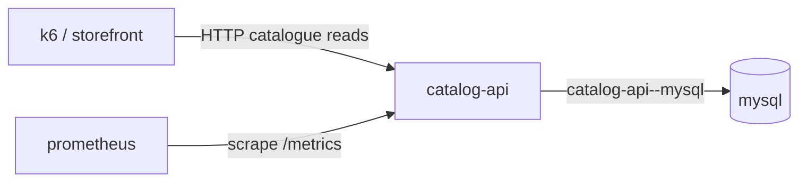
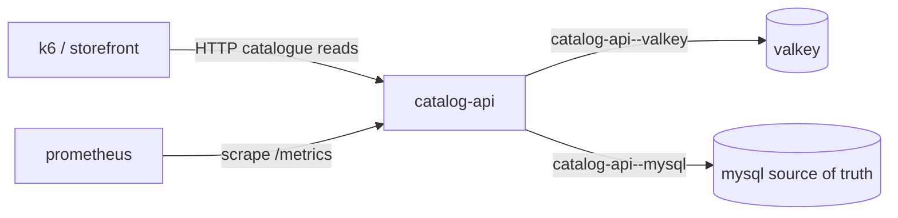

# End-to-End Demo Specification

## Purpose and status

This demo shows a credible performance-diagnosis loop: catalogue read traffic rises, the Go catalogue API slows on MySQL reads, Copilot identifies the service-to-database dependency, cache-aside with Valkey is added, Radius shows the application graph diff, the updated application deploys to Kubernetes, and metrics recover.

Phase 1 in this repository implements the isolated performance lab and both Kubernetes graph states. The Radius Canvas already has graph, planned, graph-diff, deploying, and deployed views. Live telemetry in those views is new work: it must be delivered as an adapter/overlay using the contract in [telemetry-contract.md](telemetry-contract.md), not described as a current Canvas capability.

This document describes the polished human-facing story. A separate, planned [agent graph evaluation](agent-evaluation-spec.md) will measure agents with and without Radius graph access under controlled incidents. A successful presentation is not benchmark evidence, and benchmark trials must not depend on the interactive Canvas UI.

## Human demo mode versus benchmark mode

| Property | Human demo mode | Benchmark mode |
|---|---|---|
| Purpose | Explain the diagnosis, graph diff, deployment, and recovery story | Measure the causal value of graph access |
| Operation | Presenter-guided and interactive | Unattended and repeatable |
| Primary scenario | MySQL read latency remediated with cache-aside | Versioned catalog of diagnosis and remediation incidents |
| Radius Canvas | Central presentation surface | Not required; graph data is delivered through a stable machine interface |
| Evidence | Live or clearly labeled replay telemetry | Immutable run records, validators, logs, patches, graph snapshots, and telemetry windows |
| Claims | Demonstrates a credible workflow | Supports benchmark-specific comparative claims after sufficient repetitions |

## Presenter user script

1. **Introduce the baseline.** Open the Radius graph for the baseline deployment. Point out the catalogue API, MySQL, Prometheus, and the `catalog-api -> mysql` connection.
2. **Start deterministic traffic.** Run `make load` against a baseline started with `make local-up`, or run the equivalent load against the Kubernetes endpoint.
3. **Show impact.** Display the catalogue HTTP p95 and MySQL dependency p95. The configured `DB_READ_DELAY` should make both rise together while error rate remains near zero.
4. **Ask Copilot to diagnose.** The intended prompt is: “Catalogue reads are slow under load. Find the dependency responsible and propose a minimal remediation that preserves MySQL as the source of truth.”
5. **Review evidence.** Copilot consumes the diagnostic adapter JSON, correlates the degraded HTTP resource with the `catalog-api -> mysql` connection, and explains that database read latency dominates request latency.
6. **Plan the change.** Copilot proposes Valkey using cache-aside, a bounded TTL, graceful fallback to MySQL, and cache hit/miss/error metrics.
7. **Show the planned graph.** Radius planned or graph-diff view shows one new Valkey resource and one new `catalog-api -> valkey` connection. It must retain `catalog-api -> mysql`.
8. **Apply the implementation.** Use the cache overlay or the future generated Radius application model. The API configuration changes to `CACHE_ENABLED=true`; source code does not need another edit.
9. **Deploy through Radius.** Use the existing Radius Canvas/GitHub Actions deployment path. In the deploying view, report concrete progress from the workflow and `kubectl rollout status`; raw `kubectl apply` must not replace the Radius path in the final demo.
10. **Repeat the same load.** Run the same k6 stages and catalogue access pattern.
11. **Show recovery.** Cache hits rise, MySQL request rate and contribution to p95 fall, Valkey latency stays low, and catalogue HTTP p95 returns below the success threshold.
12. **Close on topology plus telemetry.** The deployed graph shows both dependency edges with health/latency overlays sourced through the telemetry adapter.

## Why catalogue reads

Catalogue reads are familiar storefront behavior, naturally repeatable, safe to cache, and easy to explain without domain-specific knowledge. The read path supports both list and item requests, which creates stable cache keys and avoids write-invalidation complexity. MySQL remains authoritative, so the remediation demonstrates a realistic dependency optimization rather than replacing the database.

The code is original and intentionally smaller than OpenTelemetry Demo. A later phase may integrate with that storefront for recognition, but Phase 1 must remain independently runnable and understandable.

## Deterministic load and latency design

- `DB_READ_DELAY` is applied inside the MySQL repository before each read. The default demo value is `250ms`.
- The delay is cancellable through request context, so timeout and shutdown behavior remain correct.
- The database pool defaults to 10 open and 5 idle connections. These values are configurable to demonstrate queuing without changing code.
- k6 ramps to 5, then 20, then 40 virtual users and repeatedly calls both the bounded list and item endpoints.
- The same script, stages, target URL, product population, API replicas, and delay are used before and after caching.
- `CACHE_TTL` defaults to 30 seconds. During the steady stage this produces a high hit ratio while still showing periodic MySQL refreshes.
- A cache failure is non-fatal: the request records a cache error and falls back to MySQL.
- Demo comparisons use a warm-up window and then a fixed measurement window. Do not compare an entirely cold cache with an already steady baseline.

## Application graphs

### Baseline

Radius resource IDs:

- `applications.radius.dev/catalog-demo`
- `applications.core/catalog-api`
- `applications.core/mysql`
- `applications.core/prometheus`

Connection IDs:

- `catalog-api--mysql`
- `prometheus--catalog-api`

### Post-change

The post-change graph adds:

- Resource `applications.core/valkey`
- Connection `catalog-api--valkey`

It retains `catalog-api--mysql`. Cache-aside changes the frequency and latency contribution of MySQL calls; it does not remove the dependency.

## Telemetry-to-graph mapping

The adapter maps Prometheus series to stable Radius identifiers:

| Evidence | Graph target | Interpretation |
|---|---|---|
| Catalogue HTTP p95 | `applications.core/catalog-api` | User-visible service latency |
| MySQL dependency p95 | `catalog-api--mysql` | Database contribution to request latency |
| Valkey dependency p95 | `catalog-api--valkey` | Cache dependency health after the change |
| Cache hit ratio | `catalog-api--valkey` and API resource | Effectiveness of cache-aside |
| HTTP error rate | `applications.core/catalog-api` | Guardrail against latency-only success |

The adapter returns current value, baseline, severity, unit, window, and PromQL source. Canvas overlays should remain visually separate from the declarative Radius model: topology comes from Radius, measurements come from telemetry.

## Canvas actions and tool needs

Existing Canvas states used by the demo:

- **graph**: inspect deployed resources and connections.
- **planned**: inspect the proposed application model before deployment.
- **graph-diff**: compare baseline and cache-enabled topology.
- **deploying**: show GitHub Actions progress and Kubernetes rollout progress.
- **deployed**: show the resulting application and deployment outcome.

New work needed:

- A telemetry adapter action that accepts application/environment scope and returns the diagnostic JSON contract.
- An overlay renderer for resource and connection severity, values, baselines, and evidence links.
- A refresh action with bounded polling and explicit stale/unavailable states.
- A Copilot-facing diagnostic tool that returns the same contract so diagnosis and visualization share identifiers and queries.
- A way to preserve before/after measurement windows for graph-diff narration.

The adapter must not mutate the Radius model, infer connections from metrics, or claim that a Prometheus target is a Radius resource without an explicit mapping.

## Radius and deployment flow

1. Author or generate a Radius application model corresponding to the baseline Kubernetes resources.
2. Display the planned graph and deploy through the existing Canvas/GitHub Actions path.
3. Use workflow status plus `kubectl rollout status deployment/catalog-api`, and equivalent dependency rollouts, as concrete progress signals.
4. Capture the deployed baseline graph and baseline telemetry window.
5. Apply the cache-aside code/configuration and add the Valkey resource and connection.
6. Generate the application graph diff before creating or reviewing the pull request.
7. Deploy the cache-enabled revision through the same workflow.
8. Wait for the catalogue API and Valkey rollouts, then run the identical k6 load.
9. Query the post-change telemetry window and display it on the deployed graph.

Phase 1 supplies Kubernetes manifests, but not `app.bicep`, image publishing, credentials, or a deployment workflow.

## Success criteria

- Baseline traffic produces successful catalogue responses and a visible catalogue p95 dominated by MySQL dependency latency.
- Diagnostic output identifies `catalog-api--mysql` as degraded with matching PromQL evidence.
- The graph diff adds exactly one runtime dependency resource, Valkey, and one API-to-Valkey connection while preserving MySQL.
- With caching enabled and warm, cache hit ratio is at least 80% over the measurement window.
- Post-change catalogue HTTP p95 improves by at least 60% from baseline under the same load.
- Post-change HTTP error rate remains below 1%.
- Valkey dependency p95 remains below 25ms in the demo environment.
- The deploy view reports workflow and rollout progress, then reaches a clear deployed or failed state.
- All claims can be reproduced from commands and queries documented in this repository.

These criteria establish demo reliability. They are not the agent benchmark score. Benchmark gates and weighted measures are defined in [agent-evaluation-spec.md](agent-evaluation-spec.md).

## Reliability and fallback plan

- Pre-pull container images and pre-build the API image before a live presentation.
- Reset Compose volumes or the Kubernetes namespace before the dress rehearsal, then seed the same ten products.
- Confirm Prometheus has at least two successful scrapes before starting load.
- Run a short cache warm-up before the post-change measurement window.
- Keep `DB_READ_DELAY` as the primary deterministic mechanism; do not depend on incidental cloud database slowness.
- Save baseline and post-change diagnostic JSON fixtures from a successful rehearsal. If live telemetry access fails, label the Canvas overlay as replayed evidence and continue the graph/deployment story.
- If deployment is unavailable, render both Kustomize variants and the graph diff, then use a previously deployed environment for the metrics comparison.
- If k6 is unavailable, use a documented fixed-concurrency HTTP load fallback, but do not change success thresholds mid-demo.
- If Valkey is unavailable, demonstrate the service's fallback behavior and cache error metric; do not claim performance recovery.

## Evaluation compatibility

The demo environment should evolve into the same resettable scenario substrate used by the benchmark:

- Compose and Kubernetes trials begin from versioned images, manifests, seed data, load profiles, and incident parameters.
- Incident injection is reversible and declarative; no trial depends on manually editing a running container.
- The graph-enabled and graph-disabled conditions receive the same repository snapshot, task, telemetry, traces, non-graph tools, and budgets.
- The graph-enabled condition receives Radius topology and identifiers through an adapter. The control condition receives ordinary repository and runtime artifacts but no graph-derived summary or conclusion.
- Cache-aside scenarios always model both `catalog-api--valkey` and `catalog-api--mysql`; MySQL remains the source of truth.
- Interactive Canvas actions may visualize a completed run, but benchmark orchestration and validation remain headless.
